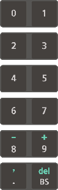

# 1.1.2 티치 펜던트

티치 펜던트는 TP600과 TP630을 지원합니다. 이 조작 설명서에서는 TP600 모델을 기준으로 사용 방법을 설명합니다.

TP600은 Hi6 제어기 전용으로 개발된 모델로 큰 화면의 터치 스크린을 제공합니다.

<table>
  <thead>
    <tr>
      <th style="text-align:left">&#xBC88;&#xD638;</th>
      <th style="text-align:left">&#xC774;&#xB984;</th>
      <th style="text-align:left">&#xC124;&#xBA85;</th>
    </tr>
  </thead>
  <tbody>
    <tr>
      <td style="text-align:left">
        
      </td>
      <td style="text-align:left">&#xC870;&#xC791;&#xD0A4;2</td>
      <td style="text-align:left">&#xB85C;&#xBD07;&#xC758; &#xB3D9;&#xC791;&#xC744; &#xC81C;&#xC5B4;&#xD558;&#xACE0;
        &#xBA85;&#xB839;&#xC744; &#xC785;&#xB825;&#xD558;&#xAC70;&#xB098; &#xBA54;&#xB274;&#xB97C;
        &#xC120;&#xD0DD;&#xD558;&#xACE0; &#xC124;&#xC815;&#xD569;&#xB2C8;&#xB2E4;.</td>
    </tr>
    <tr>
      <td style="text-align:left">
        
      </td>
      <td style="text-align:left">&#xB514;&#xC2A4;&#xD50C;&#xB808;&#xC774;</td>
      <td style="text-align:left">&#xD130;&#xCE58; &#xC2A4;&#xD06C;&#xB9B0;&#xC73C;&#xB85C; &#xB85C;&#xBD07;&#xC758;
        &#xB3D9;&#xC791; &#xC0C1;&#xD0DC;&#xC640; &#xC124;&#xC815; &#xC815;&#xBCF4;&#xB97C;
        &#xD655;&#xC778; &#xBC0F; &#xBCC0;&#xACBD;&#xD569;&#xB2C8;&#xB2E4;.</td>
    </tr>
    <tr>
      <td style="text-align:left">
        
      </td>
      <td style="text-align:left">&#xBAA8;&#xB4DC; &#xC2A4;&#xC704;&#xCE58;</td>
      <td style="text-align:left">&#xBAA8;&#xB4DC; &#xC2A4;&#xC704;&#xCE58;&#xB97C; &#xB3CC;&#xB824; &#xC6B4;&#xC804;
        &#xBAA8;&#xB4DC;(
        &#xC218;&#xB3D9;/
        &#xC790;&#xB3D9;/
        &#xC6D0;&#xACA9;)&#xB97C; &#xC120;&#xD0DD;&#xD569;&#xB2C8;&#xB2E4;. &#xD2F0;&#xCE58;
        &#xD39C;&#xB358;&#xD2B8;&#xC5D0;&#xC11C; &#xBAA8;&#xB4DC; &#xC2A4;&#xC704;&#xCE58;
        &#xD0A4;&#xB97C; &#xBE7C;&#xBA74; &#xC120;&#xD0DD;&#xB41C; &#xC6B4;&#xC804;
        &#xBAA8;&#xB4DC;&#xB85C; &#xC7A0;&#xAE08; &#xC124;&#xC815;&#xB429;&#xB2C8;&#xB2E4;.</td>
    </tr>
    <tr>
      <td style="text-align:left">
        
      </td>
      <td style="text-align:left">&#xBE44;&#xC0C1; &#xC815;&#xC9C0; &#xC2A4;&#xC704;&#xCE58;</td>
      <td style="text-align:left">&#xAE34;&#xAE09; &#xC0C1;&#xD669; &#xBC1C;&#xC0DD; &#xC2DC; &#xBE44;&#xC0C1;
        &#xC815;&#xC9C0; &#xC2A4;&#xC704;&#xCE58;&#xB97C; &#xB20C;&#xB7EC; &#xB85C;&#xBD07;&#xC758;
        &#xB3D9;&#xC791;&#xC744; &#xC815;&#xC9C0;&#xC2DC;&#xD0B5;&#xB2C8;&#xB2E4;.</td>
    </tr>
    <tr>
      <td style="text-align:left">
        
      </td>
      <td style="text-align:left">&#xC870;&#xADF8; &#xB2E4;&#xC774;&#xC5BC;</td>
      <td style="text-align:left">&#xC870;&#xADF8; &#xB2E4;&#xC774;&#xC5BC;&#xC744; &#xB3CC;&#xB824; &#xBA54;&#xB274;&#xB97C;
        &#xC124;&#xC815;&#xD569;&#xB2C8;&#xB2E4;.</td>
    </tr>
    <tr>
      <td style="text-align:left">
        
      </td>
      <td style="text-align:left">&#xB9C8;&#xC6B4;&#xD305; &#xBE0C;&#xB798;&#xD0B7;</td>
      <td style="text-align:left">&#xD2F0;&#xCE58; &#xD39C;&#xB358;&#xD2B8;&#xB97C; &#xB4E4;&#xAC70;&#xB098;
        &#xAC78;&#xC5B4; &#xBCF4;&#xAD00;&#xD569;&#xB2C8;&#xB2E4;.</td>
    </tr>
    <tr>
      <td style="text-align:left">
        
      </td>
      <td style="text-align:left">&#xC778;&#xC5D0;&#xC774;&#xBE14;&#xB9C1; &#xC2A4;&#xC704;&#xCE58;</td>
      <td
      style="text-align:left">
        
&#xC218;&#xB3D9; &#xBAA8;&#xB4DC;&#xC5D0;&#xC11C; &#xD2F0;&#xCE58; &#xD39C;&#xB358;&#xD2B8;&#xB85C;
          &#xB85C;&#xBD07; &#xC870;&#xC791; &#xC2DC;, &#xC548;&#xC804; &#xC2A4;&#xC704;&#xCE58;&#xB85C;
          &#xC0AC;&#xC6A9;&#xD569;&#xB2C8;&#xB2E4;.

        <ul>
          <li>1&#xB2E8;, 3&#xB2E8;: &#xB85C;&#xBD07; &#xC6B4;&#xC804;&#xC774; &#xC815;&#xC9C0;&#xB429;&#xB2C8;&#xB2E4;.
            3&#xB2E8;&#xC77C; &#xACBD;&#xC6B0;, 2&#xB2E8;&#xC744; &#xAC70;&#xCE58;&#xC9C0;
            &#xC54A;&#xACE0; 1&#xB2E8;&#xC73C;&#xB85C; &#xBCF5;&#xADC0;&#xD569;&#xB2C8;&#xB2E4;.</li>
          <li>2&#xB2E8;: &#xB85C;&#xBD07;&#xC744; &#xC870;&#xC791;&#xD560; &#xC218;
            &#xC788;&#xC2B5;&#xB2C8;&#xB2E4;.</li>
        </ul>
        </td>
    </tr>
    <tr>
      <td style="text-align:left">
        
      </td>
      <td style="text-align:left">&#xCF00;&#xC774;&#xBE14; &#xC5F0;&#xACB0; &#xCEE4;&#xB125;&#xD130;</td>
      <td
      style="text-align:left">&#xC81C;&#xC5B4;&#xAE30;&#xC640; &#xC5F0;&#xACB0;&#xD558;&#xAE30; &#xC704;&#xD55C;
        &#xCF00;&#xC774;&#xBE14;&#xC744; &#xC5F0;&#xACB0;&#xD558;&#xB294; &#xCEE4;&#xB125;&#xD130;&#xC785;&#xB2C8;&#xB2E4;.</td>
    </tr>
    <tr>
      <td style="text-align:left">
        
      </td>
      <td style="text-align:left">USB &#xC5F0;&#xACB0; &#xD3EC;&#xD2B8;</td>
      <td style="text-align:left">&#xC774;&#xB3D9;&#xC2DD; &#xC800;&#xC7A5; &#xC7A5;&#xCE58; &#xB4F1; USB
        &#xD1B5;&#xC2E0;&#xC73C;&#xB85C; &#xC811;&#xC18D; &#xAC00;&#xB2A5;&#xD55C;
        &#xC7A5;&#xCE58;&#xB97C; &#xC5F0;&#xACB0;&#xD569;&#xB2C8;&#xB2E4;.</td>
    </tr>
  </tbody>
</table>

TP630은 기존 Hi5a 제어기와 동일한 조작키 사용 환경을 적용한 모델로 TP600의 화면과 유사한 구성의 화면을 제공합니다.

## 조작키

<table>
  <thead>
    <tr>
      <th style="text-align:left">&#xC870;&#xC791;&#xD0A4;</th>
      <th style="text-align:left">&#xC774;&#xB984;</th>
      <th style="text-align:left">&#xC124;&#xBA85;</th>
    </tr>
  </thead>
  <tbody>
    <tr>
      <td style="text-align:left">
        
      </td>
      <td style="text-align:left">shift</td>
      <td style="text-align:left">
        <ul>
          <li>&lt;shift&gt; &#xD0A4;&#xB97C; &#xD2B9;&#xC815; &#xD0A4;&#xC640; &#xD568;&#xAED8;
            &#xB204;&#xB974;&#xBA74; &#xD574;&#xB2F9; &#xD0A4;&#xC758; &#xAE30;&#xB2A5;&#xC774;
            &#xC804;&#xD658;&#xB429;&#xB2C8;&#xB2E4;.</li>
          <li>JOB &#xD3B8;&#xC9D1; &#xCC3D;&#xC5D0;&#xC11C; &lt;&#x2191;/&#x2193;&gt;
            &#xD0A4;&#xC640; &#xD568;&#xAED8; &#xB204;&#xB974;&#xBA74; &#xC0AC;&#xC6A9;
            &#xC911;&#xC778; &#xD654;&#xBA74;&#xC744; &#xC804;&#xD658;&#xD560; &#xC218;
            &#xC788;&#xC2B5;&#xB2C8;&#xB2E4;.</li>
        </ul>
      </td>
    </tr>
    <tr>
      <td style="text-align:left">
        
      </td>
      <td style="text-align:left">ctrl</td>
      <td style="text-align:left">&lt;ctrl&gt; &#xD0A4;&#xB97C; &#xD2B9;&#xC815; &#xD0A4;&#xC640; &#xD568;&#xAED8;
        &#xB204;&#xB974;&#xBA74; &#xD574;&#xB2F9; &#xD0A4;&#xC5D0; &#xC815;&#xC758;&#xB41C;
        &#xAE30;&#xB2A5;&#xC774; &#xC2E4;&#xD589;&#xB429;&#xB2C8;&#xB2E4;.</td>
    </tr>
    <tr>
      <td style="text-align:left">
        
      </td>
      <td style="text-align:left">&#xC704;/&#xC544;&#xB798;</td>
      <td style="text-align:left">&#xC218;&#xB3D9; &#xBAA8;&#xB4DC;&#xC5D0;&#xC11C; &lt;&#x2193;/&#x2191;&gt;
        &#xD0A4;&#xB97C; &#xB204;&#xB974;&#xBA74; &#xC2A4;&#xD15D; &#xB2E8;&#xC704;&#xB85C;
        &#xC804;&#xC9C4; &#xB610;&#xB294; &#xD6C4;&#xC9C4;&#xD569;&#xB2C8;&#xB2E4;.</td>
    </tr>
    <tr>
      <td style="text-align:left">
        
      </td>
      <td style="text-align:left">&#xC815;&#xC9C0;</td>
      <td style="text-align:left">
        
&lt;&#xC815;&#xC9C0;&gt; &#xD0A4;&#xB97C; &#xB204;&#xB974;&#xBA74; &#xC790;&#xB3D9;
          &#xC6B4;&#xC804; &#xC911;&#xC778; &#xB85C;&#xBD07;&#xC774; &#xC77C;&#xC2DC;&#xC801;&#xC73C;&#xB85C;
          &#xBA48;&#xCDA5;&#xB2C8;&#xB2E4;.

        <ul>
          <li>&#xB85C;&#xBD07;&#xC774; &#xC815;&#xC9C0;&#xD558;&#xBA74; &#xC815;&#xC9C0;
            &#xB7A8;&#xD504;&#xAC00; &#xCF1C;&#xC9C0;&#xACE0; &#xC2DC;&#xC791; &#xB7A8;&#xD504;&#xAC00;
            &#xAEBC;&#xC9D1;&#xB2C8;&#xB2E4;.</li>
          <li>&#xB85C;&#xBD07;&#xC740; &#xC791;&#xC131;&#xB41C; &#xD504;&#xB85C;&#xADF8;&#xB7A8;&#xC758;
            &#xACBD;&#xB85C; &#xC218;&#xD589; &#xC911;&#xC5D0; &#xC815;&#xC9C0;&#xB41C;
            &#xC0C1;&#xD0DC;&#xC774;&#xBBC0;&#xB85C; &#xC8FC;&#xBCC0; &#xC7A5;&#xCE58;&#xC640;
            &#xCDA9;&#xB3CC;&#xD560; &#xC704;&#xD5D8;&#xC740; &#xC5C6;&#xC2B5;&#xB2C8;&#xB2E4;.</li>
        </ul>
      </td>
    </tr>
    <tr>
      <td style="text-align:left">
        
      </td>
      <td style="text-align:left">&#xC2DC;&#xC791;</td>
      <td style="text-align:left">&lt;&#xC2DC;&#xC791;&gt; &#xD0A4;&#xB97C; &#xB204;&#xB974;&#xBA74; &#xB85C;&#xBD07;&#xC5D0;
        &#xC791;&#xC131;&#xB41C; &#xD504;&#xB85C;&#xADF8;&#xB7A8;&#xC758; &#xC790;&#xB3D9;
        &#xC6B4;&#xC804;&#xC744; &#xC2DC;&#xC791;&#xD569;&#xB2C8;&#xB2E4;. &#xB85C;&#xBD07;&#xC758;
        &#xC790;&#xB3D9; &#xC6B4;&#xC804;&#xC774; &#xC2DC;&#xC791;&#xB418;&#xBA74;
        &#xC2DC;&#xC791; &#xB7A8;&#xD504;&#xAC00; &#xCF1C;&#xC9C0;&#xACE0; &#xC815;&#xC9C0;
        &#xB7A8;&#xD504;&#xAC00; &#xAEBC;&#xC9D1;&#xB2C8;&#xB2E4;.</td>
    </tr>
    <tr>
      <td style="text-align:left">
        
      </td>
      <td style="text-align:left">&#xBAA8;&#xD130;</td>
      <td style="text-align:left">
        
&#xB85C;&#xBD07; &#xAC01; &#xCD95;&#xC758; &#xBAA8;&#xD130;&#xC5D0; &#xC11C;&#xBCF4;
          &#xC804;&#xC6D0;&#xC744; &#xACF5;&#xAE09;&#xD569;&#xB2C8;&#xB2E4;.

        <ul>
          <li>&#xC218;&#xB3D9; &#xBAA8;&#xB4DC;&#xC5D0;&#xC11C; &lt;&#xBAA8;&#xD130;&gt;
            &#xD0A4;&#xB97C; &#xB204;&#xB974;&#xBA74; &#xBAA8;&#xD130; &#xB7A8;&#xD504;&#xAC00;
            &#xAE5C;&#xBE61;&#xC785;&#xB2C8;&#xB2E4;.</li>
          <li>&#xC790;&#xB3D9; &#xBAA8;&#xB4DC;&#xC5D0;&#xC11C; &lt;&#xBAA8;&#xD130;&gt;
            &#xD0A4;&#xB97C; &#xB204;&#xB974;&#xBA74; &#xBAA8;&#xD130; &#xB7A8;&#xD504;&#xAC00;
            &#xCF1C;&#xC9D1;&#xB2C8;&#xB2E4;.</li>
        </ul>
      </td>
    </tr>
    <tr>
      <td style="text-align:left">
        
      </td>
      <td style="text-align:left">enter</td>
      <td style="text-align:left">
        <ul>
          <li>&#xC218;&#xCE58; &#xC785;&#xB825; &#xC2DC; &lt;enter&gt; &#xD0A4;&#xB97C;
            &#xB204;&#xB974;&#xBA74; &#xC785;&#xB825;&#xAC12;&#xC774; &#xC124;&#xC815;&#xC5D0;
            &#xC801;&#xC6A9;&#xB429;&#xB2C8;&#xB2E4;.</li>
          <li>&#xD5C8;&#xB77D;/&#xAC70;&#xBD80;(Yes/No)&#xC758; &#xC751;&#xB2F5;&#xC5D0;
            &#xB300;&#xD574; &lt;enter&gt; &#xD0A4;&#xB97C; &#xB204;&#xB974;&#xBA74;
            &#xD5C8;&#xB77D;(Yes)&#xC774; &#xC120;&#xD0DD;&#xB429;&#xB2C8;&#xB2E4;.</li>
          <li>&#xC218;&#xB3D9; &#xBAA8;&#xB4DC;&#xC5D0;&#xC11C; &#xBA85;&#xB839;&#xBB38;
            &#xC218;&#xC815; &#xC2DC;, &#xBB38;&#xC7A5; &#xCEE4;&#xC11C; &#xC0C1;&#xD0DC;&#xC5D0;&#xC11C;
            &lt;enter&gt; &#xD0A4;&#xB97C; &#xB204;&#xB974;&#xBA74; &#xBA85;&#xB839;&#xBB38;
            &#xC778;&#xC218;&#xB97C; &#xD3B8;&#xC9D1;&#xD560; &#xC218; &#xC788;&#xB294;
            &#xB2E8;&#xC5B4; &#xCEE4;&#xC11C; &#xC0C1;&#xD0DC;&#xB85C; &#xC804;&#xD658;&#xB429;&#xB2C8;&#xB2E4;.</li>
        </ul>
      </td>
    </tr>
    <tr>
      <td style="text-align:left">
        
      </td>
      <td style="text-align:left">esc</td>
      <td style="text-align:left">
        <ul>
          <li>&#xD0A4; &#xC785;&#xB825;&#xC774;&#xB098; &#xC9C4;&#xD589; &#xC911;&#xC778;
            &#xAC01;&#xC885; &#xAE30;&#xB2A5;&#xC744; &#xCDE8;&#xC18C;&#xD569;&#xB2C8;&#xB2E4;.</li>
          <li>&lt;esc&gt; &#xD0A4;&#xB97C; &#xB204;&#xB974;&#xBA74; &#xBCC0;&#xACBD;
            &#xB0B4;&#xC6A9;&#xC744; &#xC800;&#xC7A5;&#xD558;&#xC9C0; &#xC54A;&#xACE0;
            &#xC0C1;&#xC704; &#xB808;&#xBCA8;&#xB85C; &#xC804;&#xD658;&#xD560; &#xC218;
            &#xC788;&#xC2B5;&#xB2C8;&#xB2E4;.</li>
        </ul>
      </td>
    </tr>
    <tr>
      <td style="text-align:left">
        
      </td>
      <td style="text-align:left">&#xC67C;&#xCABD;/&#xC624;&#xB978;&#xCABD;</td>
      <td style="text-align:left">
        <ul>
          <li>&#xD14D;&#xC2A4;&#xD2B8; &#xC785;&#xB825; &#xC2DC;, &#xCEE4;&#xC11C;&#xB97C;
            &#xC774;&#xC804; &#xB610;&#xB294; &#xB2E4;&#xC74C;&#xC73C;&#xB85C; &#xC774;&#xB3D9;&#xD569;&#xB2C8;&#xB2E4;.</li>
          <li>&#xB2E8;&#xC5B4; &#xCEE4;&#xC11C; &#xC0C1;&#xD0DC;&#xC5D0;&#xC11C; &lt;&#x2190;/&#x2192;&gt;
            &#xD0A4;&#xB97C; &#xB204;&#xB974;&#xBA74; &#xAE30;&#xB85D;&#xB41C; &#xC2A4;&#xD15D;&#xC774;&#xB098;
            &#xB2E4;&#xB978; &#xAE30;&#xB2A5; &#xC778;&#xC218;&#xB85C; &#xC774;&#xB3D9;&#xD569;&#xB2C8;&#xB2E4;.</li>
        </ul>
      </td>
    </tr>
    <tr>
      <td style="text-align:left">
        
      </td>
      <td style="text-align:left">
        
&#xC22B;&#xC790;&#xD0A4;

        
&#xC870;&#xADF8;&#xD0A4;

      </td>
      <td style="text-align:left">
        <ul>
          <li>&#xC22B;&#xC790;&#xB97C; &#xC785;&#xB825;&#xD569;&#xB2C8;&#xB2E4;.</li>
          <li>&lt;shift&gt; &#xD0A4;&#xC640; &#xD568;&#xAED8; &#xB204;&#xB974;&#xBA74;
            &#xBD80;&#xD638;(- / +)&#xB098; &#xC27C;&#xD45C;(,)&#xB97C; &#xC785;&#xB825;&#xD558;&#xAC70;&#xB098;,
            &#xBA85;&#xB839;&#xBB38; &#xB610;&#xB294; &#xC778;&#xC218;&#xB97C; &#xC0AD;&#xC81C;&#xD560;
            &#xC218; &#xC788;&#xC2B5;&#xB2C8;&#xB2E4;.</li>
          <li>&lt;BS&gt;: Backspace. &#xCEE4;&#xC11C;&#xAC00; &#xC785;&#xB825;&#xB41C;
            &#xC704;&#xCE58;&#xC5D0;&#xC11C; &#xD14D;&#xC2A4;&#xD2B8;&#xB97C; &#xD55C;
            &#xAE00;&#xC790;&#xC529; &#xC9C0;&#xC6C1;&#xB2C8;&#xB2E4;. &#xB610;&#xD55C;
            &#xBA85;&#xB839;&#xC5B4; &#xD3B8;&#xC9D1; &#xC2DC; &#xC778;&#xC218;&#xB97C;
            &#xC120;&#xD0DD;&#xD558;&#xACE0; &lt;BS&gt; &#xD0A4;&#xB97C; &#xB204;&#xB974;&#xBA74;
            &#xC778;&#xC218; &#xAC12; &#xC804;&#xCCB4;&#xB97C; &#xC0AD;&#xC81C;&#xD560;
            &#xC218; &#xC788;&#xC2B5;&#xB2C8;&#xB2E4;.</li>
        </ul>
        
&#xC218;&#xB3D9; &#xBAA8;&#xB4DC;&#xC5D0;&#xC11C; &#xBAA8;&#xD130;&#xAC00;
          &#xCF1C;&#xC9C4; &#xC0C1;&#xD0DC;&#xC5D0;&#xC11C; &#xC778;&#xC5D0;&#xC774;&#xBE14;&#xB9C1;
          &#xC2A4;&#xC704;&#xCE58;&#xB97C; &#xC7A1;&#xACE0; &#xC788;&#xB294; &#xB3D9;&#xC548;,
          &lt;enter/esc/&#x2190;/&#x2192;&gt; &#xD0A4;&#xC640; &#xC22B;&#xC790;&#xD0A4;&#xB294;
          &#x2018;&#xC870;&#xADF8;&#xD0A4;&#x2019;&#xB85C; &#xB3D9;&#xC791;&#xD569;&#xB2C8;&#xB2E4;.

        <ul>
          <li>&#xAC01; &#xD0A4;&#xC5D0; &#xC9C0;&#xC815;&#xB41C; &#xCD95;&#xC758; &#xC774;&#xB984;&#xC740;
            &#xB514;&#xC2A4;&#xD50C;&#xB808;&#xC774;&#xC758; &#xC6B0;&#xCE21; &#xAC00;&#xC7A5;&#xC790;&#xB9AC;&#xC5D0;
            &#xD45C;&#xC2DC;&#xB429;&#xB2C8;&#xB2E4;.</li>
          <li>&lt;&#x2192;&gt; &#xD0A4;&#xB294; &#xC99D;&#xAC00;(+), &lt;&#x2190;&gt;
            &#xD0A4;&#xB294; &#xAC10;&#xC18C;(-) &#xBC29;&#xD5A5;&#xC785;&#xB2C8;&#xB2E4;.</li>
        </ul>
      </td>
    </tr>
  </tbody>
</table>

