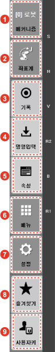
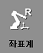

# 1.2.3 Hi6 티치 펜던트 화면

로봇의 동작을 제어하거나 로봇과 연동된 장치를 관리할 수 있습니다. Hi6 티치 펜던트 화면은 다음과 같이 구성됩니다.

<table>
  <thead>
    <tr>
      <th style="text-align:left">&#xBC88;&#xD638;</th>
      <th style="text-align:left">&#xC124;&#xBA85;</th>
    </tr>
  </thead>
  <tbody>
    <tr>
      <td style="text-align:left">
        
      </td>
      <td style="text-align:left">&#xC0C1;&#xD0DC; &#xD45C;&#xC2DC;&#xC904;&#xC785;&#xB2C8;&#xB2E4;. &#xD2F0;&#xCE58;
        &#xD39C;&#xB358;&#xD2B8;&#xC758; &#xD1B5;&#xC2E0; &#xC0C1;&#xD0DC;&#xC640;
        &#xC6B4;&#xC804; &#xBAA8;&#xB4DC;, &#xB85C;&#xBD07; &#xC2DC;&#xC2A4;&#xD15C;&#xC758;
        &#xC0C1;&#xD0DC;&#xC640; &#xBA54;&#xCEE4;&#xB2C8;&#xC998;&#xC744; &#xD45C;&#xC2DC;&#xD569;&#xB2C8;&#xB2E4;.
        &#xC790;&#xC138;&#xD55C; &#xB0B4;&#xC6A9;&#xC740; &#x201C;1.2.3.1 &#xC0C1;&#xD0DC;
        &#xD45C;&#xC2DC;&#xC904;&#x201D;&#xC744; &#xCC38;&#xC870;&#xD558;&#xC2ED;&#xC2DC;&#xC624;.</td>
    </tr>
    <tr>
      <td style="text-align:left">
        
      </td>
      <td style="text-align:left">&#xAE30;&#xB2A5; &#xBC84;&#xD2BC;&#xC744; &#xC774;&#xC6A9;&#xD574; &#xC124;&#xC815;&#xAC12;&#xC744;
        &#xD655;&#xC778;&#xD558;&#xACE0; &#xBCC0;&#xACBD;&#xD569;&#xB2C8;&#xB2E4;.
        &#xC790;&#xC138;&#xD55C; &#xB0B4;&#xC6A9;&#xC740; &#x201C;1.2.3.3 &#xAE30;&#xB2A5;
        &#xBC84;&#xD2BC;&#x201D;&#xC744; &#xCC38;&#xC870;&#xD558;&#xC2ED;&#xC2DC;&#xC624;.</td>
    </tr>
    <tr>
      <td style="text-align:left">
        
      </td>
      <td style="text-align:left">&#xC791;&#xC5C5; &#xC601;&#xC5ED;&#xC785;&#xB2C8;&#xB2E4;. JOB &#xD504;&#xB85C;&#xADF8;&#xB7A8;&#xC744;
        &#xD3B8;&#xC9D1;&#xD558;&#xACE0; &#xBAA8;&#xB2C8;&#xD130;&#xB9C1; &#xC815;&#xBCF4;&#xB97C;
        &#xD655;&#xC778;&#xD558;&#xB294; &#xB4F1; &#xB2E4;&#xC591;&#xD55C; &#xC791;&#xC5C5;&#xC744;
        &#xC218;&#xD589;&#xD569;&#xB2C8;&#xB2E4;. &#xC5EC;&#xB7EC; &#xC791;&#xC5C5;&#xC744;
        &#xB3D9;&#xC2DC;&#xC5D0; &#xC218;&#xD589;&#xD560; &#xC218; &#xC788;&#xC2B5;&#xB2C8;&#xB2E4;.</td>
    </tr>
    <tr>
      <td style="text-align:left">
        
      </td>
      <td style="text-align:left">&#xBA54;&#xB274; &#xBC84;&#xD2BC;&#xC744; &#xC774;&#xC6A9;&#xD574; &#xBA54;&#xB274;&#xC758;
        &#xC124;&#xC815;&#xAC12;&#xC744; &#xD655;&#xC778; &#xBC0F; &#xBCC0;&#xACBD;&#xD558;&#xACE0;,
        &#xB2E4;&#xC591;&#xD55C; &#xAE30;&#xB2A5;&#xC744; &#xC2E4;&#xD589;&#xD569;&#xB2C8;&#xB2E4;.
        &#xC790;&#xC138;&#xD55C; &#xB0B4;&#xC6A9;&#xC740; &#x201C;1.2.3.4 &#xBA54;&#xB274;
        &#xBC84;&#xD2BC;&#x201D;&#xC744; &#xCC38;&#xC870;&#xD558;&#xC2ED;&#xC2DC;&#xC624;.</td>
    </tr>
    <tr>
      <td style="text-align:left">
        
      </td>
      <td style="text-align:left">&#xC870;&#xADF8; &#xB9C9;&#xB300;&#xC785;&#xB2C8;&#xB2E4;. [&#xC88C;&#xD45C;&#xACC4;]
        &#xBC84;&#xD2BC;&#xC73C;&#xB85C; &#xC120;&#xD0DD;&#xD55C; &#xC870;&#xADF8;
        &#xC218;&#xD589;&#xC758; &#xAE30;&#xC900; &#xC88C;&#xD45C;&#xACC4;&#xC5D0;
        &#xB530;&#xB77C; &#xBCC0;&#xACBD;&#xB41C; &#xCD95;&#xC758; &#xC774;&#xB984;&#xC774;
        &#xD45C;&#xC2DC;&#xB429;&#xB2C8;&#xB2E4;.</td>
    </tr>
    <tr>
      <td style="text-align:left">
        
      </td>
      <td style="text-align:left">
        
&#xC774;&#xB825; &#xD45C;&#xC2DC;&#xC904;&#xC785;&#xB2C8;&#xB2E4;. &#xC790;&#xC138;&#xD55C;
          &#xB0B4;&#xC6A9;&#xC740; &#x201C;1.2.3.2 &#xC774;&#xB825; &#xD45C;&#xC2DC;&#xC904;&#x201D;&#xC744;
          &#xCC38;&#xC870;&#xD558;&#xC2ED;&#xC2DC;&#xC624;.

        <ul>
          <li>&#xD604;&#xC7AC; &#xC2DC;&#xAC04; &#xC815;&#xBCF4;&#xC640; &#xD2F0;&#xCE58;
            &#xD39C;&#xB358;&#xD2B8;&#xC758; &#xBA54;&#xBAA8;&#xB9AC; &#xC0AC;&#xC6A9;
            &#xD604;&#xD669;&#xC774; &#xD45C;&#xC2DC;&#xB429;&#xB2C8;&#xB2E4;. &#xB610;&#xD55C;
            &#xC5D0;&#xB7EC; &#xBA54;&#xC2DC;&#xC9C0; &#xB610;&#xB294; &#xACBD;&#xACE0;
            &#xBA54;&#xC2DC;&#xC9C0;&#xB97C; &#xD655;&#xC778;&#xD560; &#xC218; &#xC788;&#xC2B5;&#xB2C8;&#xB2E4;.</li>
          <li>&#xD654;&#xBA74;&#xC5D0; &#xC18C;&#xD504;&#xD2B8; &#xD0A4;&#xBCF4;&#xB4DC;&#xB97C;
            &#xD45C;&#xC2DC;&#xD558;&#xAC70;&#xB098; &#xC228;&#xAE41;&#xB2C8;&#xB2E4;.
            &#xC18C;&#xD504;&#xD2B8; &#xD0A4;&#xBCF4;&#xB4DC; &#xC0AC;&#xC6A9; &#xC911;&#xC5D0;&#xB294;
            &#xD0A4;&#xBCF4;&#xB4DC;&#xC758; &#xC704;&#xCE58;&#xB97C; &#xD654;&#xBA74;&#xC758;
            &#xC0C1;&#xB2E8;&#xC73C;&#xB85C; &#xC774;&#xB3D9;&#xD560; &#xC218; &#xC788;&#xC2B5;&#xB2C8;&#xB2E4;.</li>
        </ul>
      </td>
    </tr>
  </tbody>
</table>

### 

### 상태 표시줄

<table>
  <thead>
    <tr>
      <th style="text-align:left">&#xBC88;&#xD638;</th>
      <th style="text-align:left">&#xC124;&#xBA85;</th>
    </tr>
  </thead>
  <tbody>
    <tr>
      <td style="text-align:left">
        
      </td>
      <td style="text-align:left">&#xB85C;&#xBD07; &#xC81C;&#xC5B4;&#xAE30; &#xD50C;&#xB7AB;&#xD3FC;&#xC758;
        &#xC774;&#xB984;&#xC785;&#xB2C8;&#xB2E4;.</td>
    </tr>
    <tr>
      <td style="text-align:left">
        
      </td>
      <td style="text-align:left">&#xD2F0;&#xCE58; &#xD39C;&#xB358;&#xD2B8;&#xC640; &#xB85C;&#xBD07; &#xC81C;&#xC5B4;&#xAE30;
        &#xBCF8;&#xCCB4;&#xC758; COM &#xBAA8;&#xB4C8; &#xAC04; &#xC774;&#xB354;&#xB137;
        &#xD1B5;&#xC2E0;&#xC758; &#xC0C1;&#xD0DC;&#xB97C; &#xD45C;&#xC2DC;&#xD569;&#xB2C8;&#xB2E4;.
        (
        : &#xC815;&#xC0C1; /
        : &#xC751;&#xB2F5; &#xC5C6;&#xC74C;)</td>
    </tr>
    <tr>
      <td style="text-align:left">
        
      </td>
      <td style="text-align:left">
        
&#xB85C;&#xBD07;&#xC758; &#xC6B4;&#xC804; &#xBC29;&#xC2DD;&#xC744; &#xD45C;&#xC2DC;&#xD569;&#xB2C8;&#xB2E4;.

        <ul>
          <li><b>&#xC218;&#xB3D9;</b>: &#xC870;&#xADF8;&#xB85C; &#xB85C;&#xBD07;&#xC744;
            &#xC81C;&#xC5B4;&#xD558;&#xACE0;, JOB &#xD504;&#xB85C;&#xADF8;&#xB7A8;&#xC744;
            &#xC791;&#xC131;&#xD558;&#xB294; &#xB85C;&#xBD07; &#xAD50;&#xC2DC; &#xBAA8;&#xB4DC;&#xC785;&#xB2C8;&#xB2E4;.</li>
          <li><b>&#xC790;&#xB3D9;</b>: JOB &#xD504;&#xB85C;&#xADF8;&#xB7A8;&#xC744;
            &#xC7AC;&#xC0DD;&#xD558;&#xC5EC; &#xB85C;&#xBD07;&#xC744; &#xC790;&#xB3D9;&#xC73C;&#xB85C;
            &#xC6B4;&#xC804;&#xD558;&#xB294; &#xBAA8;&#xB4DC;&#xC785;&#xB2C8;&#xB2E4;.</li>
          <li><b>&#xC6D0;&#xACA9;&#xC218;&#xB3D9;</b>: &#xBAA8;&#xB4DC;&#xB97C; &#xC6D0;&#xACA9;&#xC5D0;&#xC11C;
            I/O&#xC2E0;&#xD638;&#xB85C; &#xACB0;&#xC815;&#xD558;&#xB294; &#xC0C1;&#xD0DC;&#xC785;&#xB2C8;&#xB2E4;.
            (&#xD604;&#xC7AC; &#xC0C1;&#xD0DC;: &#xC218;&#xB3D9; &#xBAA8;&#xB4DC;)</li>
          <li><b>&#xC6D0;&#xACA9;&#xC790;&#xB3D9;</b>: &#xBAA8;&#xB4DC;&#xB97C; &#xC6D0;&#xACA9;&#xC5D0;&#xC11C;
            I/O&#xC2E0;&#xD638;&#xB85C; &#xACB0;&#xC815;&#xD558;&#xB294; &#xC0C1;&#xD0DC;&#xC785;&#xB2C8;&#xB2E4;.
            (&#xD604;&#xC7AC; &#xC0C1;&#xD0DC;: &#xC790;&#xB3D9; &#xBAA8;&#xB4DC;)</li>
        </ul>
      </td>
    </tr>
    <tr>
      <td style="text-align:left">
        
      </td>
      <td style="text-align:left">&#xB85C;&#xBD07; &#xC2DC;&#xC2A4;&#xD15C;&#xC758; &#xB2E4;&#xC591;&#xD55C;
        &#xC0C1;&#xD0DC;&#xB97C; &#xD45C;&#xC2DC;&#xD569;&#xB2C8;&#xB2E4;.</td>
    </tr>
    <tr>
      <td style="text-align:left">
        
      </td>
      <td style="text-align:left">&#xB85C;&#xBD07;&#xC758; &#xB3D9;&#xC791; &#xC0C1;&#xD0DC;&#xB97C; &#xD45C;&#xC2DC;&#xD569;&#xB2C8;&#xB2E4;.
        (
        : &#xBAA8;&#xD130; ON /
        : &#xB85C;&#xBD07; &#xC7AC;&#xC0DD; &#xC911; /
        : &#xB85C;&#xBD07; &#xC815;&#xC9C0;)</td>
    </tr>
    <tr>
      <td style="text-align:left">
        
      </td>
      <td style="text-align:left">&#xC120;&#xD0DD;&#xB41C; &#xB85C;&#xBD07; &#xBA54;&#xCEE4;&#xB2C8;&#xC998;&#xC758;
        &#xBAA8;&#xB378;&#xBA85;&#xC744; &#xD45C;&#xC2DC;&#xD569;&#xB2C8;&#xB2E4;.</td>
    </tr>
  </tbody>
</table>

### 

### 이력 표시줄

<table>
  <thead>
    <tr>
      <th style="text-align:left">&#xBC88;&#xD638;</th>
      <th style="text-align:left">&#xC124;&#xBA85;</th>
    </tr>
  </thead>
  <tbody>
    <tr>
      <td style="text-align:left">
        
      </td>
      <td style="text-align:left">&#xB0A0;&#xC9DC;&#xC640; &#xC2DC;&#xAC04; &#xC815;&#xBCF4;&#xAC00; &#xD45C;&#xC2DC;&#xB429;&#xB2C8;&#xB2E4;.
        [&#xBA54;&#xB274;] &#xBC84;&#xD2BC; &gt; [08: &#xB0A0;&#xC9DC;, &#xC2DC;&#xAC04;
        &#xC124;&#xC815;] &#xBA54;&#xB274;&#xB97C; &#xD130;&#xCE58;&#xD558;&#xBA74;
        &#xB0A0;&#xC9DC;&#xC640; &#xC2DC;&#xAC04; &#xC815;&#xBCF4;&#xB97C; &#xBCC0;&#xACBD;&#xD560;
        &#xC218; &#xC788;&#xC2B5;&#xB2C8;&#xB2E4;. &#xB0A0;&#xC9DC;&#xC640; &#xC2DC;&#xAC04;
        &#xC815;&#xBCF4; &#xBCC0;&#xACBD;&#xC5D0; &#xB300;&#xD55C; &#xC790;&#xC138;&#xD55C;
        &#xB0B4;&#xC6A9;&#xC740; &#x201C;4.5 &#xB0A0;&#xC9DC; &#xBC0F; &#xC2DC;&#xAC04;
        &#xC124;&#xC815;&#x201D;&#xC744; &#xCC38;&#xC870;&#xD558;&#xC2ED;&#xC2DC;&#xC624;.</td>
    </tr>
    <tr>
      <td style="text-align:left">
        
      </td>
      <td style="text-align:left">
        <ul>
          <li>&#xD2F0;&#xCE58; &#xD39C;&#xB358;&#xD2B8;&#xC758; &#xBA54;&#xBAA8;&#xB9AC;(RAM)
            &#xC0AC;&#xC6A9; &#xD604;&#xD669;&#xC774; &#xD45C;&#xC2DC;&#xB429;&#xB2C8;&#xB2E4;.
            &#xBA54;&#xBAA8;&#xB9AC;&#xC758; &#xC804;&#xCCB4; &#xC6A9;&#xB7C9; &#xB300;&#xBE44;
            &#xC0AC;&#xC6A9; &#xBC0F; &#xC794;&#xC5EC; &#xC6A9;&#xB7C9;&#xC774; &#xB9C9;&#xB300;&#xADF8;&#xB798;&#xD504;&#xC5D0;
            &#xB098;&#xD0C0;&#xB098;&#xACE0; &#xC794;&#xC5EC; &#xC6A9;&#xB7C9;(MByte)&#xC740;
            &#xC218;&#xCE58;&#xB85C;&#xB3C4; &#xD655;&#xC778;&#xD560; &#xC218; &#xC788;&#xC2B5;&#xB2C8;&#xB2E4;.</li>
          <li>&#xC5D0;&#xB7EC; &#xB610;&#xB294; &#xACBD;&#xACE0; &#xC0C1;&#xD669;&#xC774;
            &#xBC1C;&#xC0DD;&#xD558;&#xBA74; &#xBA54;&#xBAA8;&#xB9AC; &#xC0AC;&#xC6A9;
            &#xD604;&#xD669; &#xB300;&#xC2E0; &#xC54C;&#xB9BC; &#xBA54;&#xC2DC;&#xC9C0;&#xAC00;
            &#xB098;&#xD0C0;&#xB098; &#xC57D; 1&#xBD84; &#xB3D9;&#xC548; &#xAE5C;&#xBE61;&#xC778;
            &#xD6C4; &#xBA48;&#xCDA5;&#xB2C8;&#xB2E4;.</li>
          <li>&#xC54C;&#xB9BC; &#xBA54;&#xC2DC;&#xC9C0; &#xC6B0;&#xCE21;&#xC5D0;&#xC11C;
            &#xC5D0;&#xB7EC; &#xBC0F; &#xACBD;&#xACE0; &#xBC1C;&#xC0DD; &#xC2DC;&#xC810;&#xC744;
            &#xD655;&#xC778;&#xD560; &#xC218; &#xC788;&#xC2B5;&#xB2C8;&#xB2E4;. &#xB610;&#xD55C;
            &#xC54C;&#xB9BC; &#xBA54;&#xC2DC;&#xC9C0;&#xB97C; &#xD130;&#xCE58;&#xD558;&#xBA74;
            &#xC0C8; &#xCC3D;&#xC5D0;&#xC11C; &#xC5D0;&#xB7EC; &#xBC0F; &#xACBD;&#xACE0;
            &#xBC1C;&#xC0DD; &#xC774;&#xB825;&#xC744; &#xD655;&#xC778;&#xD560; &#xC218;
            &#xC788;&#xC2B5;&#xB2C8;&#xB2E4;.</li>
          <li>&#xC54C;&#xB9BC; &#xBA54;&#xC2DC;&#xC9C0;&#xC5D0; &#xB300;&#xD55C; &#xC790;&#xC138;&#xD55C;
            &#xB0B4;&#xC6A9;&#xC740; &#x201C;2.5 &#xC5D0;&#xB7EC; &#xC815;&#xBCF4;&#x201D;&#xB97C;
            &#xCC38;&#xC870;&#xD558;&#xC2ED;&#xC2DC;&#xC624;.</li>
        </ul>
      </td>
    </tr>
    <tr>
      <td style="text-align:left">
        
      </td>
      <td style="text-align:left">
        
&#xD654;&#xBA74;&#xC5D0; &#xC18C;&#xD504;&#xD2B8; &#xD0A4;&#xBCF4;&#xB4DC;&#xB97C;
          &#xD45C;&#xC2DC;&#xD569;&#xB2C8;&#xB2E4;. &#xC18C;&#xD504;&#xD2B8; &#xD0A4;&#xBCF4;&#xB4DC;&#xC758;
          &#xC0AC;&#xC6A9; &#xBC29;&#xBC95;&#xC5D0; &#xB300;&#xD55C; &#xC790;&#xC138;&#xD55C;
          &#xB0B4;&#xC6A9;&#xC740; &#x201C;3.2.4.4 &#xC18C;&#xD504;&#xD2B8; &#xD0A4;&#xBCF4;&#xB4DC;&#x201D;&#xB97C;
          &#xCC38;&#xC870;&#xD558;&#xC2ED;&#xC2DC;&#xC624;.

        <ul>
          <li>&#xC18C;&#xD504;&#xD2B8; &#xD0A4;&#xBCF4;&#xB4DC; &#xC0AC;&#xC6A9; &#xC911;&#xC5D0;
            [
            ] &#xBC84;&#xD2BC;&#xC744; &#xD130;&#xCE58;&#xD558;&#xBA74; &#xD0A4;&#xBCF4;&#xB4DC;&#xC758;
            &#xC704;&#xCE58;&#xB97C; &#xD654;&#xBA74; &#xC0C1;&#xB2E8;&#xC73C;&#xB85C;
            &#xC774;&#xB3D9;&#xD560; &#xC218; &#xC788;&#xC2B5;&#xB2C8;&#xB2E4;.</li>
          <li>&#xC18C;&#xD504;&#xD2B8; &#xD0A4;&#xBCF4;&#xB4DC;&#xB97C; &#xC228;&#xAE30;&#xB824;&#xBA74;,
            [
            ] &#xBC84;&#xD2BC;&#xC744; &#xD130;&#xCE58;&#xD558;&#xC2ED;&#xC2DC;&#xC624;.</li>
        </ul>
      </td>
    </tr>
  </tbody>
</table>

### 

### 기능 버튼

<table>
  <thead>
    <tr>
      <th style="text-align:left"></th>
      <th style="text-align:left">&#xBC88;&#xD638;</th>
      <th style="text-align:left">&#xC124;&#xBA85;</th>
    </tr>
  </thead>
  <tbody>
    <tr>
      <td style="text-align:left"></td>
      <td style="text-align:left">
        
      </td>
      <td style="text-align:left">
        
[&#xAE30;&#xB85D;&#xC870;&#xAC74;] &#xBC84;&#xD2BC;: move &#xBB38; &#xAE30;&#xB85D;
          &#xC870;&#xAC74;&#xC758; &#xAE30;&#xBCF8;&#xAC12;&#xC744; &#xC124;&#xC815;&#xD569;&#xB2C8;&#xB2E4;.

        
[&#xAE30;&#xB85D;&#xC870;&#xAC74;] &#xBC84;&#xD2BC;&#xC744; &#xD130;&#xCE58;&#xD55C;
          &#xD6C4; &#xC124;&#xC815;&#xCC3D;&#xC5D0;&#xC11C; &#xBCF4;&#xAC04;, &#xC774;&#xB3D9;
          &#xC18D;&#xB3C4;&#xC640; &#xB2E8;&#xC704;, Accuracy, &#xD234; &#xBC88;&#xD638;&#xB97C;
          &#xC785;&#xB825;&#xD558;&#xACE0; [&#xD655;&#xC778;] &#xBC84;&#xD2BC;(
          )&#xC744; &#xD130;&#xCE58;&#xD558;&#xC2ED;&#xC2DC;&#xC624;.

      </td>
    </tr>
    <tr>
      <td style="text-align:left">
        
      </td>
      <td style="text-align:left">
        
      </td>
      <td style="text-align:left">
        
[&#xC2E4;&#xD589;&#xB2E8;&#xC704;] &#xBC84;&#xD2BC;: &#xC218;&#xB3D9;
          &#xB610;&#xB294; &#xC790;&#xB3D9; &#xBAA8;&#xB4DC;&#xC5D0;&#xC11C;&#xC758;
          &#xD504;&#xB85C;&#xADF8;&#xB7A8; &#xC2E4;&#xD589; &#xB2E8;&#xC704;&#xB97C;
          &#xC124;&#xC815;&#xD569;&#xB2C8;&#xB2E4;.

        

        
&#xC218;&#xB3D9; &#xBAA8;&#xB4DC;: &#xC6D0;&#xD558;&#xB294; &#xC635;&#xC158;&#xC774;
          &#xB098;&#xD0C0;&#xB0A0; &#xB54C;&#xAE4C;&#xC9C0; [&#xC2E4;&#xD589;&#xB2E8;&#xC704;]
          &#xBC84;&#xD2BC;&#xC744; &#xBC18;&#xBCF5;&#xD574;&#xC11C; &#xD130;&#xCE58;&#xD558;&#xC2ED;&#xC2DC;&#xC624;.

        <ul>
          <li>
            [cmd]: &#xBA85;&#xB839;&#xC5B4; &#xD55C; &#xD589;&#xC529; &#xC2E4;&#xD589;&#xD569;&#xB2C8;&#xB2E4;.</li>
          <li>
            [step]: &#xD55C; &#xC2A4;&#xD15D;&#xC529; &#xC2E4;&#xD589;&#xD569;&#xB2C8;&#xB2E4;.</li>
          <li>
            [end]: end &#xBA85;&#xB839;&#xBB38;&#xAE4C;&#xC9C0; &#xC2E4;&#xD589;&#xD569;&#xB2C8;&#xB2E4;.</li>
        </ul>
        

        <ul>
          <li>&#xC790;&#xB3D9; &#xBAA8;&#xB4DC;: [&#xC2E4;&#xD589;&#xB2E8;&#xC704;]
            &#xBC84;&#xD2BC;&#xC744; &#xD130;&#xCE58;&#xD55C; &#xD6C4; &#xC124;&#xC815;&#xCC3D;&#xC5D0;&#xC11C;
            &#xC635;&#xC158;&#xC744; &#xC124;&#xC815;&#xD558;&#xC2ED;&#xC2DC;&#xC624;.</li>
          <li>
            [1cycle]: end &#xBA85;&#xB839;&#xBB38;&#xAE4C;&#xC9C0; &#xC2E4;&#xD589;
            &#xD6C4; &#xC815;&#xC9C0;&#xD569;&#xB2C8;&#xB2E4;.</li>
          <li>
            [cont]: end &#xBA85;&#xB839;&#xBB38;&#xAE4C;&#xC9C0; &#xC2E4;&#xD589;
            &#xD6C4; &#xC2A4;&#xD15D; 0&#xBD80;&#xD130; &#xB2E4;&#xC2DC; &#xC2E4;&#xD589;&#xD569;&#xB2C8;&#xB2E4;.</li>
        </ul>
      </td>
    </tr>
    <tr>
      <td style="text-align:left"></td>
      <td style="text-align:left">
        
      </td>
      <td style="text-align:left">
        
[&#xC18D;&#xB3C4;&#xC870;&#xC808;] &#xBC84;&#xD2BC;: &#xC0AC;&#xC6A9;&#xC790;&#xC758;
          &#xC548;&#xC804;&#xC744; &#xC704;&#xD574; &#xC2A4;&#xD15D; &#xC18D;&#xB3C4;&#xB97C;
          &#xC124;&#xC815;&#xD569;&#xB2C8;&#xB2E4;.

        
[&#xC18D;&#xB3C4;&#xC870;&#xC808;] &#xBC84;&#xD2BC;&#xC744; &#xD130;&#xCE58;&#xD55C;
          &#xD6C4; &#xC124;&#xC815;&#xCC3D;&#xC5D0;&#xC11C; &#xC2A4;&#xD15D; &#xC804;&#xD6C4;&#xC9C4;
          &#xCD5C;&#xACE0; &#xC18D;&#xB3C4;&#xC640; &#xC790;&#xB3D9; &#xC6B4;&#xC804;
          &#xC18D;&#xB3C4; &#xBE44;&#xC728;&#xC744; &#xC124;&#xC815;&#xD558;&#xC2ED;&#xC2DC;&#xC624;.

        

        <ul>
          <li>
            &#xC218;&#xB3D9; &#xBAA8;&#xB4DC;: &#xC2A4;&#xD15D; FWD/BWD &#xC81C;&#xD55C;
            &#xC18D;&#xB3C4;(&#x339C;/sec)&#xB97C; &#xD45C;&#xC2DC;&#xD569;&#xB2C8;&#xB2E4;.</li>
          <li>
            &#xC790;&#xB3D9; &#xBAA8;&#xB4DC;: &#xC7AC;&#xC0DD; &#xC18D;&#xB3C4;(%)&#xB97C;
            &#xD45C;&#xC2DC;&#xD569;&#xB2C8;&#xB2E4;.</li>
        </ul>
      </td>
    </tr>
    <tr>
      <td style="text-align:left"></td>
      <td style="text-align:left">
        
      </td>
      <td style="text-align:left">
        
[&#xC870;&#xADF8; &#xC18D;&#xB3C4; &#xB808;&#xBCA8;/&#xC870;&#xADF8; &#xC778;&#xCE6D;]
          &#xBC84;&#xD2BC;: &#xCD95;&#xBCC4; &#xB610;&#xB294; &#xC9C1;&#xAD50; &#xC870;&#xADF8;&#xC758;
          &#xC18D;&#xB3C4; &#xB808;&#xBCA8;&#xACFC; &#xC870;&#xADF8;&#xD0A4;&#xC758;
          &#xC0AC;&#xC6A9; &#xBAA8;&#xB4DC;&#xB97C; &#xC124;&#xC815;&#xD569;&#xB2C8;&#xB2E4;.

        <ul>
          <li>
            
[
              /
              ]: &#xC6D0;&#xD558;&#xB294; &#xCD95;&#xBCC4; &#xB610;&#xB294; &#xC9C1;&#xAD50;
              &#xC870;&#xADF8;&#xC758; &#xC18D;&#xB3C4; &#xB808;&#xBCA8;(1: &#xC800;&#xC18D;
              ~ 8: &#xACE0;&#xC18D;)&#xC774; &#xB098;&#xD0C0;&#xB0A0; &#xB54C;&#xAE4C;&#xC9C0;
              &#xBC84;&#xD2BC;&#xC744; &#xBC18;&#xBCF5;&#xD558;&#xC5EC; &#xD130;&#xCE58;&#xD558;&#xC2ED;&#xC2DC;&#xC624;.
              &#xBC84;&#xD2BC;&#xC744; &#xAE38;&#xAC8C; &#xD130;&#xCE58;&#xD558;&#xBA74;
              &#xCD5C;&#xC800; &#xB610;&#xB294; &#xCD5C;&#xACE0; &#xB808;&#xBCA8;&#xC744;
              &#xD55C; &#xBC88;&#xC5D0; &#xC124;&#xC815;&#xD560; &#xC218; &#xC788;&#xC2B5;&#xB2C8;&#xB2E4;.

            

          </li>
          <li>
            
            [1]: &#xB808;&#xBCA8; &#xAC12;&#xC744; &#xD130;&#xCE58;&#xD558;&#xBA74;
            &#xB808;&#xBCA8; &#xAC12;&#xC758; &#xC88C;&#xCE21; &#xC0C1;&#xB2E8;&#xC5D0;
            inch &#xD45C;&#xC2DC;&#xAC00; &#xB098;&#xD0C0;&#xB098;&#xACE0; &#xC778;&#xCE6D;
            &#xBAA8;&#xB4DC;&#xB85C; &#xC804;&#xD658;&#xB429;&#xB2C8;&#xB2E4;. &#xC77C;&#xBC18;
            &#xBAA8;&#xB4DC;&#xB85C; &#xB3CC;&#xC544;&#xAC00;&#xB824;&#xBA74; &#xB808;&#xBCA8;
            &#xAC12;&#xC744; &#xD130;&#xCE58;&#xD558;&#xC2ED;&#xC2DC;&#xC624;. inch
            &#xD45C;&#xC2DC;&#xAC00; &#xC0AC;&#xB77C;&#xC9D1;&#xB2C8;&#xB2E4;.</li>
        </ul>
      </td>
    </tr>
    <tr>
      <td style="text-align:left"></td>
      <td style="text-align:left">
        
      </td>
      <td style="text-align:left">
        
[&#xD234;] &#xBC84;&#xD2BC;: &#xC120;&#xD0DD;&#xB41C; &#xD234; &#xBC88;&#xD638;&#xB97C;
          &#xD655;&#xC778;&#xD558;&#xACE0; &#xC124;&#xC815;&#xD569;&#xB2C8;&#xB2E4;.

        
[&#xD234;] &#xBC84;&#xD2BC;&#xC744; &#xD130;&#xCE58;&#xD55C; &#xD6C4;
          &#xC124;&#xC815;&#xCC3D;&#xC5D0;&#xC11C; &#xD234; &#xBC88;&#xD638;&#xB97C;
          &#xC785;&#xB825;&#xD558;&#xACE0; [&#xD655;&#xC778;] &#xBC84;&#xD2BC;&#xC744;
          &#xD130;&#xCE58;&#xD558;&#xC2ED;&#xC2DC;&#xC624;.

      </td>
    </tr>
    <tr>
      <td style="text-align:left"></td>
      <td style="text-align:left">
        
      </td>
      <td style="text-align:left">
        

          
          [&#xAC74;] &#xBC84;&#xD2BC;: &#xC120;&#xD0DD;&#xB41C; &#xAC74; &#xBC88;&#xD638;&#xB97C;
          &#xD655;&#xC778;&#xD558;&#xACE0; &#xAC74;&#xC758; ON/OFF &#xC0C1;&#xD0DC;&#xB97C;
          &#xC124;&#xC815;&#xD569;&#xB2C8;&#xB2E4;.

        
&#xAC74; &#xBC88;&#xD638;&#xB97C; &#xD655;&#xC778;&#xD558;&#xACE0; [&#xAC74;]
          &#xBC84;&#xD2BC;&#xC744; &#xD130;&#xCE58;&#xD558;&#xC2ED;&#xC2DC;&#xC624;.
          &#xAC74;&#xC758; &#xC0C1;&#xD0DC;&#xAC00; ON &#xB610;&#xB294; OFF&#xB85C;
          &#xC804;&#xD658;&#xB418;&#xACE0; &#xBC84;&#xD2BC;&#xC758; &#xC0C9;&#xC774;
          &#xBCC0;&#xACBD;&#xB429;&#xB2C8;&#xB2E4;.

      </td>
    </tr>
    <tr>
      <td style="text-align:left"></td>
      <td style="text-align:left">
        
      </td>
      <td style="text-align:left">[&#xB3C4;&#xC6C0;&#xB9D0;] &#xBC84;&#xD2BC;: &#xC120;&#xD0DD;&#xB41C;
        &#xBA85;&#xB839;&#xBB38;&#xC774;&#xB098; &#xC5D0;&#xB7EC; &#xBA54;&#xC2DC;&#xC9C0;
        &#xB610;&#xB294; &#xACBD;&#xACE0; &#xBA54;&#xC2DC;&#xC9C0;&#xC5D0; &#xB300;&#xD55C;
        &#xC0C1;&#xC138; &#xC815;&#xBCF4;&#xAC00; &#xB098;&#xD0C0;&#xB0A9;&#xB2C8;&#xB2E4;.</td>
    </tr>
  </tbody>
</table>


조그 인칭 모드

일반 모드에서는 조그키를 누르고 있는 동안 로봇이 계속 움직이지만, 인칭 모드에서는 각 인칭 레벨의 설정 값만큼만 이동한 후 정지하므로 세밀하게 조작할 수 있습니다.



건\(GUN\)

* 스폿용접을 사용할 때, 스텝 기록 시 GUN 가압 동작의 기록 여부를 결정합니다. &lt;shift&gt; 키와 함께 누르면 GUN 신호가 수동 출력됩니다.
* 아크용접을 사용할 때, 자동 운전 시에 램프가 켜져 있으면 실제로 아크 용접을 진행하고, 램프가 꺼져 있으면 아크용접을 진행하지 않고 티칭된 궤적만을 확인합니다.


### 메뉴 버튼

<table>
  <thead>
    <tr>
      <th style="text-align:left"></th>
      <th style="text-align:left">&#xBC88;&#xD638;</th>
      <th style="text-align:left">&#xC124;&#xBA85;</th>
    </tr>
  </thead>
  <tbody>
    <tr>
      <td style="text-align:left"></td>
      <td style="text-align:left">
        
      </td>
      <td style="text-align:left">
        
&#xBA54;&#xCEE4;&#xB2C8;&#xC998;(mechanism): &#xC120;&#xD0DD;&#xB41C;
          &#xBA54;&#xCEE4;&#xB2C8;&#xC998;&#xC744; &#xD655;&#xC778;&#xD558;&#xACE0;
          &#xC124;&#xC815;&#xD569;&#xB2C8;&#xB2E4;.

        
&#xC6D0;&#xD558;&#xB294; &#xBA54;&#xCEE4;&#xB2C8;&#xC998; &#xADF8;&#xB8F9;&#xC774;
          &#xB098;&#xD0C0;&#xB0A0; &#xB54C;&#xAE4C;&#xC9C0; <b>[&#xBA54;&#xCEE4;&#xB2C8;&#xC998;]</b> &#xBC84;&#xD2BC;&#xC744;
          &#xBC18;&#xBCF5;&#xD574;&#xC11C; &#xD130;&#xCE58;&#xD558;&#xC2ED;&#xC2DC;&#xC624;.
          &#xCD08;&#xAE30; &#xC124;&#xC815;&#xC5D0;&#xC11C; &#xB85C;&#xBD07; &#xBAA8;&#xB378;&#xC774;
          &#xC120;&#xD0DD;&#xB418;&#xC9C0; &#xC54A;&#xC740; &#xACBD;&#xC6B0;, &#xBA54;&#xCEE4;&#xB2C8;&#xC998;
          &#xADF8;&#xB8F9;&#xC774; &#xD45C;&#xC2DC;&#xB418;&#xC9C0; &#xC54A;&#xACE0;
          &#xBBF8;&#xCD08;&#xAE30;&#xD654; &#xD45C;&#xC2DC;&#xAC00; &#xB098;&#xD0C0;&#xB0A9;&#xB2C8;&#xB2E4;.

      </td>
    </tr>
    <tr>
      <td style="text-align:left">
        
      </td>
      <td style="text-align:left">
        
      </td>
      <td style="text-align:left">
        
&#xC88C;&#xD45C;&#xACC4;(coordinate system): &#xC870;&#xADF8; &#xC218;&#xD589;&#xC758;
          &#xAE30;&#xC900; &#xC88C;&#xD45C;&#xACC4;&#xB97C; &#xD655;&#xC778;&#xD558;&#xACE0;
          &#xC124;&#xC815;&#xD569;&#xB2C8;&#xB2E4;.

        
&#xC6D0;&#xD558;&#xB294; &#xC88C;&#xD45C;&#xACC4; &#xBC29;&#xC2DD;&#xC774;
          &#xB098;&#xD0C0;&#xB0A0; &#xB54C;&#xAE4C;&#xC9C0; <b>[&#xC88C;&#xD45C;&#xACC4;]</b> &#xBC84;&#xD2BC;&#xC744;
          &#xBC18;&#xBCF5;&#xD574;&#xC11C; &#xD130;&#xCE58;&#xD558;&#xC2ED;&#xC2DC;&#xC624;.
          &#xC120;&#xD0DD;&#xD55C; &#xAE30;&#xC900; &#xC88C;&#xD45C;&#xACC4;&#xC5D0;
          &#xB530;&#xB77C; &#xBCC0;&#xACBD;&#xB41C; &#xCD95;&#xC758; &#xC774;&#xB984;&#xC774;
          &#xD654;&#xBA74; &#xC6B0;&#xCE21; &#xC870;&#xADF8; &#xB9C9;&#xB300;&#xC5D0;
          &#xB098;&#xD0C0;&#xB0A9;&#xB2C8;&#xB2E4;.

        

        <ul>
          <li>
            &#xCD95;(Joint) &#xC88C;&#xD45C;&#xACC4;: &#xC870;&#xADF8; &#xB9C9;&#xB300;&#xC5D0;
            &#xAC01; &#xCD95;&#xC758; &#xC774;&#xB984;&#xC774; &#xD45C;&#xC2DC;&#xB429;&#xB2C8;&#xB2E4;.
            &#xCD95; &#xC774;&#xB984; &#xC6B0;&#xCE21;&#xC758;<b> [-/+]</b> &#xBC84;&#xD2BC;&#xC744;
            &#xD130;&#xCE58;&#xD558;&#xBA74; &#xD574;&#xB2F9;&#xD558;&#xB294; &#xCD95;&#xC744;
            &#xC6C0;&#xC9C1;&#xC77C; &#xC218; &#xC788;&#xC2B5;&#xB2C8;&#xB2E4;.</li>
          <li>
            &#xB85C;&#xBD07;(Robot) &#xC88C;&#xD45C;&#xACC4;: &#xC870;&#xADF8; &#xB9C9;&#xB300;&#xC5D0;
            X, Y, Z, RX, RY, RZ&#xC640; &#xBD80;&#xAC00;&#xCD95;&#xC774; &#xD45C;&#xC2DC;&#xB429;&#xB2C8;&#xB2E4;.
            &#xB85C;&#xBD07; &#xC88C;&#xD45C;&#xACC4;&#xB97C; &#xAE30;&#xC900;&#xC73C;&#xB85C;
            &#xB85C;&#xBD07;&#xC758; &#xD234; &#xB05D;(TCP, Tool Center Point)&#xC744;
            &#xC774;&#xB3D9; &#xBC0F; &#xD68C;&#xC804;&#xD560; &#xC218; &#xC788;&#xC2B5;&#xB2C8;&#xB2E4;.</li>
          <li>
            &#xC0AC;&#xC6A9;&#xC790;(User) &#xC88C;&#xD45C;&#xACC4;: &#xC870;&#xADF8;
            &#xB9C9;&#xB300;&#xC5D0; X, Y, Z, RX, RY, RZ&#xC640; &#xBD80;&#xAC00;&#xCD95;&#xC774;
            &#xD45C;&#xC2DC;&#xB429;&#xB2C8;&#xB2E4;. &#xC0AC;&#xC6A9;&#xC790; &#xC88C;&#xD45C;&#xACC4;&#xB97C;
            &#xAE30;&#xC900;&#xC73C;&#xB85C; &#xB85C;&#xBD07;&#xC758; &#xD234; &#xB05D;(TCP)&#xC744;
            &#xC774;&#xB3D9; &#xBC0F; &#xD68C;&#xC804;&#xD560; &#xC218; &#xC788;&#xC2B5;&#xB2C8;&#xB2E4;.</li>
          <li>
            &#xD234;(Tool) &#xC88C;&#xD45C;&#xACC4;: &#xC870;&#xADF8; &#xB9C9;&#xB300;&#xC5D0;
            X, Y, Z, RX, RY, RZ&#xC640; &#xBD80;&#xAC00;&#xCD95;&#xC774; &#xD45C;&#xC2DC;&#xB429;&#xB2C8;&#xB2E4;.
            &#xD234; &#xC88C;&#xD45C;&#xACC4;&#xB97C; &#xAE30;&#xC900;&#xC73C;&#xB85C;
            &#xB85C;&#xBD07;&#xC758; &#xD234; &#xB05D;(TCP)&#xC744; &#xC774;&#xB3D9;
            &#xBC0F; &#xD68C;&#xC804;&#xD560; &#xC218; &#xC788;&#xC2B5;&#xB2C8;&#xB2E4;.</li>
        </ul>
      </td>
    </tr>
    <tr>
      <td style="text-align:left"></td>
      <td style="text-align:left">
        
      </td>
      <td style="text-align:left">
        
&#xAE30;&#xB85D;(RECord): JOB &#xD504;&#xB85C;&#xADF8;&#xB7A8;&#xC5D0;&#xC11C;
          move &#xBB38;&#xC744; &#xC785;&#xB825;&#xD569;&#xB2C8;&#xB2E4;.

        
<b>[&#xAE30;&#xB85D;]</b> &#xBC84;&#xD2BC;&#xC744; &#xD130;&#xCE58;&#xD558;&#xC2ED;&#xC2DC;&#xC624;.
          &#xD604;&#xC7AC; &#xCEE4;&#xC11C; &#xC704;&#xCE58;&#xC758; &#xBC14;&#xB85C;
          &#xC544;&#xB798;&#xC5D0; move &#xBB38;&#xC774; &#xC785;&#xB825;&#xB429;&#xB2C8;&#xB2E4;.

        <ul>
          <li>&#xB85C;&#xBD07;&#xC758; &#xD604;&#xC7AC; &#xC790;&#xC138;&#xAC00; &#xD0C0;&#xAC9F;
            &#xD3EC;&#xC988;&#xB85C; &#xAE30;&#xB85D;&#xB418;&#xACE0; move &#xBB38;&#xC758;
            &#xBCF4;&#xAC04;, &#xC774;&#xB3D9; &#xC18D;&#xB3C4;&#xC640; &#xB2E8;&#xC704;,
            &#xC815;&#xBC00;&#xB3C4;, &#xD234; &#xBC88;&#xD638;, &#xBA54;&#xCEE4;&#xB2C8;&#xC998;
            &#xC138;&#xD2B8;&#xB294; <b>[&#xAE30;&#xB85D;&#xC870;&#xAC74;]</b> &#xBC84;&#xD2BC;&#xC73C;&#xB85C;
            &#xC124;&#xC815;&#xD55C; &#xAC12;&#xC774; &#xC801;&#xC6A9;&#xB429;&#xB2C8;&#xB2E4;.</li>
          <li>&#xD0C0;&#xAC9F; &#xD3EC;&#xC988;&#xC640; move &#xBB38; &#xAE30;&#xB85D;
            &#xC870;&#xAC74;&#xAC12;&#xC740; &#xCD94;&#xD6C4;&#xC5D0; &#xD3B8;&#xC9D1;&#xD560;
            &#xC218; &#xC788;&#xC2B5;&#xB2C8;&#xB2E4;.</li>
        </ul>
        

          (<b>&lt;shift&gt;</b> &#xD0A4; &#xC870;&#xD569; &#xC2DC;) &#xC704;&#xCE58;
          &#xC218;&#xC815;: JOB &#xD504;&#xB85C;&#xADF8;&#xB7A8;&#xC5D0;&#xC11C;
          &#xB85C;&#xBD07;&#xC758; &#xD604;&#xC7AC; &#xC790;&#xC138;&#xB97C; &#xC2A4;&#xD15D;&#xC758;
          &#xD0C0;&#xAC9F; &#xD3EC;&#xC988;&#xB85C; &#xC801;&#xC6A9;&#xD569;&#xB2C8;&#xB2E4;.

      </td>
    </tr>
    <tr>
      <td style="text-align:left"></td>
      <td style="text-align:left">
        
      </td>
      <td style="text-align:left">
        
&#xBA85;&#xB839; &#xC785;&#xB825;: &#xC6D0;&#xD558;&#xB294; &#xBA85;&#xB839;&#xC5B4;&#xB97C;
          &#xC785;&#xB825;&#xD569;&#xB2C8;&#xB2E4;.

        
<b>[&#xBA85;&#xB839;&#xC785;&#xB825;]</b> &#xBC84;&#xD2BC;&#xC744; &#xD130;&#xCE58;&#xD55C;
          &#xD6C4; &#xBA85;&#xB839; &#xC785;&#xB825;&#xCC3D;&#xC5D0;&#xC11C; &#xBA85;&#xB839;&#xC5B4;&#xB97C;
          &#xD130;&#xCE58;&#xD558;&#xC2ED;&#xC2DC;&#xC624;. &#xD604;&#xC7AC; &#xCEE4;&#xC11C;
          &#xC704;&#xCE58;&#xC758; &#xBC14;&#xB85C; &#xC544;&#xB798;&#xC5D0; &#xBA85;&#xB839;&#xBB38;&#xC774;
          &#xC785;&#xB825;&#xB429;&#xB2C8;&#xB2E4;. &#xBA85;&#xB839; &#xC785;&#xB825;&#xC5D0;
          &#xB300;&#xD55C; &#xC790;&#xC138;&#xD55C; &#xB0B4;&#xC6A9;&#xC740; &#x201C;3.2.2
          &#xBA85;&#xB839;&#xBB38; &#xC785;&#xB825;&#x201D;&#xC744; &#xCC38;&#xC870;&#xD558;&#xC2ED;&#xC2DC;&#xC624;.

        

        

          (<b>&lt;shift&gt;</b> &#xD0A4; &#xC870;&#xD569; &#xC2DC;) &#xC704;&#xCE58;
          &#xC218;&#xC815;: JOB &#xD504;&#xB85C;&#xADF8;&#xB7A8;&#xC5D0;&#xC11C;
          &#xB85C;&#xBD07;&#xC758; &#xD604;&#xC7AC; &#xC790;&#xC138;&#xB97C; &#xC2A4;&#xD15D;&#xC758;
          &#xD0C0;&#xAC9F; &#xD3EC;&#xC988;&#xB85C; &#xC801;&#xC6A9;&#xD569;&#xB2C8;&#xB2E4;.

      </td>
    </tr>
    <tr>
      <td style="text-align:left"></td>
      <td style="text-align:left">
        
      </td>
      <td style="text-align:left">
        
&#xC18D;&#xC131;: &#xBA85;&#xB839;&#xBB38;&#xC758; &#xC18D;&#xC131;&#xC744;
          &#xD655;&#xC778;&#xD569;&#xB2C8;&#xB2E4;.

        
&#xBA85;&#xB839;&#xBB38;&#xC744; &#xD130;&#xCE58;&#xD558;&#xC5EC; &#xC120;&#xD0DD;&#xD55C;
          &#xD6C4;<b> [&#xC18D;&#xC131;]</b> &#xBC84;&#xD2BC;&#xC744; &#xD130;&#xCE58;&#xD558;&#xC2ED;&#xC2DC;&#xC624;.
          &#xBA85;&#xB839;&#xBB38;&#xC758; &#xC18D;&#xC131;&#xCC3D;&#xC774; &#xB098;&#xD0C0;&#xB0A9;&#xB2C8;&#xB2E4;.

        

        

          (<b>&lt;shift&gt;</b> &#xD0A4; &#xC870;&#xD569; &#xC2DC;) &#xBE14;&#xB85D;
          &#xD3B8;&#xC9D1;: JOB &#xD504;&#xB85C;&#xADF8;&#xB7A8;&#xC5D0;&#xC11C;
          &#xBCF5;&#xC0AC;&#xD558;&#xAE30;, &#xC798;&#xB77C;&#xB0B4;&#xAE30;, &#xBD99;&#xC5EC;&#xB123;&#xAE30;&#xB97C;
          &#xC218;&#xD589;&#xD560; &#xC218; &#xC788;&#xB294; &#xBE14;&#xB85D; &#xD3B8;&#xC9D1;
          &#xBAA8;&#xB4DC;&#xB85C; &#xC9C4;&#xC785;&#xD569;&#xB2C8;&#xB2E4;. &#xBE14;&#xB85D;
          &#xD3B8;&#xC9D1;&#xC5D0; &#xB300;&#xD55C; &#xC790;&#xC138;&#xD55C; &#xB0B4;&#xC6A9;&#xC740;
          &#x201C;3.2.4.5 &#xBE14;&#xB85D; &#xD3B8;&#xC9D1; &#xBAA8;&#xB4DC;&#x201D;&#xB97C;
          &#xCC38;&#xC870;&#xD558;&#xC2ED;&#xC2DC;&#xC624;.

      </td>
    </tr>
    <tr>
      <td style="text-align:left"></td>
      <td style="text-align:left">
        
      </td>
      <td style="text-align:left"><b>[&#xBA54;&#xB274;]</b>: &#xD504;&#xB85C;&#xADF8;&#xB7A8;&#xC758; &#xC11C;&#xBE44;&#xC2A4;
        &#xAE30;&#xB2A5; &#xBA54;&#xB274;&#xB97C; &#xC0AC;&#xC6A9;&#xD569;&#xB2C8;&#xB2E4;.</td>
    </tr>
    <tr>
      <td style="text-align:left"></td>
      <td style="text-align:left">
        
      </td>
      <td style="text-align:left"><b>[&#xC124;&#xC815;]</b>: &#xD504;&#xB85C;&#xADF8;&#xB7A8;&#xC758; &#xC2DC;&#xC2A4;&#xD15C;
        &#xBA54;&#xB274;&#xB97C; &#xC774;&#xC6A9;&#xD574; &#xC0AC;&#xC6A9; &#xD658;&#xACBD;&#xC744;
        &#xC124;&#xC815;&#xD569;&#xB2C8;&#xB2E4;.</td>
    </tr>
    <tr>
      <td style="text-align:left"></td>
      <td style="text-align:left">
        
      </td>
      <td style="text-align:left">
        
&#xC990;&#xACA8;&#xCC3E;&#xAE30;: &#xCF54;&#xB4DC; &#xBC88;&#xD638;&#xB97C;
          &#xC774;&#xC6A9;&#xD574; &#xBBF8;&#xB9AC; &#xC9C0;&#xC815;&#xD55C; &#xAE30;&#xB2A5;&#xC744;
          &#xBE60;&#xB974;&#xAC8C; &#xC2E4;&#xD589;&#xD569;&#xB2C8;&#xB2E4;.

        
<b>[&#xC990;&#xACA8;&#xCC3E;&#xAE30;] </b>&#xBC84;&#xD2BC;&#xC744; &#xD130;&#xCE58;&#xD55C;
          &#xD6C4; &#xCF54;&#xB4DC; &#xBC88;&#xD638;&#xB97C; &#xC785;&#xB825;&#xD558;&#xACE0;<b> [&#xD655;&#xC778;]</b> &#xBC84;&#xD2BC;&#xC744;
          &#xD130;&#xCE58;&#xD558;&#xC2ED;&#xC2DC;&#xC624;. &#xC9C0;&#xC815;&#xB41C;
          &#xAE30;&#xB2A5;&#xC774; &#xC2E4;&#xD589;&#xB429;&#xB2C8;&#xB2E4;.

      </td>
    </tr>
    <tr>
      <td style="text-align:left"></td>
      <td style="text-align:left">
        
      </td>
      <td style="text-align:left">
        
&#xC0AC;&#xC6A9;&#xC790;&#xD0A4;: &#xC0AC;&#xC6A9;&#xC790;&#xD0A4; &#xC601;&#xC5ED;&#xC5D0;
          &#xBC84;&#xD2BC;&#xC73C;&#xB85C; &#xD560;&#xB2F9;&#xD55C; &#xAE30;&#xB2A5;&#xC744;
          &#xB85C;&#xBD07; &#xD2F0;&#xCE6D; &#xC2DC; &#xC0AC;&#xC6A9;&#xD569;&#xB2C8;&#xB2E4;.

        
<b>[&#xC0AC;&#xC6A9;&#xC790;&#xD0A4;]</b> &#xBC84;&#xD2BC;&#xC744; &#xD130;&#xCE58;&#xD558;&#xC2ED;&#xC2DC;&#xC624;.
          &#xBA54;&#xB274; &#xBC84;&#xD2BC; &#xC601;&#xC5ED;&#xC774; &#xC0AC;&#xC6A9;&#xC790;&#xD0A4;
          &#xC601;&#xC5ED;&#xC73C;&#xB85C; &#xC804;&#xD658;&#xB418;&#xC5B4; &#xBBF8;&#xB9AC;
          &#xBC84;&#xD2BC;&#xC73C;&#xB85C; &#xD560;&#xB2F9;&#xD55C; &#xAE30;&#xB2A5;&#xC744;
          &#xC0AC;&#xC6A9;&#xD560; &#xC218; &#xC788;&#xC2B5;&#xB2C8;&#xB2E4;. &#xBA54;&#xB274;
          &#xBC84;&#xD2BC; &#xC601;&#xC5ED;&#xC73C;&#xB85C; &#xB3CC;&#xC544;&#xAC00;&#xB824;&#xBA74;, <b>[&#xC0AC;&#xC6A9;&#xC790;&#xD0A4;]</b> &#xBC84;&#xD2BC;&#xC744;
          &#xD130;&#xCE58;&#xD558;&#xAC70;&#xB098; <b>&lt;esc&gt;</b> &#xD0A4;&#xB97C;
          &#xB204;&#xB974;&#xC2ED;&#xC2DC;&#xC624;.

      </td>
    </tr>
  </tbody>
</table>

### 

### 작업 영역

JOB 프로그램을 편집하고 모니터링 정보를 확인하는 등 다양한 작업을 수행하는 작업 영역입니다.

<table>
  <thead>
    <tr>
      <th style="text-align:left">&#xBC88;&#xD638;</th>
      <th style="text-align:left">&#xC124;&#xBA85;</th>
    </tr>
  </thead>
  <tbody>
    <tr>
      <td style="text-align:left">
        
      </td>
      <td style="text-align:left">
        
&#xC791;&#xC5C5; &#xC601;&#xC5ED;&#xC740; &#xC0C1;&#xD558;, &#xB450; &#xAC1C;&#xC758;
          &#xD328;&#xB110; &#xC2A4;&#xD0DD;&#xC73C;&#xB85C; &#xAE30;&#xBCF8; &#xAD6C;&#xC131;&#xB429;&#xB2C8;&#xB2E4;.

        <ul>
          <li>&#xAC01; &#xD328;&#xB110; &#xC2A4;&#xD0DD;&#xC5D0; &#xD328;&#xB110;&#xCC3D;&#xC744;
            &#xCD94;&#xAC00;&#xD558;&#xC5EC; &#xC5EC;&#xB7EC; &#xC791;&#xC5C5;&#xC744;
            &#xB3D9;&#xC2DC;&#xC5D0; &#xC218;&#xD589;&#xD560; &#xC218; &#xC788;&#xC2B5;&#xB2C8;&#xB2E4;.</li>
          <li>&#xAE30;&#xC874; &#xD328;&#xB110; &#xC2A4;&#xD0DD;&#xC758; &#xC0C1;&#xB2E8;&#xACFC;
            &#xD558;&#xB2E8;&#xC5D0; &#xB610;&#xB294; &#xD328;&#xB110; &#xC2A4;&#xD0DD;
            &#xC0AC;&#xC774;&#xC5D0; &#xC0C8; &#xD328;&#xB110; &#xC2A4;&#xD0DD;&#xC744;
            &#xCD94;&#xAC00;&#xD560; &#xC218; &#xC788;&#xC2B5;&#xB2C8;&#xB2E4;.</li>
        </ul>
      </td>
    </tr>
    <tr>
      <td style="text-align:left">
        
      </td>
      <td style="text-align:left">
        
&#xD328;&#xB110; &#xC2A4;&#xD0DD;&#xC785;&#xB2C8;&#xB2E4;. &#xD604;&#xC7AC;
          &#xC5F4;&#xB824; &#xC788;&#xB294; &#xBAA8;&#xB4E0; &#xD328;&#xB110;&#xC758;
          &#xC774;&#xB984;&#xC774; &#xD45C;&#xC2DC;&#xB418;&#xBA70; &#xC120;&#xD0DD;&#xB41C;
          &#xD328;&#xB110;&#xCC3D;&#xC774; &#xD558;&#xB2E8;&#xC5D0; &#xB098;&#xD0C0;&#xB0A9;&#xB2C8;&#xB2E4;.

        <ul>
          <li>&#xD328;&#xB110;&#xBA85;&#xC744; &#xD130;&#xCE58;&#xD558;&#xC5EC; &#xC120;&#xD0DD;&#xD55C;
            &#xD6C4; &#xC6D0;&#xD558;&#xB294; &#xC704;&#xCE58;&#xB85C; &#xB04C;&#xC5B4;
            &#xB193;&#xC73C;&#xBA74; &#xD328;&#xB110;&#xCC3D;&#xC758; &#xC21C;&#xC11C;&#xB97C;
            &#xBC14;&#xAFC0; &#xC218; &#xC788;&#xC2B5;&#xB2C8;&#xB2E4;.</li>
          <li>&#xD328;&#xB110;&#xBA85;&#xC744; &#xD130;&#xCE58;&#xD558;&#xC5EC; &#xC120;&#xD0DD;&#xD55C;
            &#xD6C4; &#xB2E4;&#xB978; &#xD328;&#xB110; &#xC2A4;&#xD0DD;&#xC73C;&#xB85C;
            &#xB04C;&#xC5B4; &#xB193;&#xC73C;&#xBA74; &#xD328;&#xB110;&#xCC3D;&#xC758;
            &#xC704;&#xCE58;&#xB97C; &#xB2E4;&#xB978; &#xD328;&#xB110; &#xC2A4;&#xD0DD;&#xC73C;&#xB85C;
            &#xC774;&#xB3D9;&#xD560; &#xC218; &#xC788;&#xC2B5;&#xB2C8;&#xB2E4;.</li>
          <li>&#xD328;&#xB110;&#xBA85;&#xC744; &#xD130;&#xCE58;&#xD558;&#xC5EC; &#xC120;&#xD0DD;&#xD55C;
            &#xD6C4; &#xAE30;&#xC874;&#xC758; &#xD328;&#xB110; &#xC2A4;&#xD0DD; &#xC678;
            &#xB2E4;&#xB978; &#xC704;&#xCE58;&#xB85C; &#xB04C;&#xC5B4; &#xB193;&#xC73C;&#xBA74;
            &#xC0C8; &#xD328;&#xB110; &#xC2A4;&#xD0DD;&#xC774; &#xCD94;&#xAC00;&#xB418;&#xACE0;
            &#xD328;&#xB110;&#xCC3D;&#xC774; &#xC0C8; &#xD328;&#xB110; &#xC2A4;&#xD0DD;&#xC5D0;&#xC11C;
            &#xC5F4;&#xB9BD;&#xB2C8;&#xB2E4;.</li>
        </ul>
      </td>
    </tr>
    <tr>
      <td style="text-align:left">
        
      </td>
      <td style="text-align:left">
        <ul>
          <li>[+]: &#xD328;&#xB110; &#xC120;&#xD0DD;&#xCC3D;&#xC5D0;&#xC11C; &#xC6D0;&#xD558;&#xB294;
            &#xBAA8;&#xB2C8;&#xD130;&#xB9C1; &#xD56D;&#xBAA9;&#xC744; &#xC120;&#xD0DD;&#xD558;&#xC5EC;
            &#xC0C8; &#xD328;&#xB110;&#xCC3D;&#xC73C;&#xB85C; &#xC5FD;&#xB2C8;&#xB2E4;.
            &#xD328;&#xB110;&#xCC3D;&#xC740; &#xD328;&#xB110; &#xC2A4;&#xD0DD;&#xC5D0;
            &#xD0ED;&#xC73C;&#xB85C; &#xCD94;&#xAC00;&#xB429;&#xB2C8;&#xB2E4;.</li>
          <li>[X]: &#xC120;&#xD0DD;&#xD55C; &#xD328;&#xB110;&#xCC3D;&#xC744; &#xB2EB;&#xC2B5;&#xB2C8;&#xB2E4;.
            &#xD328;&#xB110; &#xC2A4;&#xD0DD;&#xC5D0; &#xD328;&#xB110;&#xCC3D;&#xC774;
            &#xD558;&#xB098;&#xB9CC; &#xC788;&#xC744; &#xACBD;&#xC6B0;&#xC5D0;&#xB294;
            &#xD574;&#xB2F9; &#xD328;&#xB110;&#xCC3D;&#xC744; &#xB2EB;&#xC744; &#xC218;
            &#xC5C6;&#xC2B5;&#xB2C8;&#xB2E4;.</li>
        </ul>
      </td>
    </tr>
  </tbody>
</table>

