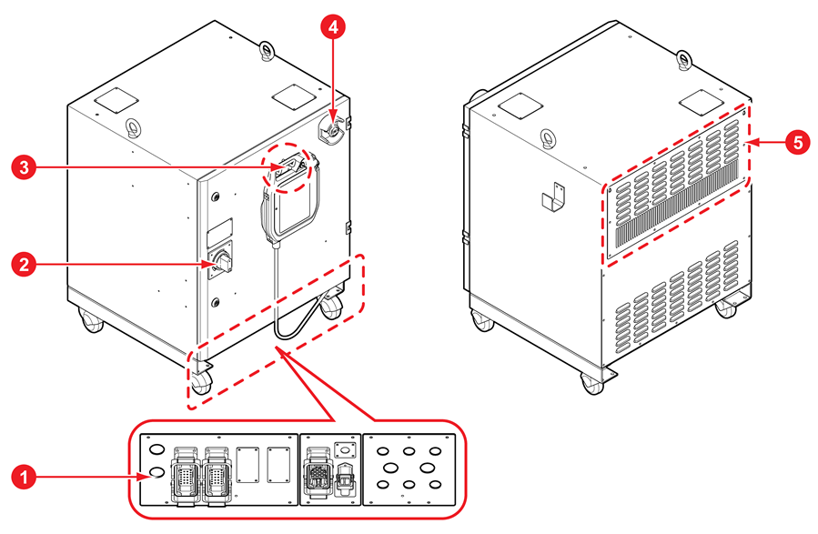

# 1.1.1 제어기

## 수직다관절로봇 제어기

| 번호 | 이름 | 설명 |
| :--- | :--- | :--- |
|  | 연결부 | 제어기에 기구 및 티치 펜던트를 연결하거나 응용 장치를 내부의 모듈과 연결하는 통로입니다. |
|  | 전원 스위치 | 제어기의 주전원을 켜거나 끕니다. |
|  | TP 보관용 고리 | 티치 펜던트를 걸어 보관합니다. |
|  | 비상 정지 스위치 | 긴급 상황 발생 시 비상 정지 스위치를 눌러 로봇의 동작을 정지시킵니다. |
|  | 냉각팬 | 제어기 내부의 가열된 공기를 외부로 강제 유출시키는 장치입니다. |

