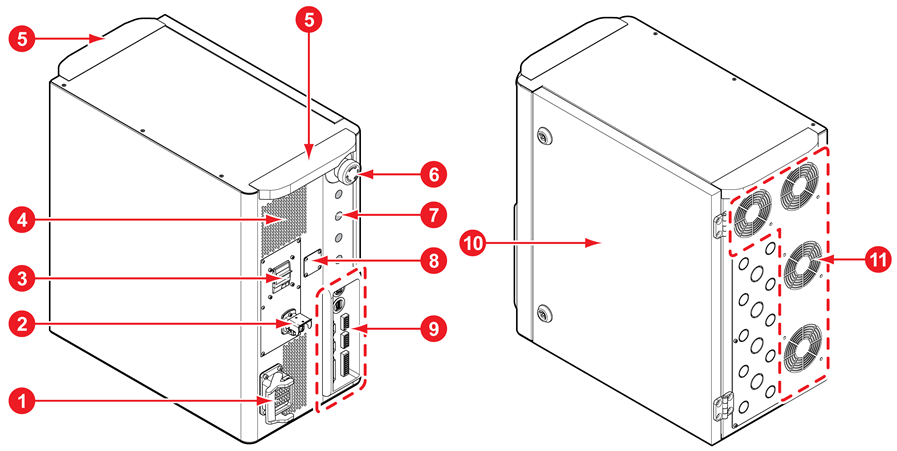

# 1.1.1 Controller

#### Vertical Articulated Robot Controller 

| No. | Name | Description |
| :--- | :--- | :--- |
|   | Connection part | A passage for connecting instruments and the teach pendant to the controller or for connecting application devices to internal modules |
|   | Power switch | Turns on or off the power of the controller |
|   | Hook for storing the TP | Used for hanging the teach pendant or storing it |
|   | Emergency stop switch | Causes the robot to stop operating when pressed in case of an emergency |
|   | Cooling fan | A device that forcibly discharges the heated air inside the controller |

#### Collaborative Robot Controller

| No. | Name | Description |
| :--- | :--- | :--- |
|  | Robot cable connector | A connector that has built-in communication and power lines, making it possible to connect the controller to the equipment. |
|  | Power connector | A connector that supplies power to the controller. |
|  | Power circuit breaker | The main power of the controller can be turned on or off with the power switch. |
|  | Vent | An air inflow passage for cooling the controller. |
|  | Handle | It is mounted on the front and rear of the controller and used for transportation. |
|  | Emergency stop switch | When an emergency situation occurs, the operation of the robot can be stopped by pressing the emergency stop switch. |
|  | Application device connection hole | A passage to be used when an application device needs to be connected using a cable, with an internal module. |
|  | Teach pendant connection hole | A passage for the connection of a teach pendant of direct-connection type. |
|  | I/O connection block | This connects peripheral devices to the controller. |
|  | Door | You can open the side of the controller by opening the door. |
|  | Cooling fan | It is a device that forcibly discharges the heated air from inside the controller. |

