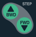
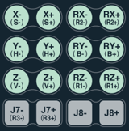


# 1.1.2 Teach Pendant 

Both the models, TP600 and TP630, are supported. This operation manual describes how to use a teach pendant based on the TP600 model. TP600 is a model developed exclusively for the Hi6 controller and provides a large touch screen.

<table>
  <thead>
    <tr>
      <th style="text-align:left">No.</th>
      <th style="text-align:left">Name</th>
      <th style="text-align:left">Description</th>
    </tr>
  </thead>
  <tbody>
    <tr>
      <td style="text-align:left">
        
      </td>
      <td style="text-align:left">Operation key</td>
      <td style="text-align:left">Controls the robot’s operation, inputs commands, or selects a menu</td>
    </tr>
    <tr>
      <td style="text-align:left">
        
      </td>
      <td style="text-align:left">Mode switch</td>
      <td style="text-align:left">You can turn the mode switch to select
  the operation mode (
        manual/
        automatic/
        remote). If you remove the mode
  switch from the teach pendant, the selected operation mode will be locked.</td>
    </tr>
    <tr>
      <td style="text-align:left">
        
      </td>
      <td style="text-align:left">Display</td>
      <td style="text-align:left">The touch screen enables you to check and
  change the operation status and set the information of the robot.</td>
    </tr>
    <tr>
      <td style="text-align:left">
        
      </td>
      <td style="text-align:left">Emergency stop switch</td>
      <td style="text-align:left">Causes the robot to stop operating when
  pressed in case of an emergency</td>
    </tr>
    <tr>
      <td style="text-align:left">
        
      </td>
      <td style="text-align:left">USB connection port</td>
      <td style="text-align:left">Can be used to connect a device that can be accessed by USB communication such as a transportable storage device 
      Note that the exFAT format often used for large-storage USBs is not supported.
      </td>
    </tr>
    <tr>
      <td style="text-align:left">
        
      </td>
      <td style="text-align:left">Mounting bracket</td>
      <td style="text-align:left">Holds or hangs the teach pendant to store it</td>
    </tr>
    <tr>
      <td style="text-align:left">
        
      </td>
      <td style="text-align:left">Enabling switch</td>
      <td
      style="text-align:left">
        
A switch that is to be used as a safety switch when
  operating the robot with the teach pendant in manual mode

        <ul>
          <li>Stage
       1, Stage 3: The robot operation will stop. In the case of Stage 3, the
       switch will recover to Stage 1 without going through Stage 2.</li>
          <li>Stage 2: You can operate the robot.</li>
        </ul>
        </td>
    </tr>
    <tr>
      <td style="text-align:left">
        
      </td>
      <td style="text-align:left">Cable connection connector</td>
      <td
      style="text-align:left">A connector for connecting the cable to the controller</td>
    </tr>
  </tbody>
</table>

 

## Operation Keys 

<table class=MsoNormalTable border=0 cellpadding=0 style='mso-cellspacing:1.5pt;
 mso-yfti-tbllook:1184'>
 <thead>
  <tr style='mso-yfti-irow:0;mso-yfti-firstrow:yes'>
   <td style='padding:.75pt .75pt .75pt .75pt'>
   
<b>Operation Key<o:p></o:p></b>

   </td>
   <td style='padding:.75pt .75pt .75pt .75pt'>
   
<b>Name<o:p></o:p></b>

   </td>
   <td style='padding:.75pt .75pt .75pt .75pt'>
   
<b>Description<o:p></o:p></b>

   </td>
  </tr>
 </thead>
 <tr style='mso-yfti-irow:1'>
  <td style='padding:.75pt .75pt .75pt .75pt'>
  

  </td>
  <td style='padding:.75pt .75pt .75pt .75pt'>
  
SHIFT

  </td>
  <td style='padding:.75pt .75pt .75pt .75pt'>
  
You must use this button when you want to execute the
  function displayed on the top part of the key (blue-green). 

  <ul type=disc>
   <li class=MsoNormal style='mso-margin-top-alt:auto;mso-margin-bottom-alt:
       auto;mso-list:l3 level1 lfo2;tab-stops:list 36.0pt'>When
       this key is pressed together while operating the [Fast step forward/
       backward] functions, the step forward/ backward can be activated in high
       speeds</li>
   <li class=MsoNormal style='mso-margin-top-alt:auto;mso-margin-bottom-alt:
       auto;mso-list:l3 level1 lfo2;tab-stops:list 36.0pt'>When
       editing a string from the input display window, you can move the cursor
       by pressing the button with the &lt;←/→&gt; key. </li>
   <li class=MsoNormal style='mso-margin-top-alt:auto;mso-margin-bottom-alt:
       auto;mso-list:l3 level1 lfo2;tab-stops:list 36.0pt'>From
       the task edit window, you can move the cursor by each screen by pressing
       the button with the &lt;↑/↓&gt; key. </li>
  </ul>
  </td>
 </tr>
 <tr style='mso-yfti-irow:2'>
  <td style='padding:.75pt .75pt .75pt .75pt'>
  

  </td>
  <td style='padding:.75pt .75pt .75pt .75pt'>
  
CTRL

  </td>
  <td style='padding:.75pt .75pt .75pt .75pt'>
  
Specific functions can be executed only
  with &lt;<b>CTRL</b>&gt; key.

  </td>
 </tr>
 <tr style='mso-yfti-irow:3'>
  <td style='padding:.75pt .75pt .75pt .75pt'>
  

  </td>
  <td style='padding:.75pt .75pt .75pt .75pt'>
  
STEP FWD/BWD

  </td>
  <td style='padding:.75pt .75pt .75pt .75pt'>
  
Used when going forward or backward step by step from
  Manual mode. 

  <ul type=disc>
   <li class=MsoNormal style='mso-margin-top-alt:auto;mso-margin-bottom-alt:
       auto;mso-list:l5 level1 lfo3;tab-stops:list 36.0pt'>See
       the [cond.set &gt; Step fwd/bwd max. speed] for the detailed description.</li>
   <li class=MsoNormal style='mso-margin-top-alt:auto;mso-margin-bottom-alt:
       auto;mso-list:l5 level1 lfo3;tab-stops:list 36.0pt'>When
       this key is pressed together with &lt;<b>SHIFT</b>&gt;, fast step
       forward/ backward functions can be activated.</li>
  </ul>
  </td>
 </tr>
 <tr style='mso-yfti-irow:4'>
  <td style='padding:.75pt .75pt .75pt .75pt'>
  

  </td>
  <td style='padding:.75pt .75pt .75pt .75pt'>
  
ESC

  </td>
  <td style='padding:.75pt .75pt .75pt .75pt'>
  
Used to cancel key inputs or various functions in
  process. 

  <ul type=disc>
   <li class=MsoNormal style='mso-margin-top-alt:auto;mso-margin-bottom-alt:
       auto;mso-list:l11 level1 lfo4;tab-stops:list 36.0pt'>This
       key has also function to return to the upper level without saving.</li>
  </ul>
  </td>
 </tr>
 <tr style='mso-yfti-irow:5'>
  <td style='padding:.75pt .75pt .75pt .75pt'>
  

  </td>
  <td style='padding:.75pt .75pt .75pt .75pt'>
  
Axis Operation

  </td>
  <td style='padding:.75pt .75pt .75pt .75pt'>
  
Used for robot operations according to a coordinate
  system. 

  <ul type=disc>
   <li class=MsoNormal style='mso-margin-top-alt:auto;mso-margin-bottom-alt:
       auto;mso-list:l12 level1 lfo5;tab-stops:list 36.0pt'>Each
       axis moves in the joint coordinate system.</li>
   <li class=MsoNormal style='mso-margin-top-alt:auto;mso-margin-bottom-alt:
       auto;mso-list:l12 level1 lfo5;tab-stops:list 36.0pt'>A
       robot moves in rectangular directions in the robot coordinate system.</li>
  </ul>
  </td>
 </tr>
 <tr style='mso-yfti-irow:6'>
  <td style='padding:.75pt .75pt .75pt .75pt'>
  

  </td>
  <td style='padding:.75pt .75pt .75pt .75pt'>
  
Direction

  </td>
  <td style='padding:.75pt .75pt .75pt .75pt'>
  
Used for moving the cursor on the TP panel. 

  <ul type=disc>
   <li class=MsoNormal style='mso-margin-top-alt:auto;mso-margin-bottom-alt:
       auto;mso-list:l1 level1 lfo6;tab-stops:list 36.0pt'>&lt;↑/↓&gt;
       keys move steps and functions.</li>
   <li class=MsoNormal style='mso-margin-top-alt:auto;mso-margin-bottom-alt:
       auto;mso-list:l1 level1 lfo6;tab-stops:list 36.0pt'>&lt;←/→&gt;
       keys move parameters of recorded steps or functions.</li>
  </ul>
  </td>
 </tr>
 <tr style='mso-yfti-irow:7'>
  <td style='padding:.75pt .75pt .75pt .75pt'>
  

  </td>
  <td style='padding:.75pt .75pt .75pt .75pt'>
  
R-code

  </td>
  <td style='padding:.75pt .75pt .75pt .75pt'>
  
Used for a quick execution of a registered function. 

  <ul type=disc>
   <li class=MsoNormal style='mso-margin-top-alt:auto;mso-margin-bottom-alt:
       auto;mso-list:l14 level1 lfo7;tab-stops:list 36.0pt'>Pressing
       R-code key leads to a pop-up window for inputting a code number. For
       more information, refer to &quot;8. R Codes&quot;.</li>
   <li class=MsoNormal style='mso-margin-top-alt:auto;mso-margin-bottom-alt:
       auto;mso-list:l14 level1 lfo7;tab-stops:list 36.0pt'>R-code
       key followed by &lt;<b>ENTER </b>&gt; without a code number is the same
       as “R0 : Step counter reset”.</li>
   <li class=MsoNormal style='mso-margin-top-alt:auto;mso-margin-bottom-alt:
       auto;mso-list:l14 level1 lfo7;tab-stops:list 36.0pt'>In
       a yes-no question, pressing R-code means the negative answer.</li>
  </ul>
  </td>
 </tr>
 <tr style='mso-yfti-irow:8'>
  <td style='padding:.75pt .75pt .75pt .75pt'>
  

  </td>
  <td style='padding:.75pt .75pt .75pt .75pt'>
  
Enter

  </td>
  <td style='padding:.75pt .75pt .75pt .75pt'>
  
Used for the reflection of input data. 

  <ul type=disc>
   <li class=MsoNormal style='mso-margin-top-alt:auto;mso-margin-bottom-alt:
       auto;mso-list:l6 level1 lfo8;tab-stops:list 36.0pt'>Contents
       of Input frame is reflected on Edit frame if using this key for
       completing number input. </li>
   <li class=MsoNormal style='mso-margin-top-alt:auto;mso-margin-bottom-alt:
       auto;mso-list:l6 level1 lfo8;tab-stops:list 36.0pt'>This
       key can be also used when selecting permit (Yes) for response of
       Permit/Refuse (Yes/No).</li>
   <li class=MsoNormal style='mso-margin-top-alt:auto;mso-margin-bottom-alt:
       auto;mso-list:l6 level1 lfo8;tab-stops:list 36.0pt'>When
       you press this key from the sentence cursor, it will switch to the word
       cursor, with which the parameter can be edited. </li>
  </ul>
  </td>
 </tr>
 <tr style='mso-yfti-irow:9'>
  <td style='padding:.75pt .75pt .75pt .75pt'>
  

  </td>
  <td style='padding:.75pt .75pt .75pt .75pt'>
  
Motor ON

  </td>
  <td style='padding:.75pt .75pt .75pt .75pt'>
  
Used to supply Servo power to the motor in each axis of
  Robot.

  <ul type=disc>
   <li class=MsoNormal style='mso-margin-top-alt:auto;mso-margin-bottom-alt:
       auto;mso-list:l4 level1 lfo9;tab-stops:list 36.0pt'>The
       [MOTOR ON] lamp flickers in Manual mode.</li>
   <li class=MsoNormal style='mso-margin-top-alt:auto;mso-margin-bottom-alt:
       auto;mso-list:l4 level1 lfo9;tab-stops:list 36.0pt'>The
       [MOTOR ON] lamp turns on in AUTO mode.</li>
  </ul>
  </td>
 </tr>
 <tr style='mso-yfti-irow:10'>
  <td style='padding:.75pt .75pt .75pt .75pt'>
  

  </td>
  <td style='padding:.75pt .75pt .75pt .75pt'>
  
START

  </td>
  <td style='padding:.75pt .75pt .75pt .75pt'>
  
Used to automatically play a job program.

  <ul type=disc>
   <li class=MsoNormal style='mso-margin-top-alt:auto;mso-margin-bottom-alt:
       auto;mso-list:l15 level1 lfo10;tab-stops:list 36.0pt'>Under
       the condition that the mode switch lies in AUTO, and the motor is ON, <START>key
       plays the job program automatically.</li>
   <li class=MsoNormal style='mso-margin-top-alt:auto;mso-margin-bottom-alt:
       auto;mso-list:l15 level1 lfo10;tab-stops:list 36.0pt'>If
       AUTO operation of Robot is started, the [START] lamp turns on and the
       [STOP] lamp turns off.</li>
  </ul>
  </td>
 </tr>
 <tr style='mso-yfti-irow:11'>
  <td style='padding:.75pt .75pt .75pt .75pt'>
  

  </td>
  <td style='padding:.75pt .75pt .75pt .75pt'>
  
STOP

  </td>
  <td style='padding:.75pt .75pt .75pt .75pt'>
  
Used to temporarily stop the robot during AUTO operation.
  

  <ul type=disc>
   <li class=MsoNormal style='mso-margin-top-alt:auto;mso-margin-bottom-alt:
       auto;mso-list:l2 level1 lfo11;tab-stops:list 36.0pt'>If
       Robot stop, the [STOP] lamp turns on and the [START] lamp turns off. </li>
   <li class=MsoNormal style='mso-margin-top-alt:auto;mso-margin-bottom-alt:
       auto;mso-list:l2 level1 lfo11;tab-stops:list 36.0pt'>When
       the robot stops, there is no risk of colliding with other devices
       because it stops on the originally planned path.</li>
  </ul>
  </td>
 </tr>
 <tr style='mso-yfti-irow:12'>
  <td style='padding:.75pt .75pt .75pt .75pt'>
  

  </td>
  <td style='padding:.75pt .75pt .75pt .75pt'>
  
History

  </td>
  <td style='padding:.75pt .75pt .75pt .75pt'>
  
Used for checking previous working history.

  <ul type=disc>
   <li class=MsoNormal style='mso-margin-top-alt:auto;mso-margin-bottom-alt:
       auto;mso-list:l17 level1 lfo12;tab-stops:list 36.0pt'>This
       displays the History message box that records the execution history,
       error history, message history etc. of task command</li>
   <li class=MsoNormal style='mso-margin-top-alt:auto;mso-margin-bottom-alt:
       auto;mso-list:l17 level1 lfo12;tab-stops:list 36.0pt'>When
       you press this once, it shows the output history of the main board and
       when you press it again, it shows the output history of the teach
       pendant.</li>
  </ul>
  </td>
 </tr>
 <tr style='mso-yfti-irow:13'>
  <td style='padding:.75pt .75pt .75pt .75pt'>
  

  </td>
  <td style='padding:.75pt .75pt .75pt .75pt'>
  
GUN

  </td>
  <td style='padding:.75pt .75pt .75pt .75pt'>
  
Used for Spot and Arc welding applications, and the LED
  shows on-off status.

  <ul type=disc>
   <li class=MsoNormal style='mso-margin-top-alt:auto;mso-margin-bottom-alt:
       auto;mso-list:l13 level1 lfo13;tab-stops:list 36.0pt'>When
       you press this button with the [SHIFT (FAST)] key, GUN1 signal will be
       outputted manually.</li>
   <li class=MsoNormal style='mso-margin-top-alt:auto;mso-margin-bottom-alt:
       auto;mso-list:l13 level1 lfo13;tab-stops:list 36.0pt'>In
       the case of a spot welding, when you press with the &lt;<b>REC</b>&gt;
       key, SPOT command follows MOVE automatically.</li>
   <li class=MsoNormal style='mso-margin-top-alt:auto;mso-margin-bottom-alt:
       auto;mso-list:l13 level1 lfo13;tab-stops:list 36.0pt'>When
       this LED is turned on during automatic operation using the arc welding,
       the robot will actually execute the arc welding. When this LED is turned
       off, it will not execute arc welding and just check the taught trace.</li>
  </ul>
  </td>
 </tr>
 <tr style='mso-yfti-irow:14'>
  <td style='padding:.75pt .75pt .75pt .75pt'>
  

  </td>
  <td style='padding:.75pt .75pt .75pt .75pt'>
  
TOOL / COORD

  </td>
  <td style='padding:.75pt .75pt .75pt .75pt'>
  
Used for selecting a reference coordinate system.

  <ul type=disc>
   <li class=MsoNormal style='mso-margin-top-alt:auto;mso-margin-bottom-alt:
       auto;mso-list:l16 level1 lfo14;tab-stops:list 36.0pt'>You
       can select a coordinate system (axis, Cartesian, tool) to move the robot
       when pressing the axis operation key. </li>
   <li class=MsoNormal style='mso-margin-top-alt:auto;mso-margin-bottom-alt:
       auto;mso-list:l16 level1 lfo14;tab-stops:list 36.0pt'>When
       you press with the &lt;<b>SHIFT</b>&gt; key, the message box to select
       the tool number will open.</li>
  </ul>
  </td>
 </tr>
 <tr style='mso-yfti-irow:15'>
  <td style='padding:.75pt .75pt .75pt .75pt'>
  

  </td>
  <td style='padding:.75pt .75pt .75pt .75pt'>
  
POS.MOD / REC

  </td>
  <td style='padding:.75pt .75pt .75pt .75pt'>
  
Used when recording steps in program, namely when adding
  MOVE command.

  <ul type=disc>
   <li class=MsoNormal style='mso-margin-top-alt:auto;mso-margin-bottom-alt:
       auto;mso-list:l9 level1 lfo15;tab-stops:list 36.0pt'>MOVE
       command inserted by this key is consisted of a hidden pose.</li>
   <li class=MsoNormal style='mso-margin-top-alt:auto;mso-margin-bottom-alt:
       auto;mso-list:l9 level1 lfo15;tab-stops:list 36.0pt'>You
       can insert the next step when the cursor is placed at a step</li>
   <li class=MsoNormal style='mso-margin-top-alt:auto;mso-margin-bottom-alt:
       auto;mso-list:l9 level1 lfo15;tab-stops:list 36.0pt'>It
       is possible to modify a selected step position by pressing with the &lt;<b>SHIFT</b>&gt;
       key. </li>
  </ul>
  </td>
 </tr>
 <tr style='mso-yfti-irow:16'>
  <td style='padding:.75pt .75pt .75pt .75pt'>
  

  </td>
  <td style='padding:.75pt .75pt .75pt .75pt'>
  
PROG / STEP

  </td>
  <td style='padding:.75pt .75pt .75pt .75pt'>
  
Used for selecting steps.

  <ul type=disc>
   <li class=MsoNormal style='mso-margin-top-alt:auto;mso-margin-bottom-alt:
       auto;mso-list:l8 level1 lfo16;tab-stops:list 36.0pt'>With
       &lt;<b>SHIFT</b>&gt; key, this key makes a job program window pop up. </li>
   <li class=MsoNormal style='mso-margin-top-alt:auto;mso-margin-bottom-alt:
       auto;mso-list:l8 level1 lfo16;tab-stops:list 36.0pt'>When
       you press the [PROG] key twice, the program list is displayed.</li>
  </ul>
  </td>
 </tr>
 <tr style='mso-yfti-irow:17'>
  <td style='padding:.75pt .75pt .75pt .75pt'>
  

  </td>
  <td style='padding:.75pt .75pt .75pt .75pt'>
  
MECH

  </td>
  <td style='padding:.75pt .75pt .75pt .75pt'>
  
Used for selecting the mechanism and unit.

  <ul type=disc>
   <li class=MsoNormal style='mso-margin-top-alt:auto;mso-margin-bottom-alt:
       auto;mso-list:l7 level1 lfo17;tab-stops:list 36.0pt'>For
       the mechanism, the robot is 0 and for additional axis, it follows the
       setting set by the user in the initial setting menu. </li>
   <li class=MsoNormal style='mso-margin-top-alt:auto;mso-margin-bottom-alt:
       auto;mso-list:l7 level1 lfo17;tab-stops:list 36.0pt'>When
       you press this button with the SHIFT key, you can use this button for
       the unit. Unit is used when the user wants to configure the program in
       specific combination of units.</li>
  </ul>
  </td>
 </tr>
 <tr style='mso-yfti-irow:18;mso-yfti-lastrow:yes'>
  <td style='padding:.75pt .75pt .75pt .75pt'>
  

  </td>
  <td style='padding:.75pt .75pt .75pt .75pt'>
  
Number key

  </td>
  <td style='padding:.75pt .75pt .75pt .75pt'>
  
Used for inputting numbers or deleting.

  <ul type=disc>
   <li class=MsoNormal style='mso-margin-top-alt:auto;mso-margin-bottom-alt:
       auto;mso-list:l0 level1 lfo18;tab-stops:list 36.0pt'>With
       &lt;<b>SHIFT</b>&gt; key, you can enter the ‘+’ and ‘-’ signs or delete
       a command sentence or a parameter.</li>
   <li class=MsoNormal style='mso-margin-top-alt:auto;mso-margin-bottom-alt:
       auto;mso-list:l0 level1 lfo18;tab-stops:list 36.0pt'>&lt;<b>BS</b>&gt;
       key deletes character by character backward. (Backspace). Also, when
       editing command sentence, all parameter values are deleted. </li>
  </ul>
  </td>
 </tr>
</table>

<o:p>&nbsp;</o:p>

</body>

</html>
