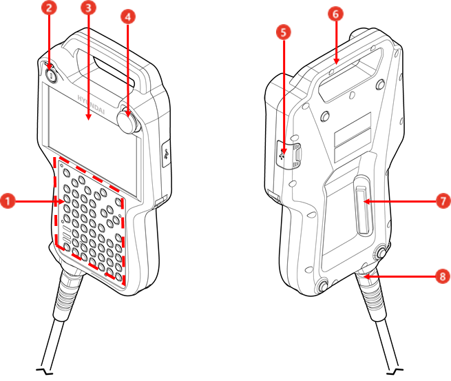
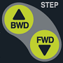
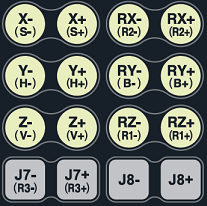
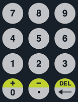

# 1.1.2 티치 펜던트

티치 펜던트는 TP600과 TP630을 지원합니다. 본 조작 설명서에서는 _TP630_ 모델을 기준으로 사용 방법을 설명합니다.

TP630은 기존 Hi5a 제어기와 동일한 조작키 사용 환경을 제공합니다.

<table>
  <thead>
    <tr>
      <th style="text-align:left">번호</th>
      <th style="text-align:left">이름</th>
      <th style="text-align:left">설명</th>
    </tr>
  </thead>
  <tbody>
    <tr>
      <td style="text-align:left">
        
      </td>
      <td style="text-align:left">조작키</td>
      <td style="text-align:left">로봇의 동작을 제어하고
        명령을 입력하거나 메뉴를
        선택하고 설정합니다.</td>
    </tr>
    <tr>
      <td style="text-align:left">
        
      </td>
      <td style="text-align:left">모드 스위치</td>
      <td style="text-align:left">모드 스위치를 돌려 운전
        모드(
        수동/
        자동/
        원격)를 선택합니다. 티치
        펜던트에서 모드 스위치
        키를 빼면 선택된 운전
        모드로 잠금 설정됩니다.</td>
    </tr>
    <tr>
      <td style="text-align:left">
        
      </td>
      <td style="text-align:left">디스플레이</td>
      <td style="text-align:left">터치 스크린으로 로봇의
        동작 상태와 설정 정보를
        확인 및 변경합니다.</td>
    </tr>
    <tr>
      <td style="text-align:left">
        
      </td>
      <td style="text-align:left">비상 정지 스위치</td>
      <td style="text-align:left">긴급 상황 발생 시 비상
        정지 스위치를 눌러 로봇의
        동작을 정지시킵니다.</td>
    </tr>
    <tr>
      <td style="text-align:left">
        
      </td>
      <td style="text-align:left">USB 연결 포트</td>
      <td style="text-align:left">이동식 저장 장치 등 USB 통신으로 접속 가능한 장치를 연결합니다. 
        대용량 USB에 사용되는 exFAT포맷은 지원하지 않으므로 유의하십시오.
      </td>
    </tr>
    <tr>
      <td style="text-align:left">
        
      </td>
      <td style="text-align:left">마운팅 브래킷</td>
      <td style="text-align:left">티치 펜던트를 들거나
        걸어 보관합니다.</td>
    </tr>
    <tr>
      <td style="text-align:left">
        
      </td>
      <td style="text-align:left">인에이블링 스위치</td>
      <td
      style="text-align:left">
        
수동 모드에서 티치 펜던트로
          로봇 조작 시, 안전 스위치로
          사용합니다.

        <ul>
          <li>1단, 3단: 로봇 운전이 정지됩니다.
            3단일 경우, 2단을 거치지
            않고 1단으로 복귀합니다.</li>
          <li>2단: 로봇을 조작할 수
            있습니다.</li>
        </ul>
        </td>
    </tr>
    <tr>
      <td style="text-align:left">
        
      </td>
      <td style="text-align:left">케이블 연결 커넥터</td>
      <td
      style="text-align:left">제어기와 연결하기 위한
        케이블을 연결하는 커넥터입니다.</td>
    </tr>
  </tbody>
</table>

## 조작키

<table>
  <thead>
    <tr>
      <th style="text-align:left">조작키</th>
      <th style="text-align:left">이름</th>
      <th style="text-align:left">설명</th>
    </tr>
  </thead>
  <tbody>
    <tr>
      <td style="text-align:left">
        
      </td>
      <td style="text-align:left">SHIFT</td>
      <td style="text-align:left">
      
키의 상부(연두색)에 표시된 기능을 실행할 때는 함께 사용합니다. 

        <ul>
          <li><<b>SHIFT</b>> 키를 특정 키와 함께
            누르면 해당 키의 기능이
            전환됩니다.</li>
          <li>[스텝 전/후진] 기능 조작시 이 키를 함께 누르면, 고속 스텝 전/후진 기능이 동작합니다.</li>
          <li>입력 표시창에서 문자열을 편집할 때는, &lt;←/→&gt; 방향키와 같이 눌러 커서(cursor)를 이동시킬 수 있습니다. </li>
          <li>JOB 편집 창에서 &lt;↑/↓&gt;
            키와 함께 누르면 사용
            중인 화면을 전환할 수
            있습니다.</li>
        </ul>
      </td>
    </tr>
    <tr>
      <td style="text-align:left">
        
      </td>
      <td style="text-align:left">CTRL</td>
      <td style="text-align:left"><<b>CTRL</b>> 키를 특정 키와 함께
        누르면 해당 키에 정의된
        기능이 실행됩니다.</td>
    </tr>
    <tr>
      <td style="text-align:left">
        
      </td>
      <td style="text-align:left">스텝 전/후진</td>
      <td style="text-align:left">
      
수동모드에서 스텝단위로 전진 또는 후진할 때 사용합니다. 

      <ul>
          <li>자세한 내용은 [<b>조건설정</b>] → [2: 스텝 전/후진시 최고속]을 참고하십시오.</li>
          <li><<b>SHIFT</b>>키와 함께 누르면 고속 스텝 전/후진 기능이 동작합니다.
      </ul>
   </td>
    </tr>
    <tr>
      <td style="text-align:left">
        
      </td>
      <td style="text-align:left">ESC</td>
      <td style="text-align:left">
      
현재 상태나, 화면을 취소합니다. 

        <ul>
          <li>키 입력이나 진행 중인
            각종 기능을 취소합니다.</li>
          <li><<b>ESC</b>> 키를 누르면 변경
            내용을 저장하지 않고
            상위 레벨로 전환할 수
            있습니다.</li>
        </ul>
      </td>
    </tr>
    <tr>
      <td style="text-align:left">
        
      </td>
      <td style="text-align:left">축 조작키</td>
      <td style="text-align:left">
        
로봇의 각 축을 조작합니다. 

        <ul>
          <li>조인트 좌표계인 경우 각 축을 구동합니다.</li>
          <li>로봇 좌표계인 경우 직교방향으로 구동합니다.</li>
        </ul>
      </td>
    </tr>
    <tr>
      <td style="text-align:left">
        
      </td>
      <td style="text-align:left">방향키</td>
      <td style="text-align:left">
        
화면의 선택 옵션이나 편집위치를 이동합니다. 

        <ul>
          <li>&lt;↑/↓&gt;
            키를 누르면 스텝이나 펑션을 이동합니다.</li>
          <li>단어 커서 상태에서 &lt;←/→&gt;
            방향키를 누르면 기록된 스텝이나
            다른 기능 인수로 이동합니다.</li>
        </ul>
      </td>
    </tr>
    <tr>
      <td style="text-align:left">
        
      </td>
      <td style="text-align:left">R코드</td>
      <td style="text-align:left">
        
코드별로 정의된 기능을 신속히 수행합니다. 

        <ul>
          <li>R 코드로 등록된 기능을 수행하거나RESET기능이 필요할 때 사용합니다.</li>
          <li>[R..(NO)]를 누른 후 <<b>ENTER</b>>키를 누르면, R코드의 “R0 : 스텝카운터 리셋”과 동일한 RESET 기능이 수행됩니다. 자세한 설명은 R코드 기능을 참고하십시오.</li>
          <li>허락/거부(Yes/No)의 응답에 대해 거부(No)를 선택할 때 사용합니다.</li>
        </ul>
      </td>
    </tr>
    <tr>
      <td style="text-align:left">
        
      </td>
      <td style="text-align:left">Enter</td>
      <td style="text-align:left">
      
입력 정보가 반영됩니다. 

        <ul>
          <li>수치 입력 시 <<b>ENTER</b>> 키를
            누르면 입력값이 설정에
            적용됩니다.</li>
          <li>허락/거부(Yes/No)의 응답에
            대해 <<b>ENTER</b>> 키를 누르면
            허락(Yes)이 선택됩니다.</li>
          <li>수동 모드에서 명령문
            수정 시, 문장 커서 상태에서
            <<b>ENTER</b>> 키를 누르면 명령문
            인수를 편집할 수 있는
            단어 커서 상태로 전환됩니다.</li>
        </ul>
      </td>
    </tr>
    <tr>
      <td style="text-align:left">
        
      </td>
      <td style="text-align:left">모터온</td>
      <td style="text-align:left">
        
로봇 각 축의 모터에 서보
          전원을 공급합니다.

        <ul>
          <li>수동 모드에서 <<b>모터온</b>>
            키를 누르면 모터 램프가
            깜빡입니다.</li>
          <li>자동 모드에서 <<b>모터온</b>>
            키를 누르면 모터 램프가
            켜집니다.</li>
        </ul>
      </td>
    </tr>
   <tr>
      <td style="text-align:left">
        
      </td>
      <td style="text-align:left">시작</td>
      <td style="text-align:left"><<b>시작</b>> 키를 누르면 로봇에
        작성된 프로그램의 자동
        운전을 시작합니다. 로봇의
        자동 운전이 시작되면
        시작 램프가 켜지고 정지
        램프가 꺼집니다.</td>
    </tr>
   <tr>
      <td style="text-align:left">
        
      </td>
      <td style="text-align:left">정지</td>
      <td style="text-align:left">
        
<<b>정지</b>> 키를 누르면 자동
          운전 중인 로봇이 일시적으로
          멈춥니다.

        <ul>
          <li>로봇이 정지하면 정지
            램프가 켜지고 시작 램프가
            꺼집니다.</li>
          <li>로봇은 작성된 프로그램의
            경로 수행 중에 정지된
            상태이므로 주변 장치와
            충돌할 위험은 없습니다.</li>
        </ul>
      </td>
    </tr>
        <tr>
      <td style="text-align:left">
        
      </td>
      <td style="text-align:left">지난화면</td>
      <td style="text-align:left">
        
지난 운전 이력을 보여줍니다.

        <ul>
          <li>작업 명령문의 실행 이력이나 에러 이력, 메시지 이력 등이 기록되는 지난 화면 대화상자를 나타냅니다.</li>
          <li>한 번 누르면, 메인보드가 출력하는 이력을 보여주고, 한 번 더 누르면 티치펜던트가 출력하는 이력을 보여줍니다.</li>
        </ul>
      </td>
    </tr>
        <tr>
      <td style="text-align:left">
        
      </td>
      <td style="text-align:left">GUN</td>
      <td style="text-align:left">
        
스텝 기록과 동시에 GUN 신호의 기록 여부를 결정합니다. 기능 선택 상태는 좌측의 LED에 표시됩니다.

        <ul>
          <li><<b>SHIFT</b>>키와 함께 누르면 GUN1 신호가 수동 출력됩니다.</li>
          <li>아크 용접을 사용할 때, 자동 운전시에 LED가 점등되어 있으면 실제로 아크 용접을 진행하고, LED가 소등되어 있으면 아크 용접을 진행하지 않고 티칭된 궤적만을 확인합니다.</li>
        </ul>
      </td>
    </tr>
        <tr>
      <td style="text-align:left">
        
      </td>
      <td style="text-align:left">툴/좌표계</td>
      <td style="text-align:left">
        
로봇 구동시 기준 좌표계를 선택합니다.

        <ul>
          <li>축 조작 키를 누를 경우 로봇을 움직일 좌표계(축, 직교, TOOL)를 선택합니다.
          </li>
          <li><<b>SHIFT</b>>와 동시에 누르면 툴 번호를 선택 받는 대화상자가 열립니다.</li>
        </ul>
      </td>
    </tr>
        <tr>
      <td style="text-align:left">
        
      </td>
      <td style="text-align:left">위치수정/기록</td>
      <td style="text-align:left">
        
프로그램내의 스텝을 기록할 때 즉, MOVE명령을 추가할 때 사용합니다.

        <ul>
          <li>이 때 입력되는 MOVE 명령은 숨은 포즈로 이루어진 명령입니다.</li>
          <li>커서가 스텝에 위치해 있을 때에는 다음 스텝을 삽입할 수 있습니다. </li>
          <li><<b>SHIFT</b>>키와 함께 누르면 선택된 스텝의 위치를 수정할 때 사용합니다. </li>
        </ul>
      </td>
    </tr>
        <tr>
      <td style="text-align:left">
        
      </td>
      <td style="text-align:left">프로그램/스텝</td>
      <td style="text-align:left">
        
스텝을 선택할 때 사용합니다.

        <ul>
          <li><<b>SHIFT</b>>키와 함께 누르면 프로그램을 선택하는데 사용합니다. </li>
          <li><<b>프로그램</b>>키를 2번 누르면, 프로그램 목록이 표시됩니다.</li>
        </ul>
      </td>
    </tr>
        <tr>
      <td style="text-align:left">
        
      </td>
      <td style="text-align:left">유닛/메커니즘</td>
      <td style="text-align:left">
        
메커니즘과 유닛을 선택할 때 사용합니다.

        <ul>
          <li>메커니즘은 로봇이 0번이고 부가축에 대해서는 사용자가 초기화 설정 메뉴에서 설정하는데 따릅니다.</li>
          <li>유닛은 <<b>SHIFT</b>>키를 누른 상태에서 이 키를 조작하여 선택할 수 있습니다. 유닛은 메커니즘의 조합으로 사용자가 특정 조합의 유닛으로 프로그램을 구성하고자 할 때 사용합니다.</li>
        </ul>
      </td>
    </tr>
    <tr>
      <td style="text-align:left">
        
      </td>
      <td style="text-align:left">
        
숫자키

      </td>
      <td style="text-align:left">
      
숫자를 입력하거나 삭제합니다.

      <ul>
          <li><<b>SHIFT</b>>키와 함께 누르면
            부호(- / +)나 쉼표(,)를 입력하거나,
            명령문 또는 인수를 삭제(DEL)할
            수 있습니다.</li>
          <li><<b>BS</b>>: 커서가 입력된
            위치에서 텍스트를 한
            글자씩 지웁니다.(backspace) 또한,
            명령어 편집 시 인수를
            선택하고 <<b>BS</b>> 키를 누르면
            인수 값 전체를 삭제할
            수 있습니다.</li>
        </ul>
      </td>
    </tr>
  </tbody>
</table>

