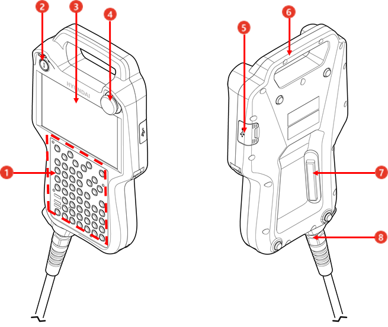
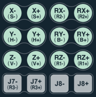

# 1.1.2 教学终端

本操作手册描述了如何使用基于TP630型号的教学终端。TP630是专为${cont_model}控制器开发的型号，并提供了一个大型触摸屏。

<table>
  <thead>
    <tr>
      <th style="text-align:left">编号</th>
      <th style="text-align:left">名称</th>
      <th style="text-align:left">描述</th>
    </tr>
  </thead>
  <tbody>
    <tr>
      <td style="text-align:left">
        
      </td>
      <td style="text-align:left">操作键</td>
      <td style="text-align:left">控制机器人的操作，输入命令或选择菜单</td>
    </tr>
    <tr>
      <td style="text-align:left">
        
      </td>
      <td style="text-align:left">模式开关</td>
      <td style="text-align:left">您可以旋转模式开关以选择操作模式 (
        手动/
        自动/
        远程)。如果您将模式开关从教学终端上移除，所选操作模式将被锁定。</td>
    </tr>
    <tr>
      <td style="text-align:left">
        
      </td>
      <td style="text-align:left">显示屏</td>
      <td style="text-align:left">触摸屏使您能够检查和更改操作状态并设定机器人的信息。</td>
    </tr>
    <tr>
      <td style="text-align:left">
        
      </td>
      <td style="text-align:left">紧急停止开关</td>
      <td style="text-align:left">在紧急情况下按下时使机器人停止操作</td>
    </tr>
    <tr>
      <td style="text-align:left">
        
      </td>
      <td style="text-align:left">USB连接端口</td>
      <td style="text-align:left">可用于连接可以通过USB通信访问的设备，如可移动存储设备 
      请使用FAT32格式。请注意，不支持exFAT、NTFS格式。
      </td>
    </tr>
    <tr>
      <td style="text-align:left">
        
      </td>
      <td style="text-align:left">安装支架</td>
      <td style="text-align:left">固定或悬挂教学终端以便存放</td>
    </tr>
    <tr>
      <td style="text-align:left">
        
      </td>
      <td style="text-align:left">启用开关</td>
      <td
      style="text-align:left">
        
在手动模式下使用教学终端操作机器人时作为安全开关的开关

        <ul>
          <li>阶段
       1，阶段 3：机器人操作将停止。在阶段 3 的情况下，
       开关将恢复到阶段 1，而无需经过阶段 2。</li>
          <li>阶段 2：您可以操作机器人。</li>
        </ul>
        </td>
    </tr>
    <tr>
      <td style="text-align:left">
        
      </td>
      <td style="text-align:left">电缆连接器</td>
      <td
      style="text-align:left">用于将电缆连接到控制器的连接器</td>
    </tr>
  </tbody>
</table>

 

#### 操作键 

<table class=MsoNormalTable border=0 cellpadding=0 style='mso-cellspacing:1.5pt;
 mso-yfti-tbllook:1184'>
 <thead>
  <tr style='mso-yfti-irow:0;mso-yfti-firstrow:yes'>
   <td style='padding:.75pt .75pt .75pt .75pt'>
   
<b>操作键<o:p></o:p></b>

   </td>
   <td style='padding:.75pt .75pt .75pt .75pt'>
   
<b>名称<o:p></o:p></b>

   </td>
   <td style='padding:.75pt .75pt .75pt .75pt'>
   
<b>描述<o:p></o:p></b>

   </td>
  </tr>
 </thead>
 <tr style='mso-yfti-irow:1'>
  <td style='padding:.75pt .75pt .75pt .75pt'>
  

  </td>
  <td style='padding:.75pt .75pt .75pt .75pt'>
  
SHIFT

  </td>
  <td style='padding:.75pt .75pt .75pt .75pt'>
  
您必须在想要执行键顶部（蓝绿色）显示的功能时使用此按钮。

  <ul type=disc>
   <li class=MsoNormal style='mso-margin-top-alt:auto;mso-margin-bottom-alt:
       auto;mso-list:l3 level1 lfo2;tab-stops:list 36.0pt'>当
       此键在操作[快速向前/
       向后]功能时一起按下，能够以高速激活向前/向后步进</li>
   <li class=MsoNormal style='mso-margin-top-alt:auto;mso-margin-bottom-alt:
       auto;mso-list:l3 level1 lfo2;tab-stops:list 36.0pt'>当
       从输入显示窗口编辑字符串时，可以通过按下带有`[←/→]`键的按钮来移动光标。</li>
   <li class=MsoNormal style='mso-margin-top-alt:auto;mso-margin-bottom-alt:
       auto;mso-list:l3 level1 lfo2;tab-stops:list 36.0pt'>从
       任务编辑窗口，可以通过按下带有`[↑/↓]`键的按钮逐屏移动光标。</li>
  </ul>
  </td>
 </tr>
 <tr style='mso-yfti-irow:2'>
  <td style='padding:.75pt .75pt .75pt .75pt'>
  

  </td>
  <td style='padding:.75pt .75pt .75pt .75pt'>
  
CTRL

  </td>
  <td style='padding:.75pt .75pt .75pt .75pt'>
  
特定功能只能通过`[CTRL]`键执行。

  </td>
 </tr>
 <tr style='mso-yfti-irow:3'>
  <td style='padding:.75pt .75pt .75pt .75pt'>
  

  </td>
  <td style='padding:.75pt .75pt .75pt .75pt'>
  
步进前进/后退

  </td>
  <td style='padding:.75pt .75pt .75pt .75pt'>
  
在手动模式下逐步向前或向后移动时使用。

  <ul type=disc>
   <li class=MsoNormal style='mso-margin-top-alt:auto;mso-margin-bottom-alt:
       auto;mso-list:l5 level1 lfo3;tab-stops:list 36.0pt'>请
       参阅`[cond.set] - 步进前进/后退最大速度`以获取详细描述。</li>
   <li class=MsoNormal style='mso-margin-top-alt:auto;mso-margin-bottom-alt:
       auto;mso-list:l5 level1 lfo3;tab-stops:list 36.0pt'>当
       此键与`[SHIFT]`一起按下时，可以激活快速步进
       前进/后退功能。</li>
  </ul>
  </td>
 </tr>
 <tr style='mso-yfti-irow:4'>
  <td style='padding:.75pt .75pt .75pt .75pt'>
  

  </td>
  <td style='padding:.75pt .75pt .75pt .75pt'>
  
ESC

  </td>
  <td style='padding:.75pt .75pt .75pt .75pt'>
  
用于取消按键输入或各种正在进行的功能。

  <ul type=disc>
   <li class=MsoNormal style='mso-margin-top-alt:auto;mso-margin-bottom-alt:
       auto;mso-list:l11 level1 lfo4;tab-stops:list 36.0pt'>此
       键还具有返回到上级而不保存的功能。</li>
  </ul>
  </td>
 </tr>
 <tr style='mso-yfti-irow:5'>
  <td style='padding:.75pt .75pt .75pt .75pt'>
  

  </td>
  <td style='padding:.75pt .75pt .75pt .75pt'>
  
轴操作

  </td>
  <td style='padding:.75pt .75pt .75pt .75pt'>
  
根据坐标系进行机器人的操作。

  <ul type=disc>
   <li class=MsoNormal style='mso-margin-top-alt:auto;mso-margin-bottom-alt:
       auto;mso-list:l12 level1 lfo5;tab-stops:list 36.0pt'>每
       个轴在关节坐标系中移动。</li>
   <li class=MsoNormal style='mso-margin-top-alt:auto;mso-margin-bottom-alt:
       auto;mso-list:l12 level1 lfo5;tab-stops:list 36.0pt'>机器人
       在机器人坐标系中以直角方向移动。</li>
  </ul>
  </td>
 </tr>
 <tr style='mso-yfti-irow:6'>
  <td style='padding:.75pt .75pt .75pt .75pt'>
  

  </td>
  <td style='padding:.75pt .75pt .75pt .75pt'>
  
方向

  </td>
  <td style='padding:.75pt .75pt .75pt .75pt'>
  
用于在TP面板上移动光标。

  <ul type=disc>
   <li class=MsoNormal style='mso-margin-top-alt:auto;mso-margin-bottom-alt:
       auto;mso-list:l1 level1 lfo6;tab-stops:list 36.0pt'>`[↑/↓]`
       键移动步骤和功能。</li>
   <li class=MsoNormal style='mso-margin-top-alt:auto;mso-margin-bottom-alt:
       auto;mso-list:l1 level1 lfo6;tab-stops:list 36.0pt'>`[←/→]`
       键移动记录步骤或功能的参数。</li>
  </ul>
  </td>
 </tr>
 <tr style='mso-yfti-irow:7'>
  <td style='padding:.75pt .75pt .75pt .75pt'>
  

  </td>
  <td style='padding:.75pt .75pt .75pt .75pt'>
  
R-代码

  </td>
  <td style='padding:.75pt .75pt .75pt .75pt'>
  
用于快速执行注册的功能。

  <ul type=disc>
   <li class=MsoNormal style='mso-margin-top-alt:auto;mso-margin-bottom-alt:
       auto;mso-list:l14 level1 lfo7;tab-stops:list 36.0pt'>按下
       R-代码键会弹出一个输入代码号码的窗口。有关更多信息，请参阅“8. R 代码”。</li>
   <li class=MsoNormal style='mso-margin-top-alt:auto;mso-margin-bottom-alt:
       auto;mso-list:l14 level1 lfo7;tab-stops:list 36.0pt'>R-代码
       键后跟`[ENTER]`而没有代码号码与“R0 : 步数计数重置”相同。</li>
   <li class=MsoNormal style='mso-margin-top-alt:auto;mso-margin-bottom-alt:
       auto;mso-list:l14 level1 lfo7;tab-stops:list 36.0pt'>在
       是非问题中，按下R-代码意味着负面答案。</li>
  </ul>
  </td>
 </tr>
 <tr style='mso-yfti-irow:8'>
  <td style='padding:.75pt .75pt .75pt .75pt'>
  

  </td>
  <td style='padding:.75pt .75pt .75pt .75pt'>
  
输入

  </td>
  <td style='padding:.75pt .75pt .75pt .75pt'>
  
用于反映输入数据。

  <ul type=disc>
   <li class=MsoNormal style='mso-margin-top-alt:auto;mso-margin-bottom-alt:
       auto;mso-list:l6 level1 lfo8;tab-stops:list 36.0pt'>如果使用此键完成数字输入，则输入框的内容会反映在编辑框中。</li>
   <li class=MsoNormal style='mso-margin-top-alt:auto;mso-margin-bottom-alt:
       auto;mso-list:l6 level1 lfo8;tab-stops:list 36.0pt'>在
       Permit/Refuse (是/否) 的响应中选择Permit (是) 时也可以使用此键。</li>
   <li class=MsoNormal style='mso-margin-top-alt:auto;mso-margin-bottom-alt:
       auto;mso-list:l6 level1 lfo8;tab-stops:list 36.0pt'>当
       您在句子光标处按下此键时，它将切换到单词光标，可以编辑参数。</li>
  </ul>
  </td>
 </tr>
 <tr style='mso-yfti-irow:9'>
  <td style='padding:.75pt .75pt .75pt .75pt'>
  

  </td>
  <td style='padding:.75pt .75pt .75pt .75pt'>
  
电机开

  </td>
  <td style='padding:.75pt .75pt .75pt .75pt'>
  
用于为机器人每个轴提供伺服电源。

  <ul type=disc>
   <li class=MsoNormal style='mso-margin-top-alt:auto;mso-margin-bottom-alt:
       auto;mso-list:l4 level1 lfo9;tab-stops:list 36.0pt'>[MOTOR
       ON]灯在手动模式下闪烁。</li>
   <li class=MsoNormal style='mso-margin-top-alt:auto;mso-margin-bottom-alt:
       auto;mso-list:l4 level1 lfo9;tab-stops:list 36.0pt'>[MOTOR
       ON]灯在自动模式下点亮。</li>
  </ul>
  </td>
 </tr>
 <tr style='mso-yfti-irow:10'>
  <td style='padding:.75pt .75pt .75pt .75pt'>
  

  </td>
  <td style='padding:.75pt .75pt .75pt .75pt'>
  
开始

  </td>
  <td style='padding:.75pt .75pt .75pt .75pt'>
  
用于自动播放工作程序。

  <ul type=disc>
   <li class=MsoNormal style='mso-margin-top-alt:auto;mso-margin-bottom-alt:
       auto;mso-list:l15 level1 lfo10;tab-stops:list 36.0pt'>在
       模式开关处于自动状态且电机开启的条件下，<START>键会自动播放工作程序。</li>
   <li class=MsoNormal style='mso-margin-top-alt:auto;mso-margin-bottom-alt:
       auto;mso-list:l15 level1 lfo10;tab-stops:list 36.0pt'>如果
       机器人开始自动操作，[START]灯点亮，[STOP]灯熄灭。</li>
  </ul>
  </td>
 </tr>
 <tr style='mso-yfti-irow:11'>
  <td style='padding:.75pt .75pt .75pt .75pt'>
  

  </td>
  <td style='padding:.75pt .75pt .75pt .75pt'>
  
停止

  </td>
  <td style='padding:.75pt .75pt .75pt .75pt'>
  
用于在自动操作过程中暂时停止机器人。

  <ul type=disc>
   <li class=MsoNormal style='mso-margin-top-alt:auto;mso-margin-bottom-alt:
       auto;mso-list:l2 level1 lfo11;tab-stops:list 36.0pt'>如果
       机器人停止，[STOP]灯点亮，[START]灯熄灭。</li>
   <li class=MsoNormal style='mso-margin-top-alt:auto;mso-margin-bottom-alt:
       auto;mso-list:l2 level1 lfo11;tab-stops:list 36.0pt'>当
       机器人停止时，它在原计划路径上停止，没有与其他设备碰撞的风险。</li>
  </ul>
  </td>
 </tr>
 <tr style='mso-yfti-irow:12'>
  <td style='padding:.75pt .75pt .75pt .75pt'>
  

  </td>
  <td style='padding:.75pt .75pt .75pt .75pt'>
  
历史

  </td>
  <td style='padding:.75pt .75pt .75pt .75pt'>
  
用于检查以前的工作历史。

  <ul type=disc>
   <li class=MsoNormal style='mso-margin-top-alt:auto;mso-margin-bottom-alt:
       auto;mso-list:l17 level1 lfo12;tab-stops:list 36.0pt'>这
       会显示记录执行历史、错误历史、消息历史等的历史消息框</li>
   <li class=MsoNormal style='mso-margin-top-alt:auto;mso-margin-bottom-alt:
       auto;mso-list:l17 level1 lfo12;tab-stops:list 36.0pt'>当
       您按下此键一次时，它会显示主板的输出历史，再按一次，则显示教学终端的输出历史。</li>
  </ul>
  </td>
 </tr>
 <tr style='mso-yfti-irow:13'>
  <td style='padding:.75pt .75pt .75pt .75pt'>
  

  </td>
  <td style='padding:.75pt .75pt .75pt .75pt'>
  
枪

  </td>
  <td style='padding:.75pt .75pt .75pt .75pt'>
  
用于点焊和弧焊应用，LED显示开关状态。

  <ul type=disc>
   <li class=MsoNormal style='mso-margin-top-alt:auto;mso-margin-bottom-alt:
       auto;mso-list:l13 level1 lfo13;tab-stops:list 36.0pt'>当
       您按下此按钮与[SHIFT(FAST)]键时，GUN1信号将手动输出。</li>
   <li class=MsoNormal style='mso-margin-top-alt:auto;mso-margin-bottom-alt:
       auto;mso-list:l13 level1 lfo13;tab-stops:list 36.0pt'>在进行点焊时，当您按下`[REC]`键时，SPOT命令会自动跟随MOVE。</li>
   <li class=MsoNormal style='mso-margin-top-alt:auto;mso-margin-bottom-alt:
       auto;mso-list:l13 level1 lfo13;tab-stops:list 36.0pt'>当
       在使用弧焊的自动操作期间此LED点亮时，机器人将实际执行弧焊。此LED熄灭时，它将不执行弧焊，仅检查教学轨迹。</li>
  </ul>
  </td>
 </tr>
 <tr style='mso-yfti-irow:14'>
  <td style='padding:.75pt .75pt .75pt .75pt'>
  

  </td>
  <td style='padding:.75pt .75pt .75pt .75pt'>
  
工具 / 坐标

  </td>
  <td style='padding:.75pt .75pt .75pt .75pt'>
  
用于选择参考坐标系。

  <ul type=disc>
   <li class=MsoNormal style='mso-margin-top-alt:auto;mso-margin-bottom-alt:
       auto;mso-list:l16 level1 lfo14;tab-stops:list 36.0pt'>您
       可以在按下轴操作键时选择坐标系统（轴、笛卡尔、工具）以移动机器人。</li>
   <li class=MsoNormal style='mso-margin-top-alt:auto;mso-margin-bottom-alt:
       auto;mso-list:l16 level1 lfo14;tab-stops:list 36.0pt'>当
       您按下`[SHIFT]`键时，将弹出选择工具编号的消息框。</li>
  </ul>
  </td>
 </tr>
 <tr style='mso-yfti-irow:15'>
  <td style='padding:.75pt .75pt .75pt .75pt'>
  

  </td>
  <td style='padding:.75pt .75pt .75pt .75pt'>
  
POS.MOD / REC

  </td>
  <td style='padding:.75pt .75pt .75pt .75pt'>
  
用于在程序中记录步骤，即添加MOVE命令时。

  <ul type=disc>
   <li class=MsoNormal style='mso-margin-top-alt:auto;mso-margin-bottom-alt:
       auto;mso-list:l9 level1 lfo15;tab-stops:list 36.0pt'>此键插入的MOVE命令由隐藏姿态组成。</li>
   <li class=MsoNormal style='mso-margin-top-alt:auto;mso-margin-bottom-alt:
       auto;mso-list:l9 level1 lfo15;tab-stops:list 36.0pt'>当光标置于步骤时，可以插入下一步</li>
   <li class=MsoNormal style='mso-margin-top-alt:auto;mso-margin-bottom-alt:
       auto;mso-list:l9 level1 lfo15;tab-stops:list 36.0pt'>通过按下`[SHIFT]`键可以修改选定的步骤位置。</li>
  </ul>
  </td>
 </tr>
 <tr style='mso-yfti-irow:16'>
  <td style='padding:.75pt .75pt .75pt .75pt'>
  

  </td>
  <td style='padding:.75pt .75pt .75pt .75pt'>
  
程序 / 步骤

  </td>
  <td style='padding:.75pt .75pt .75pt .75pt'>
  
用于选择步骤。

  <ul type=disc>
   <li class=MsoNormal style='mso-margin-top-alt:auto;mso-margin-bottom-alt:
       auto;mso-list:l8 level1 lfo16;tab-stops:list 36.0pt'>使用
       `[SHIFT]`键，此键将弹出工作程序窗口。</li>
   <li class=MsoNormal style='mso-margin-top-alt:auto;mso-margin-bottom-alt:
       auto;mso-list:l8 level1 lfo16;tab-stops:list 36.0pt'>按
       下[PROG]键两次，将显示程序列表。</li>
  </ul>
  </td>
 </tr>
 <tr style='mso-yfti-irow:17'>
  <td style='padding:.75pt .75pt .75pt .75pt'>
  

  </td>
  <td style='padding:.75pt .75pt .75pt .75pt'>
  
机械

  </td>
  <td style='padding:.75pt .75pt .75pt .75pt'>
  
用于选择机制和单元。

  <ul type=disc>
   <li class=MsoNormal style='mso-margin-top-alt:auto;mso-margin-bottom-alt:
       auto;mso-list:l7 level1 lfo17;tab-stops:list 36.0pt'>对于
       机制，机器人是0，对于附加轴，遵循用户在初始设置菜单中设置的设置。</li>
   <li class=MsoNormal style='mso-margin-top-alt:auto;mso-margin-bottom-alt:
       auto;mso-list:l7 level1 lfo17;tab-stops:list 36.0pt'>当
       您按下此按钮与SHIFT键时，您可以将此按钮用于单位。当用户希望按照特定单位组合配置程序时，将使用单位。</li>
  </ul>
  </td>
 </tr>
 <tr style='mso-yfti-irow:18;mso-yfti-lastrow:yes'>
  <td style='padding:.75pt .75pt .75pt .75pt'>
  

  </td>
  <td style='padding:.75pt .75pt .75pt .75pt'>
  
数字键

  </td>
  <td style='padding:.75pt .75pt .75pt .75pt'>
  
用于输入数字或删除。

  <ul type=disc>
   <li class=MsoNormal style='mso-margin-top-alt:auto;mso-margin-bottom-alt:
       auto;mso-list:l0 level1 lfo18;tab-stops:list 36.0pt'>与
       `[SHIFT]`键一起，您可以输入'+'和'-'符号或删除
       命令句子或参数。</li>
   <li class=MsoNormal style='mso-margin-top-alt:auto;mso-margin-bottom-alt:
       auto;mso-list:l0 level1 lfo18;tab-stops:list 36.0pt'>`[BS]`
       键按字符反向删除。(Backspace)。而且，在编辑命令句子时，所有参数值都被删除。 </li>
  </ul>
  </td>
 </tr>
</table>
