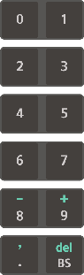

# 1.1.2 Teach Pendant

TP600 and TP630 teach pendants are supported. This operation manual describes how to use a teach pendant based on the TP600 model.

TP600 is a model developed exclusively for the Hi6 controller and provides a large touch screen.

<table>
  <thead>
    <tr>
      <th style="text-align:left">No.</th>
      <th style="text-align:left">Name</th>
      <th style="text-align:left">Description</th>
    </tr>
  </thead>
  <tbody>
    <tr>
      <td style="text-align:left">
        
      </td>
      <td style="text-align:left">Operation key</td>
      <td style="text-align:left">Controls the robot&#x2019;s operation, inputs commands, or selects a menu</td>
    </tr>
    <tr>
      <td style="text-align:left">
        
      </td>
      <td style="text-align:left">Display</td>
      <td style="text-align:left">The touch screen enables you to check and change the operation status
        and set the information of the robot.</td>
    </tr>
    <tr>
      <td style="text-align:left">
        
      </td>
      <td style="text-align:left">Mode switch</td>
      <td style="text-align:left">You can turn the mode switch to select the operation mode (
        manual,
        automatic,
        remote). If you remove the mode switch from the teach pendant, the selected
        operation mode will be locked.</td>
    </tr>
    <tr>
      <td style="text-align:left">
        
      </td>
      <td style="text-align:left">Emergency stop switch</td>
      <td style="text-align:left">Causes the robot to stop operating when pressed in case of an emergency</td>
    </tr>
    <tr>
      <td style="text-align:left">
        
      </td>
      <td style="text-align:left">Jog dial</td>
      <td style="text-align:left">Can be used to set the menu</td>
    </tr>
    <tr>
      <td style="text-align:left">
        
      </td>
      <td style="text-align:left">Mounting bracket</td>
      <td style="text-align:left">Holds or hangs the teach pendant to store it</td>
    </tr>
    <tr>
      <td style="text-align:left">
        
      </td>
      <td style="text-align:left">Enabling switch</td>
      <td style="text-align:left">
        
A switch that is to be used as a safety switch when operating the robot
          with the teach pendant in manual mode

        <ul>
          <li>Stage 1, Stage 3: The robot operation will stop. In the case of Stage
            3, the switch will recover to Stage 1 without going through Stage 2.</li>
          <li>Stage 2: You can operate the robot.</li>
        </ul>
      </td>
    </tr>
    <tr>
      <td style="text-align:left">
        
      </td>
      <td style="text-align:left">Cable connection connector</td>
      <td style="text-align:left">A connector for connecting the cable to the controller</td>
    </tr>
    <tr>
      <td style="text-align:left">
        
      </td>
      <td style="text-align:left">USB connection port</td>
      <td style="text-align:left">Can be used to connect a device that can be accessed by USB communication
        such as a transportable storage device</td>
    </tr>
  </tbody>
</table>

 

## Operation Keys

<table>
  <thead>
    <tr>
      <th style="text-align:left">Operation Key</th>
      <th style="text-align:left">Name</th>
      <th style="text-align:left">Description</th>
    </tr>
  </thead>
  <tbody>
    <tr>
      <td style="text-align:left">
        
      </td>
      <td style="text-align:left">shift</td>
      <td style="text-align:left">
        <ul>
          <li>Pressing the <b>&lt;shift&gt;</b> key together with a specific key will
            switch the function of the specific key.</li>
          <li>You can switch the current screen in use by pressing this key together
            with the <b>&lt;&#x2191;/&#x2193;&gt; </b>key in the JOB editing window.</li>
        </ul>
      </td>
    </tr>
    <tr>
      <td style="text-align:left">
        
      </td>
      <td style="text-align:left">ctrl</td>
      <td style="text-align:left">Pressing the <b>&lt;ctrl&gt;</b> key together with a specific key will execute
        the function defined for the specific key.</td>
    </tr>
    <tr>
      <td style="text-align:left">
        
      </td>
      <td style="text-align:left">up/down</td>
      <td style="text-align:left">Pressing the <b>&lt;&#x2193;/&#x2191;&gt; </b>key in manual mode will make
        it possible to move forward and backward in the unit of step.</td>
    </tr>
    <tr>
      <td style="text-align:left">
        
      </td>
      <td style="text-align:left">stop</td>
      <td style="text-align:left">
        
Pressing the <b>&lt;stop&gt;</b> key will temporarily stop the robot in
          automatic operation.

        <ul>
          <li>When the robot stops, the stop lamp will be turned on, and the start lamp
            will be turned off.</li>
          <li>As the robot is stopped while executing the path of the created program,
            there is no risk of collision with peripheral devices.</li>
        </ul>
      </td>
    </tr>
    <tr>
      <td style="text-align:left">
        
      </td>
      <td style="text-align:left">start</td>
      <td style="text-align:left">Pressing the <b>&lt;start&gt;</b> key will start the automatic operation
        of the program created in the robot. When the robot starts operation in
        automatic mode, the start lamp will be turned on, and the stop lamp will
        be turned off.</td>
    </tr>
    <tr>
      <td style="text-align:left">
        
      </td>
      <td style="text-align:left">motor</td>
      <td style="text-align:left">
        
You can supply the servo power to the motor of each axis of the robot.

        <ul>
          <li>Pressing the <b>&lt;motor&gt;</b> key in manual mode will make the motor
            lamp blink.</li>
          <li>Pressing the <b>&lt;motor&gt;</b> key in automatic mode will turn on the
            motor lamp.</li>
        </ul>
      </td>
    </tr>
    <tr>
      <td style="text-align:left">
        
      </td>
      <td style="text-align:left">enter</td>
      <td style="text-align:left">
        <ul>
          <li>If you press the <b>&lt;enter&gt;</b> key when inputting a number, the input
            value will be applied to the setting.</li>
          <li>If you press the <b>&lt;enter&gt;</b> key for a response of Yes/No, Yes
            will be selected.</li>
          <li>When editing a statement in manual mode, if you press the <b>&lt;enter&gt;</b> key
            while in the statement cursor, the cursor will switch to the word cursor
            that enables you to edit the parameters of the statement.</li>
        </ul>
      </td>
    </tr>
    <tr>
      <td style="text-align:left">
        
      </td>
      <td style="text-align:left">esc</td>
      <td style="text-align:left">
        <ul>
          <li>Allows you to cancel the key input or various functions in progress</li>
          <li>Pressing the <b>&lt;esc&gt;</b> key allows you to switch to a higher level
            without saving the changes.</li>
        </ul>
      </td>
    </tr>
    <tr>
      <td style="text-align:left">
        
      </td>
      <td style="text-align:left">left/right</td>
      <td style="text-align:left">
        <ul>
          <li>Allows you to move the cursor to previous or next when inputting texts</li>
          <li>If you press the <b>&lt;&#x2190;/&#x2192;&gt;</b> key in the word cursor
            status, you can move to the recorded step or other function parameters.</li>
        </ul>
      </td>
    </tr>
    <tr>
      <td style="text-align:left">
        
      </td>
      <td style="text-align:left">
        
number key

        

        

        

        

        

        

        

        

        
jog key

      </td>
      <td style="text-align:left">
        <ul>
          <li>You can input a number.</li>
          <li>If you press this key together with the <b>&lt;shift&gt; </b>key, you can
            input a sign (- / +) or comma (,), or delete a statement or parameter.</li>
          <li>
            
&lt;BS&gt;: Backspace allows you to erase the characters of the text one
              by one at the position of the cursor input. Moreover, if you select parameters
              when editing command and then press the <b>&lt;BS&gt;</b> key, you can delete
              the entire parameter values.

            

          </li>
        </ul>
        
While the motor is turned on in manual mode and the enabling switch is
          held, the &lt;enter /esc / &#x2190;/ &#x2192; &gt; keys and number keys
          will be operated as &#x201C;jog keys.&#x201D;

        <ul>
          <li>The axis name designated to each key will be displayed on the right edge
            of the display.</li>
          <li>The &lt;&#x2192;&gt; key is for the direction of increase (+), and the
            &lt;&#x2190;&gt; key is for the direction of decrease (-).</li>
        </ul>
      </td>
    </tr>
  </tbody>
</table>

<table>
  <thead>
    <tr>
      <th style="text-align:left">조작키</th>
      <th style="text-align:left">이름</th>
      <th style="text-align:left">설명</th>
    </tr>
  </thead>
  <tbody>
    <tr>
      <td style="text-align:left">
        
      </td>
      <td style="text-align:left">SHIFT</td>
      <td style="text-align:left">
      
키의 상부(연두색)에 표시된 기능을 실행할 때는 함께 사용합니다. 

        <ul>
          <li><<b>SHIFT</b>> 키를 특정 키와 함께
            누르면 해당 키의 기능이
            전환됩니다.</li>
          <li>[스텝 전/후진] 기능 조작시 이 키를 함께 누르면, 고속 스텝 전/후진 기능이 동작합니다.</li>
          <li>입력 표시창에서 문자열을 편집할 때는, &lt;←/→&gt; 방향키와 같이 눌러 커서(cursor)를 이동시킬 수 있습니다. </li>
          <li>JOB 편집 창에서 &lt;↑/↓&gt;
            키와 함께 누르면 사용
            중인 화면을 전환할 수
            있습니다.</li>
        </ul>
      </td>
    </tr>
    <tr>
      <td style="text-align:left">
        
      </td>
      <td style="text-align:left">CTRL</td>
      <td style="text-align:left"><<b>CTRL</b>> 키를 특정 키와 함께
        누르면 해당 키에 정의된
        기능이 실행됩니다.</td>
    </tr>
    <tr>
      <td style="text-align:left">
        
      </td>
      <td style="text-align:left">스텝 전/후진</td>
      <td style="text-align:left">
      
수동모드에서 스텝단위로 전진 또는 후진할 때 사용합니다. 

      <ul>
          <li>자세한 내용은 [<b>조건설정</b>] → [2: 스텝 전/후진시 최고속]을 참고하십시오.</li>
          <li><<b>SHIFT</b>>키와 함께 누르면 고속 스텝 전/후진 기능이 동작합니다.
      </ul>
   </td>
    </tr>
    <tr>
      <td style="text-align:left">
        
      </td>
      <td style="text-align:left">ESC</td>
      <td style="text-align:left">
      
현재 상태나, 화면을 취소합니다. 

        <ul>
          <li>키 입력이나 진행 중인
            각종 기능을 취소합니다.</li>
          <li><<b>ESC</b>> 키를 누르면 변경
            내용을 저장하지 않고
            상위 레벨로 전환할 수
            있습니다.</li>
        </ul>
      </td>
    </tr>
    <tr>
      <td style="text-align:left">
        
      </td>
      <td style="text-align:left">축 조작키</td>
      <td style="text-align:left">
        
로봇의 각 축을 조작합니다. 

        <ul>
          <li>조인트 좌표계인 경우 각 축을 구동합니다.</li>
          <li>로봇 좌표계인 경우 직교방향으로 구동합니다.</li>
        </ul>
      </td>
    </tr>
    <tr>
      <td style="text-align:left">
        
      </td>
      <td style="text-align:left">방향키</td>
      <td style="text-align:left">
        
화면의 선택 옵션이나 편집위치를 이동합니다. 

        <ul>
          <li>&lt;↑/↓&gt;
            키를 누르면 스텝이나 펑션을 이동합니다.</li>
          <li>단어 커서 상태에서 &lt;←/→&gt;
            방향키를 누르면 기록된 스텝이나
            다른 기능 인수로 이동합니다.</li>
        </ul>
      </td>
    </tr>
    <tr>
      <td style="text-align:left">
        
      </td>
      <td style="text-align:left">R코드</td>
      <td style="text-align:left">
        
코드별로 정의된 기능을 신속히 수행합니다. 

        <ul>
          <li>R 코드로 등록된 기능을 수행하거나RESET기능이 필요할 때 사용합니다.</li>
          <li>[R..(NO)]를 누른 후 <<b>ENTER</b>>키를 누르면, R코드의 “R0 : 스텝카운터 리셋”과 동일한 RESET 기능이 수행됩니다. 자세한 설명은 R코드 기능을 참고하십시오.</li>
          <li>허락/거부(Yes/No)의 응답에 대해 거부(No)를 선택할 때 사용합니다.</li>
        </ul>
      </td>
    </tr>
    <tr>
      <td style="text-align:left">
        
      </td>
      <td style="text-align:left">Enter</td>
      <td style="text-align:left">
      
입력 정보가 반영됩니다. 

        <ul>
          <li>수치 입력 시 <<b>ENTER</b>> 키를
            누르면 입력값이 설정에
            적용됩니다.</li>
          <li>허락/거부(Yes/No)의 응답에
            대해 <<b>ENTER</b>> 키를 누르면
            허락(Yes)이 선택됩니다.</li>
          <li>수동 모드에서 명령문
            수정 시, 문장 커서 상태에서
            <<b>ENTER</b>> 키를 누르면 명령문
            인수를 편집할 수 있는
            단어 커서 상태로 전환됩니다.</li>
        </ul>
      </td>
    </tr>
    <tr>
      <td style="text-align:left">
        
      </td>
      <td style="text-align:left">모터온</td>
      <td style="text-align:left">
        
로봇 각 축의 모터에 서보
          전원을 공급합니다.

        <ul>
          <li>수동 모드에서 <<b>모터온</b>>
            키를 누르면 모터 램프가
            깜빡입니다.</li>
          <li>자동 모드에서 <<b>모터온</b>>
            키를 누르면 모터 램프가
            켜집니다.</li>
        </ul>
      </td>
    </tr>
   <tr>
      <td style="text-align:left">
        
      </td>
      <td style="text-align:left">시작</td>
      <td style="text-align:left"><<b>시작</b>> 키를 누르면 로봇에
        작성된 프로그램의 자동
        운전을 시작합니다. 로봇의
        자동 운전이 시작되면
        시작 램프가 켜지고 정지
        램프가 꺼집니다.</td>
    </tr>
   <tr>
      <td style="text-align:left">
        
      </td>
      <td style="text-align:left">정지</td>
      <td style="text-align:left">
        
<<b>정지</b>> 키를 누르면 자동
          운전 중인 로봇이 일시적으로
          멈춥니다.

        <ul>
          <li>로봇이 정지하면 정지
            램프가 켜지고 시작 램프가
            꺼집니다.</li>
          <li>로봇은 작성된 프로그램의
            경로 수행 중에 정지된
            상태이므로 주변 장치와
            충돌할 위험은 없습니다.</li>
        </ul>
      </td>
    </tr>
        <tr>
      <td style="text-align:left">
        
      </td>
      <td style="text-align:left">지난화면</td>
      <td style="text-align:left">
        
지난 운전 이력을 보여줍니다.

        <ul>
          <li>작업 명령문의 실행 이력이나 에러 이력, 메시지 이력 등이 기록되는 지난 화면 대화상자를 나타냅니다.</li>
          <li>한 번 누르면, 메인보드가 출력하는 이력을 보여주고, 한 번 더 누르면 티치펜던트가 출력하는 이력을 보여줍니다.</li>
        </ul>
      </td>
    </tr>
        <tr>
      <td style="text-align:left">
        
      </td>
      <td style="text-align:left">GUN</td>
      <td style="text-align:left">
        
스텝 기록과 동시에 GUN 신호의 기록 여부를 결정합니다. 기능 선택 상태는 좌측의 LED에 표시됩니다.

        <ul>
          <li><<b>SHIFT</b>>키와 함께 누르면 GUN1 신호가 수동 출력됩니다.</li>
          <li>아크 용접을 사용할 때, 자동 운전시에 LED가 점등되어 있으면 실제로 아크 용접을 진행하고, LED가 소등되어 있으면 아크 용접을 진행하지 않고 티칭된 궤적만을 확인합니다.</li>
        </ul>
      </td>
    </tr>
        <tr>
      <td style="text-align:left">
        
      </td>
      <td style="text-align:left">툴/좌표계</td>
      <td style="text-align:left">
        
로봇 구동시 기준 좌표계를 선택합니다.

        <ul>
          <li>축 조작 키를 누를 경우 로봇을 움직일 좌표계(축, 직교, TOOL)를 선택합니다.
          </li>
          <li><<b>SHIFT</b>>와 동시에 누르면 툴 번호를 선택 받는 대화상자가 열립니다.</li>
        </ul>
      </td>
    </tr>
        <tr>
      <td style="text-align:left">
        
      </td>
      <td style="text-align:left">위치수정/기록</td>
      <td style="text-align:left">
        
프로그램내의 스텝을 기록할 때 즉, MOVE명령을 추가할 때 사용합니다.

        <ul>
          <li>이 때 입력되는 MOVE 명령은 숨은 포즈로 이루어진 명령입니다.</li>
          <li>커서가 스텝에 위치해 있을 때에는 다음 스텝을 삽입할 수 있습니다. </li>
          <li><<b>SHIFT</b>>키와 함께 누르면 선택된 스텝의 위치를 수정할 때 사용합니다. </li>
        </ul>
      </td>
    </tr>
        <tr>
      <td style="text-align:left">
        
      </td>
      <td style="text-align:left">프로그램/스텝</td>
      <td style="text-align:left">
        
스텝을 선택할 때 사용합니다.

        <ul>
          <li><<b>SHIFT</b>>키와 함께 누르면 프로그램을 선택하는데 사용합니다. </li>
          <li><<b>프로그램</b>>키를 2번 누르면, 프로그램 목록이 표시됩니다.</li>
        </ul>
      </td>
    </tr>
        <tr>
      <td style="text-align:left">
        
      </td>
      <td style="text-align:left">유닛/메커니즘</td>
      <td style="text-align:left">
        
메커니즘과 유닛을 선택할 때 사용합니다.

        <ul>
          <li>메커니즘은 로봇이 0번이고 부가축에 대해서는 사용자가 초기화 설정 메뉴에서 설정하는데 따릅니다.</li>
          <li>유닛은 <<b>SHIFT</b>>키를 누른 상태에서 이 키를 조작하여 선택할 수 있습니다. 유닛은 메커니즘의 조합으로 사용자가 특정 조합의 유닛으로 프로그램을 구성하고자 할 때 사용합니다.</li>
        </ul>
      </td>
    </tr>
    <tr>
      <td style="text-align:left">
        
      </td>
      <td style="text-align:left">
        
숫자키

      </td>
      <td style="text-align:left">
      
숫자를 입력하거나 삭제합니다.

      <ul>
          <li><<b>SHIFT</b>>키와 함께 누르면
            부호(- / +)나 쉼표(,)를 입력하거나,
            명령문 또는 인수를 삭제(DEL)할
            수 있습니다.</li>
          <li><<b>BS</b>>: 커서가 입력된
            위치에서 텍스트를 한
            글자씩 지웁니다.(backspace) 또한,
            명령어 편집 시 인수를
            선택하고 <<b>BS</b>> 키를 누르면
            인수 값 전체를 삭제할
            수 있습니다.</li>
        </ul>
      </td>
    </tr>
  </tbody>
</table>
