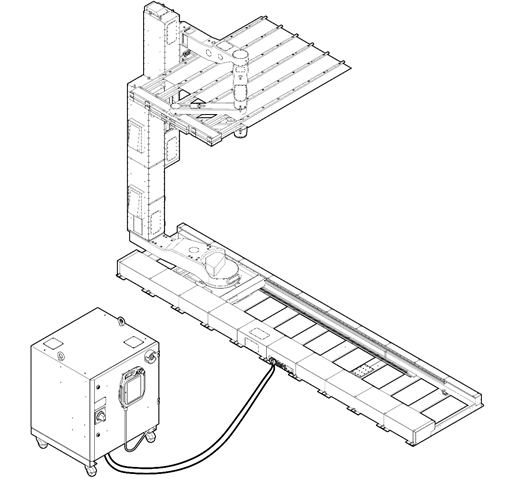
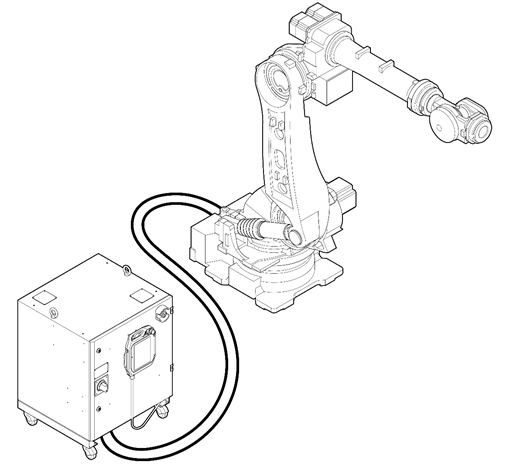

# 1.1 基础配置

工业机器人是“配备了基于自动控制的操作和移动功能的机器，以便它们能在工业现场通过使用程序执行各种工作”。协作机器人是一种工业机器人。

机器人系统由一个执行器和一个控制器组成，控制器控制执行器。用于设置和手动操作机器人系统的示教器附加在控制器上。

* 机器人：在工业现场执行各种工作，如运输物体、组装零件等。
* 控制器：根据通过示教器设置的程序设定值调整机器人的操作。它可以通过控制器的输入/输出端口与各种外部设备或装置进行互操作。
* 示教器：管理整个机器人系统的设备。它使您能够教导机器人特定的姿势或设置并控制程序。

以下展示了根据机器人类型的机器人系统的基本配置示例。

