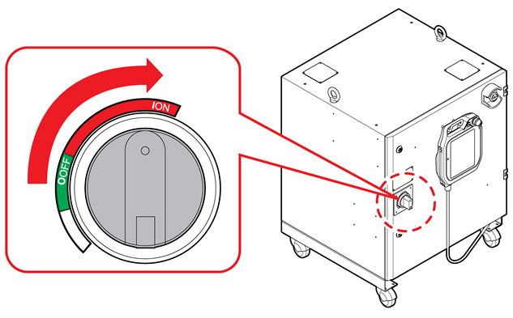
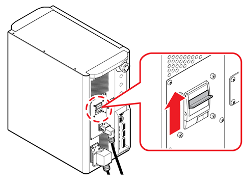

# 1.2.1 Turning On the Power


The method of turning on and off the power may differ depending on the type of controller.


#### Vertical Articulated Robot Controller

To start up the robot, power should be supplied to the robot controller. 

Turn the power switch on the left side of the robot controller to the ON direction to connect the main power of the controller. When the power is connected, the robot system will boot, and the display of the teach pendant will be turned on together with all the devices.

#### Collaborative Robot Controller

The power of the collaborative robot is supplied through the power connector of the controller.

Push upward the switch on the power breaker. When power is connected, the robot system will boot, the display of the teach pendant will be turned on, and the collaborative robot’s LED lamp will be turned on in white.

### 

