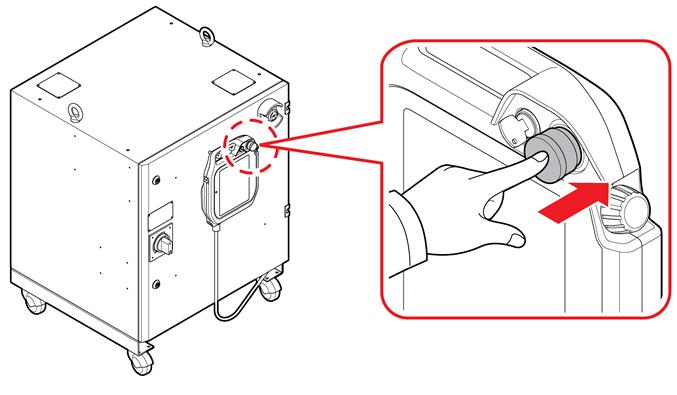
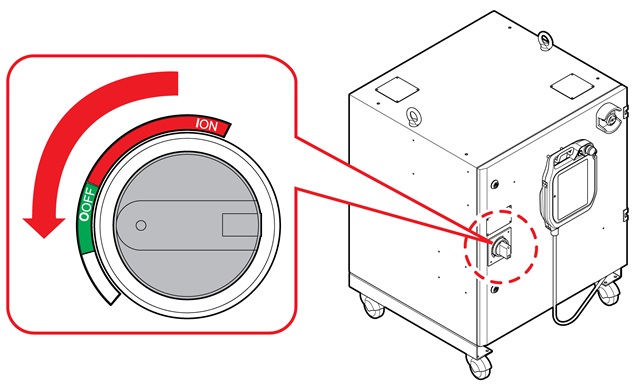

# 1.2.2 Turning Off the Power

It refers to all operations of stopping the robot and turning off the power button of the controller after performing all works.


* If the robot will not be in use for a long time, the encoder battery may be discharged, so move the robot to the reference position and then turn off the power.

* Be careful as the encoder data may be destroyed if the power is turned off while the encoder battery has a voltage drop alarm. 




* Si le robot doit rester inutilisé pendant une période prolongée, la batterie de l’encodeur peut se décharger. Amener le robot à la position de référence, puis couper l’alimentation.

* Faire preuve de prudence : les données de l’encodeur peuvent être altérées si l’alimentation est coupée alors qu’une alarme de baisse de tension de la batterie de l’encodeur est active.


#### Vertical Articulated Robot Controller

1.	Press the `[Stop]` key on the teach pendant. Then, the robot in operation will stop, and the stop lamp will be turned on.

2.	Press the emergency stop switch on the teach pendant. Then, the servo power to the robot motor will be cut off, and then the motor will be turned off.

3.	Turn the power switch on the left side of the robot controller to the OFF direction. Then, the robot system will be powered off.

