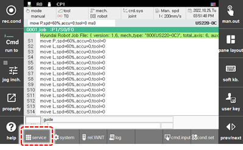
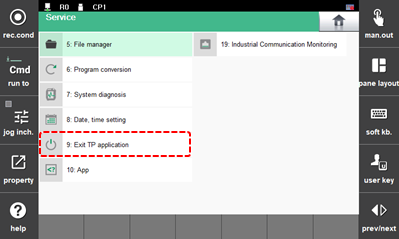
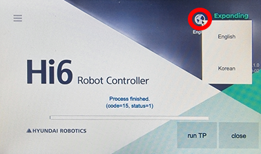
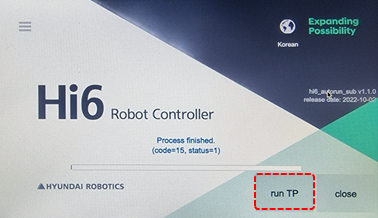

# 1.2.3 Changing the language of the teach pendant screen

If you need to change the language of the teach pendant, you can change it with the following procedure. The following is an example of changing Korean to English mode.

1.	Click \[service\] button on the function button bar.

    

2.	Select \[9: Exit TP application\].

    

3.	Click the globe icon on the top-right corner.

    

4.	Select \[English\] on pop-up menu.

5.	Click \[run TP\] button on the bottom-right corner and wait for about 8 seconds.

    

