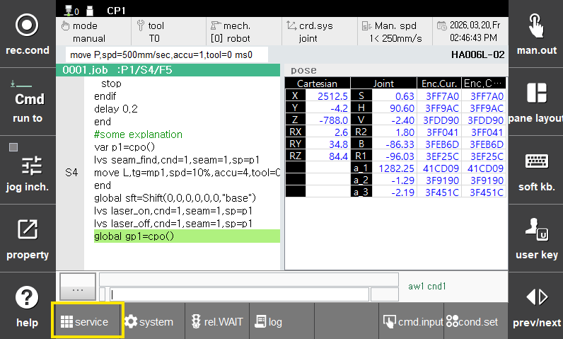
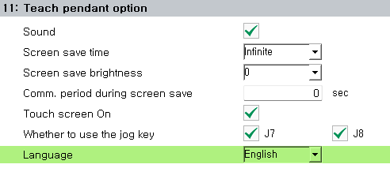

# 1.2.3 更改教学挂件屏幕的语言

如果您需要更改教学挂件的语言，可以通过以下程序进行更改。以下是将英语更改为韩语模式的示例。

### A. 通过教学挂件选项更改 (仅支持 V70.00-00 及以上版本)

1. 点击 `[F1: 服务] ([F1: service])` 按钮。

    

2. 输入 `11: 教学挂件选项`。

    

3. 从语言设置中选择 `韩语`。

    

4. 按 `[ESC]` 键返回到顶层首页屏幕，然后稍等片刻。

 

### B. 关闭教学挂件软件后更改

1. 点击 `[F1: 服务] ([F1: service])` 按钮。

   

2. 选择 9: 退出 TP 应用程序。

    

3. 点击左下角的语言组合框。

    

    

    对于 V60.32-00 以下的版本，请点击右上角的地球图标。

    

    

4. 从弹出菜单中选择 `英语`。

5. 点击右下角的 `[运行 TP]` 按钮，并等待约 15 秒钟。