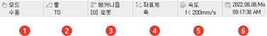

# 1.2.3.2 상태 표시줄

로봇 운전을 위한 각종 상태 값을 표시합니다. 6개 칸에 표시되는 정보는 해당 칸을 터치함으로써 설정 할 수 있습니다.

| 번호 | 설명 |
| :--- | :--- |
|  | 로봇의 운전 방식을 표시합니다. <li>수동: 조그로 로봇을 제어하고, JOB 프로그램을 작성하는 로봇 교시 모드입니다.</li> <li>자동: JOB 프로그램을 재생하여 로봇을 자동으로 운전하는 모드입니다.</li> <li>원격수동: 모드를 원격에서 I/O신호로 결정하는 상태입니다. (현재 상태: 수동 모드)</li> <li>원격자동: 모드를 원격에서 I/O신호로 결정하는 상태입니다. (현재 상태: 자동 모드)</li> |
|  | [툴] 버튼: 선택된 툴 번호를 확인하고 설정합니다.  [툴] 버튼을 터치한 후 설정창에서 툴 번호를 입력하고 [확인] 버튼을 터치하십시오.|
|  | 메커니즘(mechanism): 선택된 메커니즘을 확인하고 설정합니다.   원하는 메커니즘 그룹이 나타날 때까지 [메커니즘] 버튼을 반복해서 터치하십시오. 초기 설정에서 로봇 모델이 선택되지 않은 경우, 메커니즘 그룹이 표시되지 않고 미초기화 표시가 나타납니다. |
|  | 좌표계(coordinate system): 조그 수행의 기준 좌표계를 확인하고 설정합니다.   원하는 좌표계 방식이 나타날 때까지 <b>[좌표계]</b> 버튼을 반복해서 터치하십시오. 선택한 기준 좌표계에 따라 변경된 축의 이름이 화면 우측 조그 막대에 나타납니다.<li> 축(Joint) 좌표계: 조그 막대에 각 축의 이름이 표시됩니다. 축 이름 우측의 <b>[-/+]</b> 버튼을 터치하면 해당하는 축을 움직일 수 있습니다.</li> <li> 로봇(Robot) 좌표계: 조그 막대에 X, Y, Z, RX, RY, RZ와 부가축이 표시됩니다. 로봇 좌표계를 기준으로 로봇의 툴 끝(TCP, Tool Center Point)을 이동 및 회전할 수 있습니다.</li> <li> 사용자(User) 좌표계: 조그 막대에 X, Y, Z, RX, RY, RZ와 부가축이 표시됩니다. 사용자 좌표계를   기준으로 로봇의 툴 끝(TCP)을 이동 및 회전할 수 있습니다.</li> <li> 툴(Tool) 좌표계: 조그 막대에 X, Y, Z, RX, RY, RZ와 부가축이 표시됩니다. 툴 좌표계를 기준으로 로봇의 툴 끝(TCP)을 이동 및 회전할 수 있습니다.</li>|
|  | [조그 속도 레벨] 버튼: 축별 또는 직교 조그의 속도 레벨과 조그키의 사용 모드를 설정합니다. <li>[HI/LOW]: 원하는 축별 또는 직교 조그의 속도 레벨(1: 저속 ~ 8: 고속)이 나타날 때까지 버튼을 반복하여 터치하십시오. [SHIFT]버튼과 함께 터치하면 최저 또는 최고 레벨을 한 번에 설정할 수 있습니다.</li> |
|  | 날짜와 시간 정보가 표시됩니다.   [서비스] 버튼 &gt; [8: 날짜, 시간설정] 메뉴를 터치하면 날짜와 시간 정보를 변경할 수 있습니다. ([4.5 날짜 및 시간 설정](../../../4-menu/5-date-time-setting.md))|

