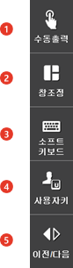

# 1.2.3.3 R(Right)버튼 막대

화면 우측 5개의 버튼을 표시하며 화면을 터치할 수 있습니다. 비활성 상태의 버튼은 회색으로 표시됩니다. 자동모드에서는 [전/후] 버튼이 비활성화됩니다.

<table>
  <thead>
    <tr>
      <th style="text-align:left">번호</th>
      <th style="text-align:left">설명</th>
    </tr>
  </thead>
  <tbody>
    <tr>
      <td style="text-align:left">
        
      </td>
      <td style="text-align:left">
        
범용 출력, 필드버스 출력 등을 수동으로 출력하거나, 변수에 값을 수동 설정합니다.

      </td>
    </tr>
    <tr>
      <td style="text-align:left">
        
      </td>
      <td style="text-align:left">
        
모니터링용 창을 분할하거나 통합하기 위해 사용합니다.

      </td>
    </tr>
    <tr>
      <td style="text-align:left">
        
      </td>
      <td style="text-align:left">
        
명령문 편집이나 주석문을 편질할 때 사용합니다. 터치스크린으로 키보드처럼 사용할 수 있습니다.

        

      </td>
    </tr>
    <tr>
      <td style="text-align:left">
        
      </td>
      <td style="text-align:left">
        
사용자 키를 기능버튼 줄에 정의하여 사용합니다. 

        
스폿/아크 응용을 위해 등록된 기능을 표시하며, 자세한 사용법은 해당 응용 매뉴얼을 참고하시기 바랍니다.

      </td>
    </tr>
    <tr>
      <td style="text-align:left">
        
      </td>
      <td style="text-align:left">
        
기능버튼 줄의 메뉴가 한 페이지를 넘어갈 때 사용합니다.

        
기능버튼이 7개 이상이 경우에 활성화되며, 버튼을 누를 때마다 다음 7개 버튼으로 화면이 전환됩니다. <<b>SHIFT</b>> 키와 함께 누르면 역방향으로 전환됩니다. 

      </td>
    </tr>
    </tr>
  </tbody>
</table>

 

