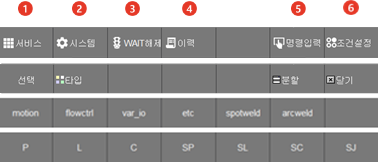

# 1.2.3.5 기능버튼 줄

화면 하단 7개의 버튼으로 구성된 기능버튼들 입니다.현재의 조작화면에 따라 구성이 달라집니다. 작업 프로그램 편집 중에는 명령어 목록이나 명령어 파라미터 설정 값 등의 버튼이 표시됩니다. 아래 표는 최상위 화면에서 표시되는 버튼에 대한 설명입니다.

| 번호 | 설명 | 
| :--- | :--- | 
|  | 변수 및 파일관리 등 사용자 편의기능과 관련된 메뉴들이 있습니다. ([4.서비스](../../../4-menu/README.md)) |
|  | 로봇 구동, 응용 프로그램 등을 위한 상세 설정 메뉴들이 있습니다. ([7.시스템](../../../7-setting/README.md)) |
|  | 입력신호 대기나 용접완료 신호 대기 시에 <**SHIFT**>+[**WAIT해제**]를 누르면 강제로 신호 대기를 해제할 수 있습니다. [**시스템** > 1: 사용자 환경] 에서 'wait 강제 해제' 항목이 유효로 되어 있으면 신호 대기를 강제 해제 할 수 없습니다. |
|  | 에러나 경고 이력을 표시합니다. 내용과 발생시각, 발생 프로그램 번호, 스텝번호, 축데이터, 입출력 상태 등을 확인합니다. ([2.5.2 에러 처리](../../../2-operation/5-error-info/2-error-handle.md))|
|  | 수동모드의 초기화면에 [명령입력] 버튼이 표시됩니다. 작업 편집창에 명령문을 입력하는 용도로 사용됩니다. ([3.2.2.1 일반 명령문 입력](../../../3-programming/2-prog-edit/1-statement.md))|
|  | 스텝 전/후진이동 시 최고속도, 경로 복구 여부 등 로봇의 운전 조건을 설정합니다. ([5.조건 설정](../../../5-conditional-setting/README.md))|