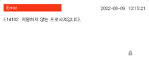

# 1.2.3.6 입력 표시줄

명령어, 문자 또는 함수 등 편집할 내용의 입력값이 표시되는 영역입니다.  
기능버튼 막대의 [**명령어 입력**]을 사용하지 않고 입력 표시창에 명령어를 바로 기록할 수 있습니다. 정의되지 않은 명령어나 문법 오류시 아래와 같은 에러가 발생합니다.

 

아래 표는 move 명령어의 각 인자에 해당하는 입력 표시창 내용입니다.

 

|명령어 인자|관련 입력 내용|
|--|--|
|||