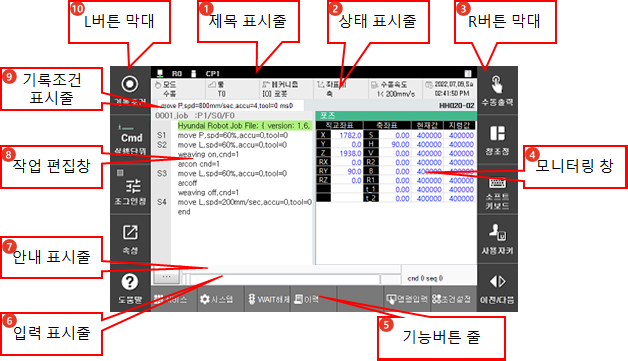

# 1.2.3 Hi6 티치 펜던트 화면

로봇의 동작을 제어하거나 로봇과 연동된 장치를 관리할 수 있습니다. Hi6 TP630 티치 펜던트 화면은 다음과 같이 10개의 화면 창으로 구성됩니다.
 

| 번호 | 설명 | 
| :--- | :--- | 
|  | 제목 표시줄 : 티치펜던트의 통신 상태와 운전 모드, 로봇 시스템의 상태와 메커니즘을 표시합니다. ([1.2.3.1 제목 표시줄](1-title-area.md)) |
|  | 상태 표시줄입니다 : 현재 로봇의 운동 모드 및 각종 설정을 표시합니다.  ([1.2.3.2 상태 표시줄](2-status-bar.md)) |
|  | R버튼 막대 : 화면 우측 메뉴 그룹입니다.  ([1.2.3.3 R(Right)버튼 막대](3-Rbt-bar.md)) |
|  | 모니터링 창 : 운전 중 각종 가동 정보를 보여줍니다.  ([1.2.3.4 모니터링 창](4-mon-area.md)) |
|  | 기능버튼 막대 : 화면 하단 메뉴 그룹입니다. 주요 설정 및 모니터링 기능을 지원합니다.  ([1.2.3.5 기능버튼 막대](5-function-buttons.md)) |
|  | 입력 표시줄 : 작업 편집창에 명령어를 입력할 수 있습니다. ([1.2.3.6 입력 표시줄](6-input-area.md)) |
|  | 안내 표시줄 : 조작 중 각종 안내 메시지를 보여줍니다.  ([1.2.3.8 안내 표시줄](7-guide-area.md)) |
|  | 작업 편집창 : JOB 프로그램을 편집하는 영역입니다.  ([1.2.3.8 작업 편집창](8-work-area.md)) |
|  | 기록조건 표시줄 : 기록할 스텝의 조건을 표시합니다.  ([1.2.3.9 기록조건 표시줄](9-record-cnd-area.md)) |
|  | L버튼 막대  : 화면 좌측 메뉴 그룹입니다.  ([1.2.3.10 L버튼 막대](10-Lbt-bar.md)) |