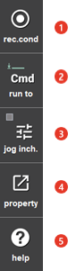

# 1.2.4.10 L(Left) button bar

5 buttons are displayed on the left side of the screen, and you can touch the buttons. Inactive buttons will be grayed out. Under the automatic mode, the record condition, jog inching are disabled, which makes it impossible to use those functions.

 

<table>
  <thead>
    <tr>
      <th style="text-align:left">No.</th>
      <th style="text-align:left">Description</th>
    </tr>
  </thead>
  <tbody>
    <tr>
      <td style="text-align:left">
        
      </td>
      <td style="text-align:left">
        
This is the key used to edit conditions including speed, accuracy, tool number, step option etc. of the recording step. Editing is done in the record condition window.

      </td>
    </tr>
    <tr>
      <td style="text-align:left">
        
      </td>
      <td style="text-align:left">
        
This selects whether to execute in steps or in functions when moving the steps forward/backward or whether to continuously execute up to the end of the task program. Currently selected condition is displayed on the button as an icon.

      </td>
    </tr>
    <tr>
      <td style="text-align:left">
        
      </td>
      <td style="text-align:left">
        
This is the key to use when you want to manually move the robot by the designated amount at inching levels. A green light will be on when the jog inching function is activated.

        

      </td>
    </tr>
    <tr>
      <td style="text-align:left">
        
      </td>
      <td style="text-align:left">
        
If this key is pressed while the cursor is placed at a certain command sentence, the Quick Open function related to the command sentence will be executed. See the Quick Open for detailed description. 

      </td>
    </tr>
    <tr>
      <td style="text-align:left">
        
      </td>
      <td style="text-align:left">
        
 Displays relevant Help depending on each status. Grammar form for command sentence is shown if pressing this key when the cursor exists in command sentence. You can view contents, measures or diagnosis methods for error pressing this key in occurrence of error.

      </td>
    </tr>
    </tr>
  </tbody>
</table>

