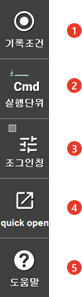

# 1.2.4.10 L(Left)버튼 막대

화면 우측 5개의 버튼을 표시하며 화면을 터치할 수 있습니다. 비활성 상태의 버튼은 회색으로 표시됩니다. 자동모드에서는 [전/후] 버튼이 비활성화됩니다.

<table>
  <thead>
    <tr>
      <th style="text-align:left"></th>
      <th style="text-align:left">번호</th>
      <th style="text-align:left">설명</th>
    </tr>
  </thead>
  <tbody>
    <tr>
      <td style="text-align:left"></td>
      <td style="text-align:left">
        
      </td>
      <td style="text-align:left">
        
기록할 스텝의 속도, accuracy, 툴 번호, 스텝 option 등의 조건을 미리 편집하는데 사용합니다.

      </td>
    </tr>
    <tr>
      <td style="text-align:left"></td>
      <td style="text-align:left">
        
      </td>
      <td style="text-align:left">
        
스텝 전/후진 시 스텝 단위로 실행할지 펑션 단위로 실행할지, 아니면 작업 프로그램 끝가지 연속으로 실행할지를 선택합니다. 현재 선택된 상태는 버튼에 아이콘으로 표시됩니다.

      </td>
    </tr>
    <tr>
      <td style="text-align:left"></td>
      <td style="text-align:left">
        
      </td>
      <td style="text-align:left">
        
인칭 레벨에서 지정한 양 만큼만 로봇을 수동으로 움직이고자 할 때 사용합니다. 조기 인칭이 선택되면 녹색으로 표시됩니다.

        

      </td>
    </tr>
    <tr>
      <td style="text-align:left"></td>
      <td style="text-align:left">
        
      </td>
      <td style="text-align:left">
        
커서를 특정 명령문에 위치한 상태에서 누르면 그 명령문과 관계된 Quick Open 기능이 실행됩니다. 

      </td>
    </tr>
    <tr>
      <td style="text-align:left"></td>
      <td style="text-align:left">
        
      </td>
      <td style="text-align:left">
        
 상황별 해당 도움말을 표시합니다. 커서가 명령문 위에 있을 때는 명령문의 문법 형식을 보여줍니다. 에러 발생 시 이 키를 누르면 에러에 대한 내용과 조치 방법 등을 확인할 수 있습니다.

      </td>
    </tr>
    </tr>
  </tbody>
</table>

