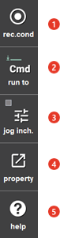

# 1.2.4.10 L(Left) button bar

5 个按钮显示在屏幕的左侧，您可以触摸这些按钮。非活动按钮将显示为灰色。在自动模式下，记录条件、慢速移动功能被禁用，因此无法使用这些功能。

 

<table>
  <thead>
    <tr>
      <th style="text-align:left">No.</th>
      <th style="text-align:left">描述</th>
    </tr>
  </thead>
  <tbody>
    <tr>
      <td style="text-align:left">
        
      </td>
      <td style="text-align:left">
        
这是用于编辑记录步骤的条件，包括速度、精度、工具编号、步骤选项等的键。编辑在记录条件窗口中进行。

      </td>
    </tr>
    <tr>
      <td style="text-align:left">
        
      </td>
      <td style="text-align:left">
        
选择在向前/向后移动步骤时是否逐步执行或以功能执行，或者是否连续执行直到任务程序结束。目前选定的条件在按钮上以图标显示。

      </td>
    </tr>
    <tr>
      <td style="text-align:left">
        
      </td>
      <td style="text-align:left">
        
这是您希望以指定量手动移动机器人时在微调级别使用的键。当 jog inching 功能被激活时，绿色指示灯会亮起。

        

      </td>
    </tr>
    <tr>
      <td style="text-align:left">
        
      </td>
      <td style="text-align:left">
        
如果在光标放置于某个命令句时按下此键，将执行与该命令句相关的快速打开功能。详细描述请参见快速打开。

      </td>
    </tr>
    <tr>
      <td style="text-align:left">
        
      </td>
      <td style="text-align:left">
        
根据每个状态显示相关的帮助。如果在光标存在于命令句时按下此键，将显示命令句的语法形式。在发生错误时，您可以通过按下此键查看内容、措施或诊断方法。

      </td>
    </tr>
    </tr>
  </tbody>
</table>