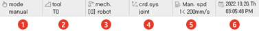

# 1.2.4.2 Status display window

This displays various statuses of robot operation. You can set the displayed information by touching each applicable section.

| No. | Description | 
| :--- | :--- |
|  | The operation mode of the robot is displayed. <li>manual: a mode for jogging operations and editing JOB programs</li> <li>auto:  a mode for running JOB programs automatically</li> <li>remote manual: a mode for remotely setting the manual or auto mode through I/O signal (current status: manual mode)</li> <li>remote auto: a mode for remotely setting the manual or auto mode through I/O signal (current status: auto mode)</li> |
|  | You can check the current tool information and change it in the pop-up message box.|
|  | Mechanism displays the robot type or the number of the selected additional axis. The robot is 0, and for the user refer to [System > 5: Initialize >6: Mechanism setting].  |
|  | This displays the status of the reference coordinate system selected for the manual operation. A status display of 'joint', 'user', 'robot', or 'tool' changes in order, each time you push the status window. With <**Axis Operation**> keys, you can move the robot according to the reference coordinate system.<li> Joint coordinate system: Each axis of the robot will move independently in accordance with the lower part name of <**Axis Operation**> keys.</li> <li> Robot coordinate system:  The robot TCP is translated and rotated on the basis of the robot coordinate system  by <**Axis Operation**> keys.</li> <li> User coordinate system:  The robot TCP is translated and rotated on the basis of the user coordinate system  by <**Axis Operation**> keys..</li> <li>  Tool coordinate system : The robot TCP is translated and rotated on the basis of the tool coordinate system by <**Axis Operation**> keys.</li>|
|  | Determine the speed to operate the robot in the manual mode. In the manual mode, there are 2 different types of operation. One is to run it manually and the other is the step forward/backward operation. There are 8 different steps (1~8) in the level of the speed of manual operation.  <li>Speed level increases by a step if pressing the speed HI key of teach pendant, and decreases by a step if pressing the speed LOW key. Speed level is set to 8 if pressing the [SHIFT (FAST)] + Speed  HI key, and is set to 1 if pressing the [SHIFT (FAST)] + Speed LOW key. </li> |
|  | Date and time information are displayed.   You can change this in [service &gt; 8: Date, time setting] menu. ([4.5 Setting of Date and Time](../../../4-service/5-date-time-setting.md))|

