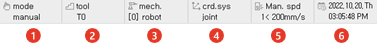

# 1.2.4.2 状态显示窗口

这显示机器人的各种操作状态。您可以通过触摸每个相关部分来设置显示的信息。

| No. | 描述 | 
| :--- | :--- |
|  | 机器人的操作模式显示。 <li>manual: 用于手动操作和编辑 JOB 程序的模式</li> <li>auto: 用于自动运行 JOB 程序的模式</li> <li>remote manual: 通过 I/O 信号远程设置手动或自动模式的模式（当前状态：手动模式）</li> <li>remote auto: 通过 I/O 信号远程设置手动或自动模式的模式（当前状态：自动模式）</li> |
|  | 您可以在弹出消息框中查看当前工具信息并进行更改。 |
|  | 机制显示机器人的类型或所选附加轴的编号。机器人为 0，供用户参考 `系统 - 5: 初始化 - 6: 机制设置 (System - 5: Initialize - 6: Mechanism setting)`。 |
|  | 显示为手动操作选择的参考坐标系的状态。 状态显示为“joint”、“user”、“robot”或“tool”，每次按下状态窗口时依次变化。 使用 `[Axis Operation]` 键，您可以根据参考坐标系移动机器人。<li>关节坐标系：机器人的每个轴将根据 `[Axis Operation]` 键的下部名称独立移动。</li> <li>机器人坐标系：机器人的 TCP 根据机器人坐标系通过 `[Axis Operation]` 键进行平移和旋转。</li> <li>用户坐标系：机器人的 TCP 根据用户坐标系通过 `[Axis Operation]` 键进行平移和旋转。</li> <li> 工具坐标系：机器人的 TCP 根据工具坐标系通过 `[Axis Operation]` 键进行平移和旋转。</li> |
|  | 确定在手动模式下操作机器人的速度。在手动模式下，有两种不同的操作类型。一种是手动运行，另一种是步进前进/后退操作。 手动操作的速度有 8 个不同的级别（1~8）。 <li>如果按下教学挂架的速度 HI 键，速度级别增加一个步骤；如果按下速度 LOW 键，速度级别降低一个步骤。 按下 [SHIFT (FAST)] + 速度 HI 键时，速度级别设置为 8；按下 [SHIFT (FAST)] + 速度 LOW 键时，速度级别设置为 1。</li> |
|  | 显示日期和时间信息。   您可以在 [service - 8: 日期、时间设置] 菜单中更改此信息。 ([4.5 日期和时间设置](../../../4-service/5-date-time-setting.md)) |