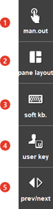

# 1.2.4.3 R(Right) button bar

5 buttons are displayed on the right side of the screen, and you can touch the buttons. Inactive buttons will be grayed out. Under the automatic mode, 'prev/next' is disabled, which makes it impossible to use those functions.

<table>
  <thead>
    <tr>
      <th style="text-align:left">No.</th>
      <th style="text-align:left">Description</th>
    </tr>
  </thead>
  <tbody>
    <tr>
      <td style="text-align:left">
        
      </td>
      <td style="text-align:left">
        
This manually outputs common output, field bus output etc. or manually sets the value to the parameter.

      </td>
    </tr>
    <tr>
      <td style="text-align:left">
        
      </td>
      <td style="text-align:left">
        
This will split the monitoring window, or combine the split windows.

      </td>
    </tr>
    <tr>
      <td style="text-align:left">
        
      </td>
      <td style="text-align:left">
        
This is used to edit a command sentence or a note. As a touch screen, it can be used just like a keyboard.

        

      </td>
    </tr>
    <tr>
      <td style="text-align:left">
        
      </td>
      <td style="text-align:left">
        
This is used to define and use a user key in the F button bar. 

        
The pre-designated functions are displayed for spot or arc welding. For more information, refer to the application manual.

      </td>
    </tr>
    <tr>
      <td style="text-align:left">
        
      </td>
      <td style="text-align:left">
        
This is used to move to the next page of the function button bar.

        
When there are more than 7 buttons in the current screen,   button will be activated, and every time this button is pressed, it will switch to the next button set. When you press <<b>SHIFT</b>> +   button, it will switch back in the reverse direction.
      </td>
    </tr>
    </tr>
  </tbody>
</table>

