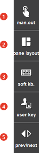

# 1.2.4.3 R(Right) 按钮条

5 个按钮显示在屏幕右侧，您可以触摸这些按钮。未激活的按钮将变为灰色。在自动模式下，“prev/next”被禁用，这使得无法使用这些功能。

<table>
  <thead>
    <tr>
      <th style="text-align:left">编号</th>
      <th style="text-align:left">描述</th>
    </tr>
  </thead>
  <tbody>
    <tr>
      <td style="text-align:left">
        
      </td>
      <td style="text-align:left">
        
此按钮用于手动输出通用输出、现场总线输出等或手动设置参数值。

      </td>
    </tr>
    <tr>
      <td style="text-align:left">
        
      </td>
      <td style="text-align:left">
        
此按钮将拆分监控窗口或合并拆分窗口。

      </td>
    </tr>
    <tr>
      <td style="text-align:left">
        
      </td>
      <td style="text-align:left">
        
此按钮用于编辑命令句或注释。作为触摸屏，使用方式与键盘相同。

        

      </td>
    </tr>
    <tr>
      <td style="text-align:left">
        
      </td>
      <td style="text-align:left">
        
此按钮用于在 F 按钮条中定义和使用用户键。

        
预设功能用于点焊或弧焊。如需更多信息，请参阅应用手册。

      </td>
    </tr>
    <tr>
      <td style="text-align:left">
        
      </td>
      <td style="text-align:left">
        
此按钮用于移动到功能按钮条的下一页。

        
当当前屏幕中有超过 7 个按钮时，该按钮将被激活，每次按下此按钮时，它将切换到下一个按钮组。当您按下`[SHIFT]` + 该按钮时，它将向后切换。
      </td>
    </tr>
    </tr>
  </tbody>
</table>