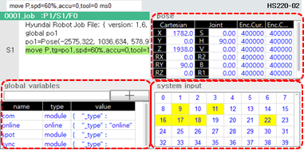

# 1.2.4.4 Monitor window

This is the window to display the location data, I/O data and status data of each application by each axis in real time. Divide the main screen and select a monitoring panel. You can have up to 3 monitoring panels. (Refer to “[6. Monitoring](../../../6-monitoring/README.md)”.)

 

