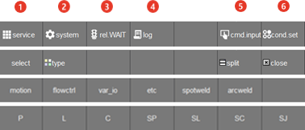

# 1.2.4.5 Function button bar

7 function buttons are displayed on the bottom of the main window. Function buttons change according to the current operating screen. For an example in the highest level screen, the buttons to go into Service menu and System menu are displayed. Also while editing a task program, the buttons for command lists or command parameter settings are displayed.

| No. | Description | 
| :--- | :--- | 
|  | service : various convenience items, such as monitoring, variables, and the file manager ([4.Service](../../../4-service/README.md)) |
|  | system : detail settings for robot operations and applications ([7.System](../../../7-system/README.md)) |
|  | rel.WAIT : release of signal waiting  such as input signal or welding completion signal by pressing with <**SHIFT**> key (precondition : [**system** > 1: User environment > 'Wait(di/wi) release' > Disable]) |
|  | log : error or waring history including  an error code, a notification message, time of error occurrence, etc. ([2.5.2 Error Handling](../../../2-operation/5-error-info/2-error-handle.md))|
|  | cmd.input : displayed in the initial page of the manual mode, and used for inputting a program command ([3.2.2.1 Statements](../../../3-programming/2-prog-edit/1-statement.md))|
|  | cond.set : robot operating conditions such as robot speed for Step forward/backward and path recovery ([5.Condition Setting](../../../5-conditional-setting/README.md))|