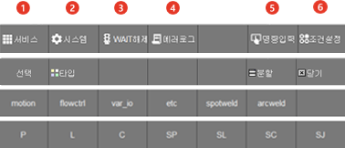

# 1.2.4.5 기능버튼 막대

화면 하단 7개의 버튼으로 구성된 기능버튼들 입니다.현재의 조작화면에 따라 구성이 달라집니다. 작업 프로그램 편집 중에는 명령어 목록이나 명령어 파라미터 설정 값 등의 버튼이 표시됩니다. 아래 표는 최상위 화면에서 표시되는 버튼에 대한 설명입니다.

<table>
  <thead>
    <tr>
      <th style="text-align:left"></th>
      <th style="text-align:left">번호</th>
      <th style="text-align:left">설명</th>
    </tr>
  </thead>
  <tbody>
    <tr>
      <td style="text-align:left"></td>
      <td style="text-align:left">
        
      </td>
      <td style="text-align:left">
        
모니터링, 변수 및 파일관리 등 사용자 편의사항과 관련된 메뉴들이 있습니다.

      </td>
    </tr>
    <tr>
      <td style="text-align:left"></td>
      <td style="text-align:left">
        
      </td>
      <td style="text-align:left">
        
로봇 구동, 응용 프로그램 등을 위한 상세 설정 메뉴들이 있습니다.

      </td>
    </tr>
    <tr>
      <td style="text-align:left"></td>
      <td style="text-align:left">
        
      </td>
      <td style="text-align:left">
        
입력신호 대기나 용접완료 신호 대기 시에 [SHIFT]+[WAIT해제]를 누르면 강제로 신호 대기를 해제할 수 있습니다. [시스템 > 1: 사용자 환경] 에서 'wait 강제 해제' 항목이 유효로 되어 있으면 신호 대기를 강제 해제 할 수 없습니다. 

        

      </td>
    </tr>
    <tr>
      <td style="text-align:left"></td>
      <td style="text-align:left">
        
      </td>
      <td style="text-align:left">
        
 "[2.5.2 에러 처리](../../2-)"

      </td>
    </tr>
    <tr>
      <td style="text-align:left"></td>
      <td style="text-align:left">
        
      </td>
      <td style="text-align:left">
        
 상황별 해당 도움말을 표시합니다. 커서가 명령문 위에 있을 때는 명령문의 문법 형식을 보여줍니다. 에러 발생 시 이 키를 누르면 에러에 대한 내용과 조치 방법 등을 확인할 수 있습니다.

      </td>
    </tr>
    <tr>
      <td style="text-align:left"></td>
      <td style="text-align:left">
        
      </td>
      <td style="text-align:left">
        
 상황별 해당 도움말을 표시합니다. 커서가 명령문 위에 있을 때는 명령문의 문법 형식을 보여줍니다. 에러 발생 시 이 키를 누르면 에러에 대한 내용과 조치 방법 등을 확인할 수 있습니다.

      </td>
    </tr>
    </tr>
  </tbody>
</table>

