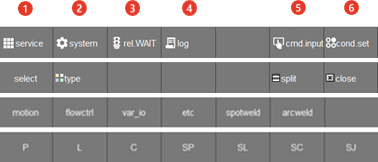

# 1.2.4.5 功能按钮栏

7 个功能按钮显示在主窗口的底部。功能按钮根据当前操作屏幕而变化。例如，在最高级别的屏幕中，显示进入服务菜单和系统菜单的按钮。此外，在编辑任务程序时，显示命令列表或命令参数设置的按钮。

| No. | 描述 | 
| :--- | :--- | 
|  | service : 各种便利项目，例如监视、变量和文件管理器 ([4.Service](../../../4-service/README.md)) |
|  | system : 机器人操作和应用的详细设置 ([7.System](../../../7-system/README.md)) |
|  | rel.WAIT : 通过按 `[SHIFT]` 键释放信号等待，例如输入信号或焊接完成信号 (前提条件 : `[F2: 系统] - 1: 用户环境 - 'Wait(di/wi) release' - 禁用 ([F2: system] - 1: User environment - 'Wait(di/wi) release' - Disable)`) |
|  | log : 错误或警告历史，包括错误代码、通知消息、错误发生时间等 ([2.5.2 Error Handling](../../../2-operation/5-error-info/2-error-handle.md)) |
|  | cmd.input : 显示在手动模式的初始页面，用于输入程序命令 ([3.2.2.1 Statements](../../../3-programming/2-prog-edit/1-statement.md)) |
|  | cond.set : 机器人操作条件，例如前进/后退的机器人速度和路径恢复 ([5.Condition Setting](../../../5-conditional-setting/README.md)) |