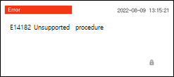
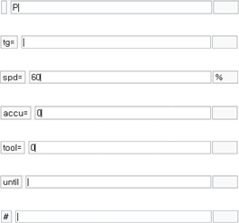

# 1.2.4.6 Input display window

This area displays input value of contents to edit such as command language, character or function. You can directly insert a command without selecting a command through the [cmd.input] button. In the case of inputting an undefined command or a grammatically incorrect one, the following error will occur.

 

The below table is the input for each parameter of 'move' command.
 

|command parameters|inputs |
|--|--|
|||