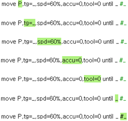

# 1.2.4.7 Guide display window

This displays the guide or direction message for the user to operate and is the area that displays the print message when the print direction is set to T/P in the 'print' command.

 

The below table is the guide message for each parameter of 'move' command.

 

|command parameters|guide messages|
|--|--|
|||