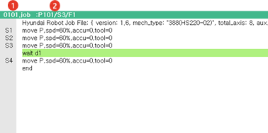
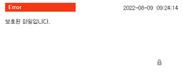

# 1.2.4.8 작업 편집창

JOB 프로그램을 편집하는 작업 영역입니다. 자세한 프로그램 작성법은 [3. 프로그램 작성](../../../3-programming/README.md) 을 참고하시기 바랍니다.

<table>
  <thead>
    <tr>
      <th style="text-align:left">번호</th>
      <th style="text-align:left">설명</th>
    </tr>
  </thead>
  <tbody>
    <tr>
      <td style="text-align:left">
        
      </td>
      <td style="text-align:left">
        선택된 JOB 프로그램의 이름을 표시합니다.
      </td>
    </tr>
    <tr>
      <td style="text-align:left">
        
      </td>
      <td style="text-align:left">
        
프로그램 내 스텝과 펑션 번호를 표시합니다.

        <ul>
          <li>P101 : 현재 JOB 프로그램 번호</li>
          <li>S3 : 현재 선택된 행의 스텝번호</li>
          <li>F1 : 현재 선택된 행의 펑션번호</li>
        </ul>
      </td>
    </tr>
    <tr>
    </tr>
  </tbody>
</table>

 편집 시도 중 파일 속성에 따라 아래와 같은 에러가 발생할 수 있습니다. 파일 속성에 관한 내용은  "[4.2.4 파일 보호](../../../4-menu/2-file-manager/4-file-protect.md)" 절을 참고하십시오.

