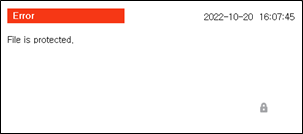

# 1.2.4.8 Task edit window

This is the window to edit the program. For program editing, refer to
"[3. Program Writing](../../../3-programming/README.md)".

 

<table>
  <thead>
    <tr>
      <th style="text-align:left">No.</th>
      <th style="text-align:left">Description</th>
    </tr>
  </thead>
  <tbody>
    <tr>
      <td style="text-align:left">
        
      </td>
      <td style="text-align:left">
        the name of the selected JOB program
      </td>
    </tr>
    <tr>
      <td style="text-align:left">
        
      </td>
      <td style="text-align:left">
        
 the step and function number of the JOB program

        <ul>
          <li>P101 : the number of the current JOB program</li>
          <li>S3 : the step number of the current selected row</li>
          <li>F1 : the function number of the current selected row</li>
        </ul>
      </td>
    </tr>
    <tr>
    </tr>
  </tbody>
</table>

 Whey you try editing the program, the following error could occur due to the property of the file. For the file property, refer to  "[4.2.4 File Protection](../../../4-service/2-file-manager/4-file-protect.md)".

