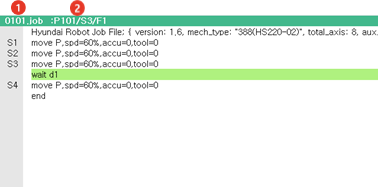
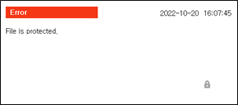

# 1.2.4.8 任务编辑窗口

这是编辑程序的窗口。有关程序编辑，请参阅
"[3. 程序编写](../../../3-programming/README.md)"。

 

<table>
  <thead>
    <tr>
      <th style="text-align:left">编号</th>
      <th style="text-align:left">描述</th>
    </tr>
  </thead>
  <tbody>
    <tr>
      <td style="text-align:left">
        
      </td>
      <td style="text-align:left">
        选定的 JOB 程序的名称
      </td>
    </tr>
    <tr>
      <td style="text-align:left">
        
      </td>
      <td style="text-align:left">
        
 JOB 程序的步骤和功能编号

        <ul>
          <li>P101 : 当前 JOB 程序的编号</li>
          <li>S3 : 当前选定行的步骤编号</li>
          <li>F1 : 当前选定行的功能编号</li>
        </ul>
      </td>
    </tr>
    <tr>
    </tr>
  </tbody>
</table>

当您尝试编辑程序时，由于文件的属性可能会发生以下错误。有关文件属性，请参阅 "[4.2.4 文件保护](../../../4-service/2-file-manager/4-file-protect.md)"。

