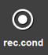

# 1.2.4.9 Record condition display window

This is the window to edit the condition of the step to record (Speed, accuracy, tool option, etc.). Press the [rec.cond] </img> on the L button bar in order to edit. For more detail, refer to "[3.2.2.3 Recording Condition](../../../3-programming/2-prog-edit/2-statement-input/3-rec-cond.md)".

 

