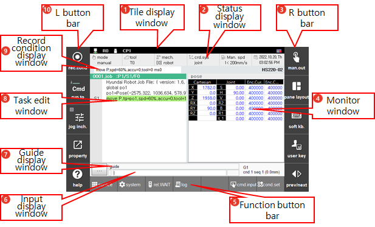

# 1.2.4 ${cont_model} 教教导器的屏幕

下图表示在教导器上显示的屏幕。${cont_model} 控制器的教导器屏幕由 10 个彩色触摸屏窗口组成。
 

| No. | 描述 | 
| :--- | :--- | 
|  | 标题显示窗口： TP 通信、机器人系统、机制等的各种状态图标。 ([1.2.3.1 标题显示窗口](1-title-area.md)) |
|  | 状态显示窗口：操作模式和设置 ([1.2.3.2 状态显示窗口](2-status-bar.md)) |
|  | R 按钮栏：主屏幕右侧的菜单组 ([1.2.3.3 R 按钮栏](3-Rbt-bar.md)) |
|  | 监视窗口：操作期间的运行数据 ([1.2.3.4 监视窗口](4-mon-area.md)) |
|  | 功能按钮栏：主屏幕底部的菜单组，支持主要设置和监控 ([1.2.3.5 功能按钮栏](5-function-buttons.md)) |
|  | 输入显示窗口：任务编辑窗口的直接输入区域 ([1.2.3.6 输入显示窗口](6-input-area.md)) |
|  | 引导显示窗口：操作期间的引导消息 ([1.2.3.7 引导显示窗口](7-guide-area.md)) |
|  | 任务编辑窗口：用于编辑 JOB 程序的区域 ([1.2.3.8 任务编辑窗口](8-work-area.md)) |
|  | 记录条件显示窗口：记录步骤的条件 ([1.2.3.9 记录条件显示窗口](9-record-cnd-area.md)) |
|  | L 按钮栏：主屏幕左侧的菜单组 ([1.2.3.10 L 按钮栏](10-Lbt-bar.md)) |