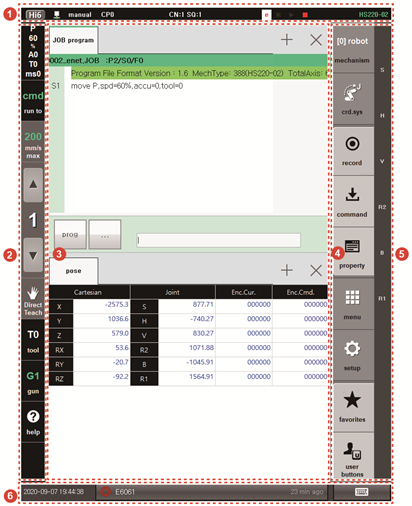

# 1.2.4 Screen of the Hi6 Teach Pendant

You can control the operation of the robot or manage devices that interoperate with the robot. The Hi6 teach pendant screen is configured as follows.

<table>
  <thead>
    <tr>
      <th style="text-align:left">No.</th>
      <th style="text-align:left">Description</th>
    </tr>
  </thead>
  <tbody>
    <tr>
      <td style="text-align:left">
        
      </td>
      <td style="text-align:left">The status bar displays the communication status and operation mode of
        the teach pendant and the status and mechanism of the robot system. For
        details, refer to &#x201C;<a href="status-bar.md"><b>1.2.4.1 Status Bar</b></a>&#x201D;</td>
    </tr>
    <tr>
      <td style="text-align:left">
        
      </td>
      <td style="text-align:left">You can check and change the setting values using the function buttons.
        For details, refer to &#x201C;<a href="function-buttons.md"><b>1.2.4.3 Function</b> <b>Buttons</b></a>&#x201D;</td>
    </tr>
    <tr>
      <td style="text-align:left">
        
      </td>
      <td style="text-align:left">Work area. You can perform various tasks such as editing the JOB program
        and checking the monitoring information. You can perform multiple tasks
        simultaneously.</td>
    </tr>
    <tr>
      <td style="text-align:left">
        
      </td>
      <td style="text-align:left">You can check and change the setting values of the menus and execute various
        functions using the menu buttons. For details, refer to &#x201C;<a href="menu-buttons.md"><b>1.2.4.4 Menu Buttons</b></a>&#x201D;</td>
    </tr>
    <tr>
      <td style="text-align:left">
        
      </td>
      <td style="text-align:left">The jog bar displays the name of the axis newly selected according to
        the reference coordinate system of the jog execution selected using the <b>[Crd. Sys]</b> button.</td>
    </tr>
    <tr>
      <td style="text-align:left">
        
      </td>
      <td style="text-align:left">
        
Taskbar. For details, refer to &#x201C;<a href="log-bar.md"><b>1.2.4.2 Log bar</b></a>&#x201D;

        <ul>
          <li>It displays the current time information and the memory usage status of
            the teach pendant. You can also check error messages or warning messages.</li>
          <li>You can display the keyboard on the screen or hide it. While using the
            soft keyboard, you can move the keyboard to the top of the screen.</li>
        </ul>
      </td>
    </tr>
  </tbody>
</table>

### 

