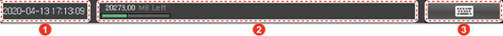

# 1.2.4.2 Log Bar

<table>
  <thead>
    <tr>
      <th style="text-align:left">No.</th>
      <th style="text-align:left">Description</th>
    </tr>
  </thead>
  <tbody>
    <tr>
      <td style="text-align:left">
        
      </td>
      <td style="text-align:left">Displays the date and time information. If you touch the <b>[Menu]</b> button
        &gt; <b>[08: Setting of Date and Time]</b> menu, you can change the date
        and time information. For details on changing the date and time information,
        refer to &#x201C;<b>4.5</b>  <b>Setting of Date and Time.</b>&#x201D;</td>
    </tr>
    <tr>
      <td style="text-align:left">
        
      </td>
      <td style="text-align:left">
        <ul>
          <li>Displays the memory (RAM) usage status of the teach pendant. Displays
            the used and residual capacity compared to the total capacity of the memory
            in a bar graph and helps check the residual capacity (MByte) numerically.</li>
          <li>If an error or warning occurs, a notification message will appear instead
            of the memory usage status and will blink for about one minute and then
            stop.</li>
          <li>You can check the occurrence timing of errors and warnings on the right
            side of the notification message. Moreover, if you touch the notification
            message, you can check the history of errors and warnings in a new window.</li>
          <li>For details on the notification message, refer to &#x201C;<b>2.5 Error Information.</b>&#x201D;</li>
        </ul>
      </td>
    </tr>
    <tr>
      <td style="text-align:left">
        
      </td>
      <td style="text-align:left">
        
Displays a soft keyboard on the screen. For details on how to use the
          soft keyboard, refer to &#x201C;<b>3.2.4.4 Soft Keyboard.</b>&#x201D;

        <ul>
          <li>If you touch the <b>[</b>
            <b>]</b> button while using the soft keyboard, you can move the keyboard
            to the top of the screen.</li>
          <li>To hide the soft keyboard, touch the <b>[</b>
            <b>]</b> button.</li>
        </ul>
      </td>
    </tr>
  </tbody>
</table>

