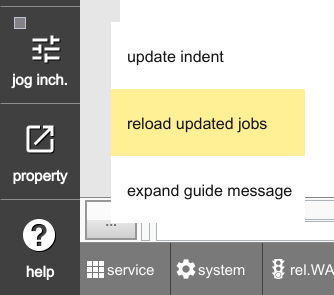
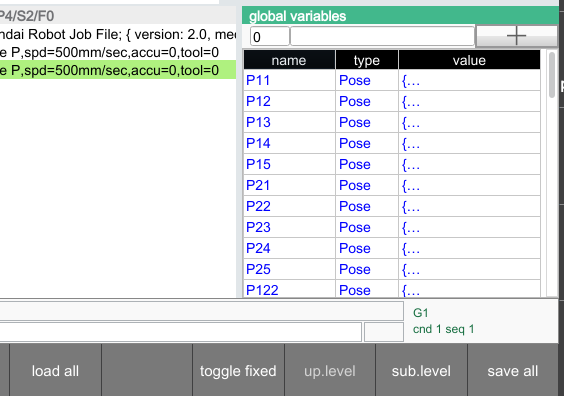

# 11.1.1 Cautions When Loading to the project/ Folder via FTP


`[Warning]` The TP file manager or FTP service allows you to modify folders and files.
However, careless modification or deletion of files may cause serious issues such as boot failure, malfunction, or data loss.
Do not modify these files unless you fully understand their mechanism or are working under the guidance of a qualified expert.


You can back up and restore configuration and teaching files in the project folder using HRWorkbench, file manager, or the backup features.

However, in some cases, it may be more convenient to use familiar FTP software to back up files to a PC or restore them to the robot controller.
This section describes important precautions to keep in mind when doing so.
(Details of each file in the project folder will be explained in the next section.)

## Applying Changes After Modifying .job Files in the project/jobs/ Folder

When you add or overwrite .job files in the `project/jobs/` folder using FTP software, the robot controller does not immediately reflect these changes in memory.
(When using HRWorkbench or file manager, changes are detected instantly and automatically loaded into memory.)

There are two ways to apply the updated files to memory:

- On the HOME screen, click the `...` button on the console bar and select `reload updated jobs`.

  

- Reboot the robot controller.

# Applying Changes After Modifying .json and .csv Files in the project/vars/ Folder

When you add or overwrite global variable files in the `project/vars/` folder using FTP software, the robot controller does not immediately reflect these changes in memory.
(When using HRWorkbench or file manager, changes are detected instantly and automatically loaded into memory.)

To apply the updated files to memory, use the method below:

- Open the Global Variables Monitoring window, then click the `Load All` (F-button) at the bottom.


Do not reboot the robot controller to apply updated global variable files.
When the controller is powered off, the current global variable values in memory are saved back to files, which will overwrite the files you just updated.

