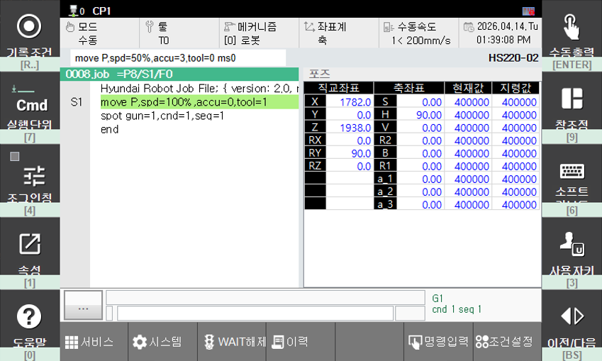
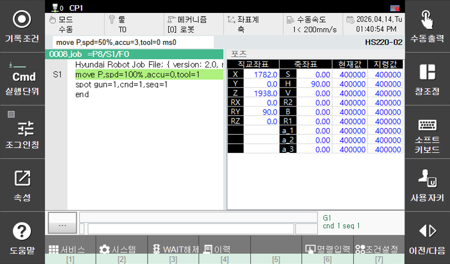

# 11.2 키패드 모드

터치스크린의 L, R, F(기능) 버튼을 키패드로 조작할 수 있는 기능입니다. `터치스크린 고장` 또는 `[F1: 서비스] - 11: 티치펜던트 옵션` 메뉴에서 `터치스크린을 OFF`한 경우, 해당 기능을 사용하여 버튼을 조작할 수 있습니다.

키패드 모드가 활성화되면 각 버튼 상단 또는 하단에 해당 버튼을 조작할 수 있는 조작키가 표시됩니다.

### L, R 버튼 막대 키패드 모드
- 단축키: `[CTRL]+[.]`
    - L 버튼 막대
        - `[R..]` : `[기록조건]`
        - `[7]` : `[실행단위]`
        - `[4]` : `[조그인칭]`
        - `[1]` : `[속성]`
        - `[0]` : `[도움말]`
    - R 버튼 막대
        - `[ENTER]` : `[수동출력]`
        - `[9]` : `[창조정]`
        - `[6]` : `[소프트키보드]`
        - `[3]` : `[사용자키]`
        - `[BS]` : `[이전/다음]`

### F 버튼 막대 키패드 모드
- 단축키: `[CTRL]+[←(Backspace)]`
    - F 버튼 막대 (숫자키에 대응하는 F 버튼에 매핑됨)
        - 아래는 최상위 화면에서 표시되는 버튼 기준 설명입니다.
        - `[1]` : `[F1: 서비스]`
        - `[2]` : `[F2: 시스템]`
        - `[3]` : `[F3: WAIT 해제]`
        - `[4]` : `[F4: 이력]`
        - `[6]` : `[F6: 명령입력]`
        - `[7]` : `[F7: 조건설정]`

