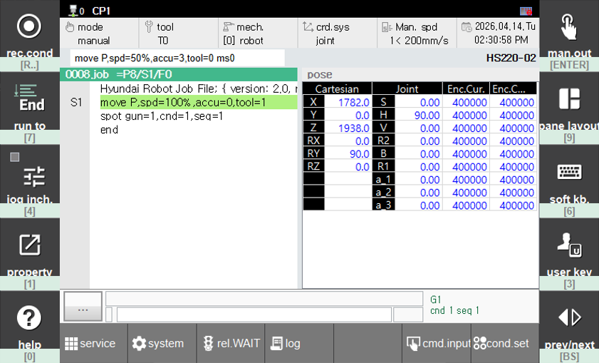

# 11.2 Keypad Mode

This feature allows the L, R and F(Function) buttons on the touch screen to operated using the keypad. If the touch screen is `malfunctioning` or if the touch screen is `turned off` via `[F1: service] - 11: Teach pendant option`, you can use this feature to operate the buttons.

When keypad mode is activated, the corresponding control keys for each button are displayed at the top or bottom of the buttons.

### L, R Button Bar Keypad Mode
- Shortcut: `[CTRL]+[.]`
    - L button bar
        - `[R..]` : `[rec.cond]`
        - `[7]` : `[run to]`
        - `[4]` : `[jog inch.]`
        - `[1]` : `[property]]`
        - `[0]` : `[help]`
    - R button bar
        - `[ENTER]` : `[man.out]`
        - `[9]` : `[pane layout]`
        - `[6]` : `[soft kb.]`
        - `[3]` : `[user key]`
        - `[BS]` : `[prev/next]`

### F Button Bar Keypad Mode
- Shortcut: `[CTRL]+[←(Backspace)]`
    - F button bar (Mapped to F buttons corresponding to number keys)
        - The following descriptions are based on the buttons displayed on the highest level screen.
        - `[1]` : `[F1: service]`
        - `[2]` : `[F2: system]`
        - `[3]` : `[F3: rel.WAIT]`
        - `[4]` : `[F4: log]`
        - `[6]` : `[F6: cmd.input]`
        - `[7]` : `[F7: cond.set]`

