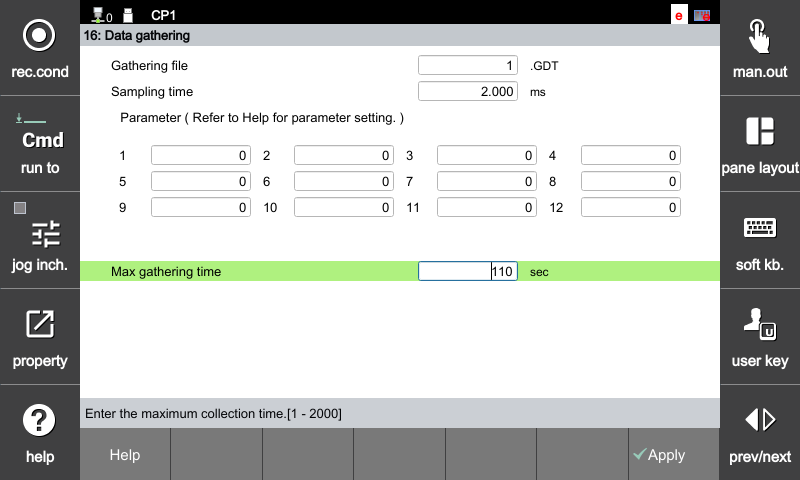

# 11.3 데이터 게더링

로봇 및 센서의 데이터를 취득할 수 있는 설정 화면 입니다. 
- 엔지니어링 모드에 접근 후, `[서비스] - [16: 데이터 수집]` 에서 게더 옵션 설정 가능합니다.
- [gather](https://hrbook-hrc.web.app/#/view/doc-hrscript/ko/10-etc/1-proc/1-gather?cont_model=${cont_model}) 문을 이용해서 데이터 수집을 할 수 있습니다.

### 데이터 취득 방법
- 수집 결과 파일 : .GDT 확장자로 저장 가능합니다.
- 토글 root의 gather 폴더에서 GDT 파일을 확인할 수 있습니다.
- 게더링 하고자 하는 옵션을 1~12번 edit box에 입력합니다.
  - 도움말에서 옵션 확인 가능합니다.
- 샘플링 시간 : 0.2ms 부터 샘플링 시간을 설정 할 수 있습니다.

