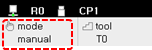

# 2.1.1 操作方法

通过使用 jog 键指导机器人的工作内容并检查指导工作的内容的方法如下。

1. 检查安全围栏和机器人操作范围内是否有人员或障碍物。

2. 通过旋转教导挂件的模式开关将操作模式设置为手动模式。

    

3. 在 ${cont_model} 教导挂件屏幕的状态栏中，检查操作模式是否设置为手动模式。

    

    * 如果设置为自动模式，通过旋转教导挂件的模式开关将操作模式设置为手动模式。

4. 用 `[SHIFT]` 触碰 `[PROG]` 键。然后，程序选择窗口将出现。

    

5. 从程序选择窗口的列表中选择一个程序，或输入程序编号，然后按 `[ENTER]` 键。

    

6. 按下教导挂件上的 `[motor]` 键。然后，电动机灯将闪烁，伺服电源将准备为机器人的每个轴的电动机提供。

7. 按下教导挂件背面的使能开关。然后，电动机灯将点亮，电动机刹车将释放，允许伺服电源供应。机器人将准备移动。

8. 使用 jog 键根据坐标系统的速度级别或运动条件操作机器人。

    * 要保存机器人的位置，在所需位置触碰 `[REC]` 键。然后该步骤将被记录。
    * 要记录步骤所需的功能，请触碰 `[cmd.input]` 按钮。
    * 要在手动前进或后退时检查机器人的位置，请按 `[STEP.FWD/STEP.BWD]` 键。在按住 `[STEP.FWD/STEP.BWD]` 键时，机器人将以步骤单位移动。当机器人到达目标步骤时，执行完成标记 \( . \) 将出现在命令前方，然后机器人将停止。