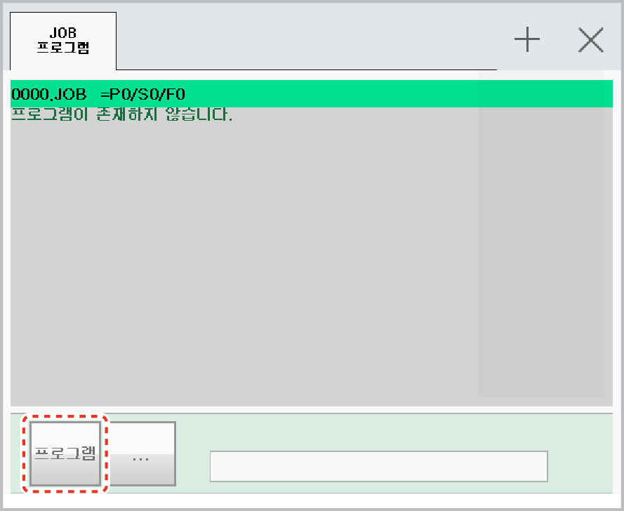

# 2.1.1 운전 방법

조그키를 이용하여 로봇에 작업 내용을 지시하고 지시된 작업 내용을 확인하는 방법은 다음과 같습니다.

1. 안전 펜스와 로봇의 동작 범위 내에 사람 또는 장애물 유무를 확인하십시오.

2. 티치 펜던트의 모드 스위치를 돌려 운전 방식을 수동 모드로 설정하십시오.

3. Hi6 티치 펜던트 화면의 상태 표시줄에서 운전 방식이 수동 모드로 설정되어 있는지 확인하십시오.

* 자동 모드로 설정된 경우, 티치 펜던트의 모드 스위치를 돌려 운전 방식을 수동 모드로 설정하십시오.

4. JOB 프로그램창에서 **\[프로그램\]** 버튼을 터치하십시오. 프로그램 선택창이 나타납니다.

5. 프로그램 선택창의 목록에서 프로그램을 선택하거나 프로그램 번호를 입력한 후 **\[확인\]** 버튼을 터치하십시오.

 6. 티치 펜던트의 **&lt;모터&gt;** 키를 누르십시오. 모터 램프가 깜빡이고 로봇 각 축의 모터에 서보 전원 공급을 위한 준비 상태가 됩니다.

7. 티치 펜던트 뒷면의 인에이블링 스위치를 누르십시오. 모터 램프가 켜지고 모터의 브레이크가 해제되어 서보 전원이 공급됩니다. 로봇을 움직일 수 있는 상태가 됩니다.

8. 조그키를 이용해 속도 레벨이나 좌표계의 이동 조건에 따라 로봇을 조작하십시오.

* 로봇의 위치를 저장하려면, 원하는 위치에서 **\[기록\]** 버튼을 터치하십시오. 스텝이 기록됩니다.
* 스텝에 필요한 기능을 기록하려면, **\[명령입력\]** 버튼을 터치하십시오.
* 수동으로 전진 또는 후진하며 기록된 로봇의 위치를 확인하려면 &lt;↓/↑&gt; 키를 누르십시오. &lt;↓/↑&gt; 키를 누르고 있는 동안 로봇이 스텝 단위로 이동합니다. 로봇이 목표 스텝에 도달하면 명령어 앞에 수행 완료 표시\( . \)가 나타나고 정지합니다.

