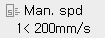

# 2.1.2 Operation Speed Adjustment

In manual mode, you can operate the robot using the step forward/backward operation and manual jog operation. The current speed setting is displayed at the speed window on the status display window.

'Man. spd' is only for the manual mode, and is replaced by 'Play spd' in the auto mode. The number '1' at the lower line of the speed window represents a jog speed level, and '200mm/s' represents a forward/backward speed limit.

For example, if the speed limit in manual mode is set to 250 mm/s and the recorded step speed is 1,000 mm/s, the moving speed of the step will be limited to 250 mm/s during the step forward/backward operation. When the recorded speed is 100 mm/s, the robot will move at 100 mm/s because the recorded speed does not exceed the speed limit.


To set the step speed limit, refer to "[5.1 Operation Condition Setting](../../5-conditional-setting/1-op-cond-set.md)".


To set the jog speed level \(1: Low to 8: High\), press repeatedly <SPEED: HI, LOW> keys  until the desired speed level appears. Even in this case, the maximum speed of the robot tool and link will be limited below the speed limit.


In automatic mode, the \[Speed Adjustment\] button will display the playback speed \(%\) instead of the step speed limit \(mm/sec\).



If the length and angle in the tool data are set differently from the actual values, the tool may operate too fast in manual mode. Before operating the robot, you must make sure that the tool data is set correctly.


