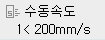

# 2.1.2    운전 속도 조정

수동 모드에서는 스텝 전후진 운전과 수동 조그 조작을 이용해 로봇을 조작합니다. TP 우측 상단에 아래와 같이 속도 창에 현재 설정된 속도가 표시 됩니다.

상단의 ‘수동속도’ 는 수동모드에서만 표시되며 자동모드 일 경우 ‘재생속도’로 표시가 변경됩니다. 속도 창 하단 좌측 8는 조그 속도 레벨을 나타내고, 우측 200mm/s는 스텝 전/후진시의 제한속도를 의미합니다. 
여기서 제한 속도라 함은 스텝 전/후진시 제한 되는 속도를 나타내며 좌측의 < 표시는 같거나 작음을 의미합니다. 예를 들어, 기록된 스텝의 속도가 1000 mm/s 이고 수동모드의 제한 속도가 200 mm/s 라면 스텝 전/후진시 스텝의 이동 속도는 200 mm/s 로 제한됩니다.
만약, 이 때 기록 속도가 100 mm/s 라면 이 속도는 수동속도인 250 mm/s 보다 작으므로 로봇은 100 mm/s 로 이동하게 됩니다.

조그 조작에는 [SPEED] 키를 사용하여 속도를 level 1 에서 level 8까지 level 1 단위로 조절 할 수 있습니다. 이 때에도 로봇 툴과 링크의 최고속은 200 mm/s 이하로 제한됩니다.

스텝 전/후진에는 [CTRL] + [SPEED] 키를 사용하여 속도를 50 mm/s 에서 250 mm/s까지 50 mm/s 단위로 조절 할 수 있습니다. 로봇 툴과 링크의 최고속은 설정 값 이하로 제한됩니다.

@@ 아래 구현

스텝 전/후진에는 [CTRL] + [SPEED] 키를 사용하여 속도를 50 mm/s 에서 250 mm/s까지 50 mm/s 단위로 조절 할 수 있습니다. 로봇 툴과 링크의 최고속은 설정 값 이하로 제한됩니다.

속도 조절은 이상에서 설명한 바와 같이 키조작으로 가능하지만 터치방식으로도 가능합니다. 수동속도 창을 터치하면 아래와 같은 창이 나타나 속도를 편리하게 조절할 수 있습니다.

@@@


자동 모드일 때, \[속도조절\] 버튼에는 스텝 제한 속도\(㎜/sec\) 대신 재생 속도\(%\)가 표시됩니다.



\[주의\] 툴 데이터의 길이와 각도가 실제와 다르게 설정되어 있으면 수동 모드에서 툴이 너무 빠르게 동작할 수 있습니다. 로봇을 조작하기 전에 반드시 툴 데이터가 올바르게 설정되어 있는지 확인하십시오.


