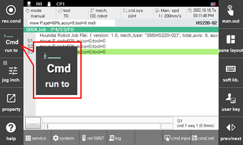
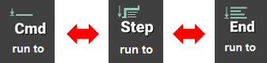
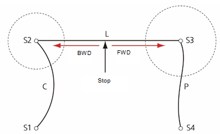
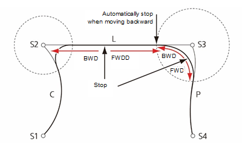
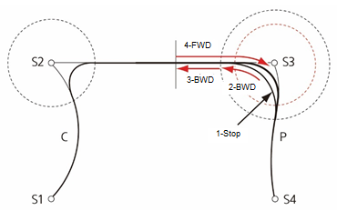
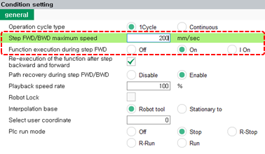

# 2.1.3 向前/向后步骤

向前/向后步骤是手动模式下操作机器人的方法之一，指的是播放录制程序的动作。通过在向前/向后操作中操控机器人，可以在安全的速度范围内检查录制的程序路径和相互锁定关系。

向前/向后操作的执行单元可以从 ${cont_model} 教学手持屏幕左侧的 `[run to]` 按钮进行检查和设置。

  

要设置向前/向后操作的执行单元，反复点击 `[run to]` 按钮，直到所需选项出现。

* `[cmd]`：将逐行执行命令
* `[Step]`：将逐步执行
* `[End]`：将执行到结束语句

 

当执行单元设置为 'Cmd' 或 'Step' 时，机器人将忽略设置的精度区域并到达记录的步骤。如果设置为end，机器人将在与播放 b/n 自动模式相同的路径上操作。

当您将执行单元设置为 'Cmd' 或 'Step' 并执行向前/向后操作时，机器人将在没有拐角的路径上操作。有关拐角的详细信息，请参见 "[2.3.1.4 精度](../3-step/1-step-cmd-param/4-accuracy.md)"。

如果您将执行单元设置为end，然后执行向前/向后操作，机器人的路径将根据停止位置而变化。换句话说，如果机器人停在非拐角的位置，然后执行向前操作，机器人将恢复原始拐角路径，但如果机器人执行向后操作，机器人将移动到记录的步骤，此时机器人将在记录的步骤处停止，然后立即移动到上一个步骤。当机器人停在拐角处时，机器人将在向前和向后移动时保持其先前的拐角路径。

当机器人停在拐角处然后执行向前操作时，机器人将在原始拐角路径上操作。在这里，如果机器人执行向后操作，而后又在没有完全到达上一个步骤的情况下再次执行向前操作，机器人可能无法在某些情况下创建原始的拐角路径。换句话说，如果步骤的距离变短于原始距离，导致无法满足现有的精度条件，则将创建一个小于原始的拐角路径。

您可以设置向前/向后操作的最大速度，并设置是否执行功能。触摸 ${cont_model} 教学手持屏幕左侧的 `[run to]` 按钮后，在设置窗口中设置速度值和功能执行选项。

* `2: 步骤前进/后退最大速度 (2: Step FWD/BWD maximum speed)`：与手动操作中设置的速度值相同
* `[3: 步骤向前执行功能]`：您可以选择功能执行选项。
  * Off：在步骤向前/向后操作中不会执行功能。无论外部 I/O 的条件如何，只能检查机器人路径。请注意，外部系统的互锁将不起作用。
  * On：您可以执行所有功能。应在外部互锁完成后使用。
  * I On：您只能执行输入等待功能。应在需要通过外部互锁检查安全时使用。