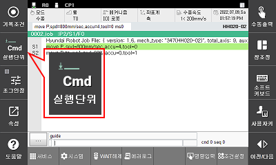
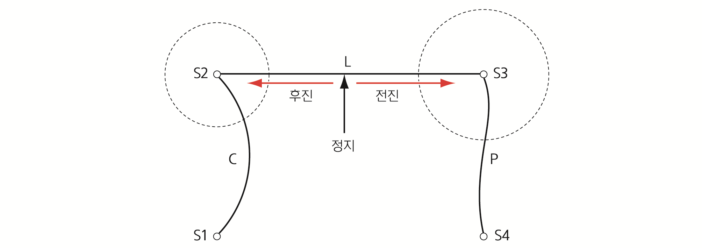
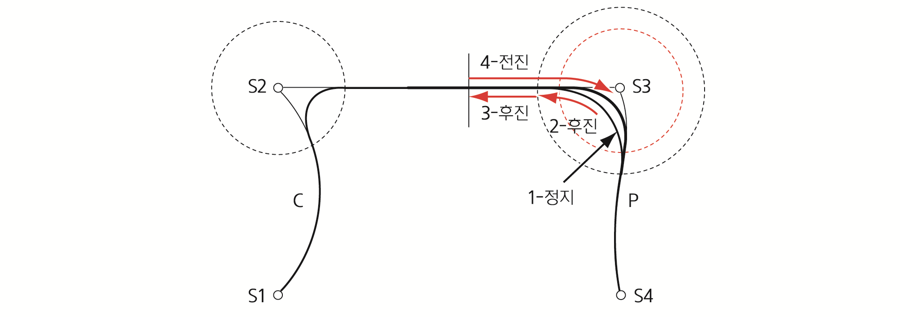
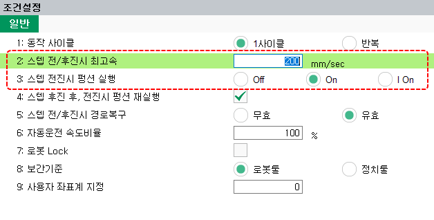

# 2.1.3 스텝 전후진

스텝 전후진이란 수동 모드에서 로봇을 조작하는 방법의 하나로 기록된 프로그램을 재생하는 것입니다. 스텝 전후진으로 로봇을 조작하면 기록된 프로그램의 경로와 상호 인터록 관계를 안전한 속도 범위에서 확인할 수 있습니다.

스텝 전후진 시 실행 단위는 Hi6 티치 펜던트 화면 좌측의 [**실행단위**] 버튼에서 확인 및 설정할 수 있습니다.

  

스텝 전후진 시 실행 단위를 설정하려면, 원하는 옵션이 나타날 때까지 [**실행단위**] 버튼을 반복해서 터치하십시오.

* [**cmd**]: 명령어 한 행씩 실행합니다.
* [**step**]: 한 스텝씩 실행합니다.
* [**end**]: end 명령문까지 실행합니다.

실행 단위가 **cmd** 또는 **step**으로 설정되어 있을 때, 로봇은 설정된 Accuracy 영역을 무시하고 기록된 스텝까지 도달하지만 **end**로 설정되어 있을 경우에 로봇은 자동 모드에서의 재생 시와 동일한 경로로 동작합니다.

실행 단위를 **cmd** 또는 **step**으로 설정하고 스텝 전후진을 수행할 때는 코너링이 없는 경로상에서 로봇이 동작합니다. 코너링에 대한 자세한 내용은 “[2.3.1.4 Accuracy](../3-step/1-step-cmd-param/4-accuracy.md)”를 참조하십시오.

실행 단위를 **end**로 설정하고 스텝 전후진을 수행하면 정지 위치에 따라 로봇의 경로가 달라집니다. 즉, 로봇이 코너링이 아닌 다른 곳에서 정지한 후 전진을 실행하면 원래 코너링의 경로를 복구하지만, 후진을 실행하면 기록된 스텝까지 이동하며 이 때 기록된 스텝에서는 정지 후 즉각 이전 스텝으로 이동합니다. 로봇이 코너링에서 정지한 후에는 전후진 시 모두 이전의 코너 경로를 유지합니다.

로봇이 코너링에서 정지한 후 전진을 실행하면 원래 코너 경로를 따라 동작합니다. 여기서 다시 후진을 실행하다가 이전 스텝에 다 도달하지 못한 상태에서 다시 전진을 실행할 때는 원래의 코너링의 경로를 만들지 못하는 경우가 있습니다. 즉, 스텝의 거리가 원래 보다 짧아져서 기존의 Accuracy 조건을 만족할 수 없으면 원래의 코너 경로 보다 작게 코너 경로가 만들어집니다.

스텝 전후진 시의 최고 속도와 펑션 실행 여부를 설정할 수 있습니다. Hi6 티치 펜던트 화면 우 하단의 \[**조건설정**\] 버튼을 터치한 후 설정창에서 속도값과 펑션 실행 옵션을 설정하십시오.

* \[2: 스텝 전/후진시 최고속\]: 수동 속도에 설정한 값과 동일합니다.
* \[3: 스텝 전진시 펑션 실행\]: 펑션 실행 옵션을 선택합니다.
  * Off: 스텝 전후진 시 펑션을 실행하지 않습니다. 외부 I/O 조건과 무관하게 로봇 경로만 확인할 수 있습니다. 외부 시스템과의 인터록이 동작하지 않으므로 주의해야 합니다.
  * On: 모든 펑션을 실행합니다. 외부 인터록이 완성된 후 사용해야 합니다.
  * I On: 입력 대기 펑션만 실행합니다. 외부 인터록에 의한 안전 확인이 필요한 경우 사용하십시오.

