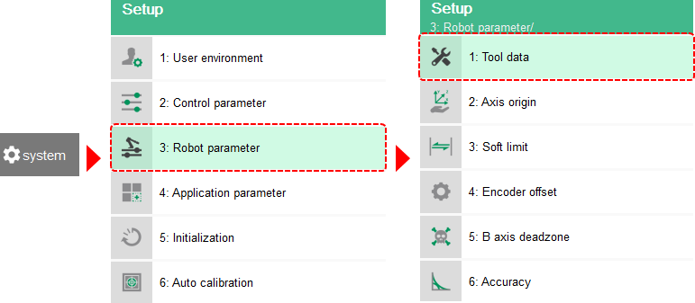
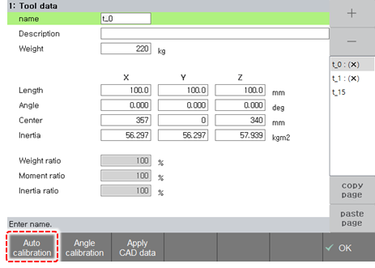
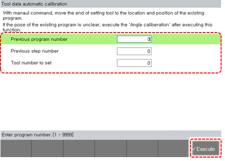

# 2.10 Tool Data Automatic Calibration

After determining the axis origin and tool length through automatic calibration, etc., if the tool is deformed, you can simply determine new tool data. At this time, the axis origin should have been determined and maintained. In addition, a fixed reference point should be taught after the tool length is determined and the angle calibration is completed. If tool deformation occurs, place the tool in the same position at the reference point designated prior to the deformation, and then perform automatic tool data calibration.

1.	Touch the \[system\] button &gt; \[3: Robot Parameter&gt; 1: Tool Data\] menu.

2.	After touching the \[Auto Calibration\] button, move the tooltip to the original position using the jog key.

3.	 After checking the program number of the predetermined reference point, the step number, and the tool number, touch the \[Execute\] button.


For details on this function, refer to “[7.4.1 Tool Data](../setting/robot-parameter/tool-data/).”


