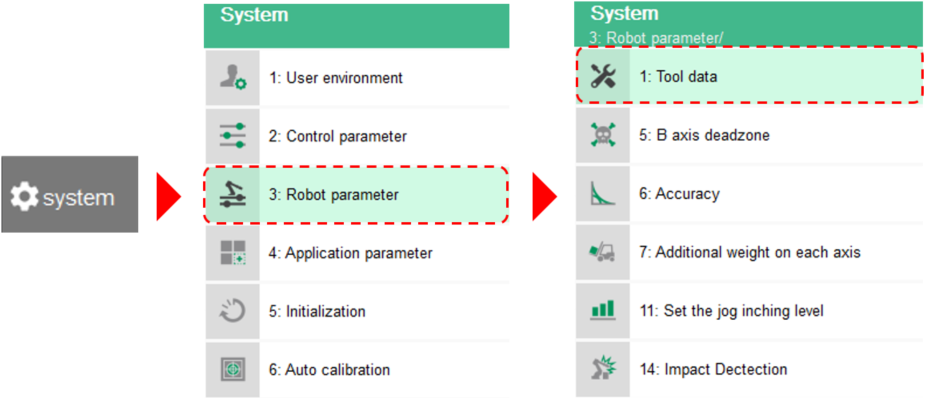
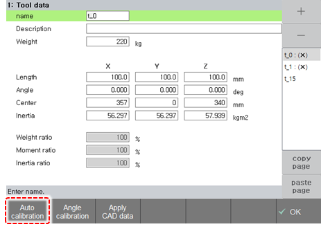
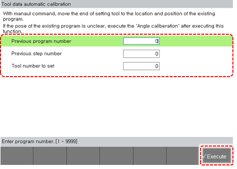

# 2.10 工具数据自动校准

在通过自动校准等确定轴原点和工具长度后，如果工具变形，可以简单地确定新的工具数据。此时，轴原点应已确定并保持。此外，应在工具长度确定和角度校准完成后教授固定参考点。如果发生工具变形，将工具放置在变形之前指定的参考点的相同位置，然后执行自动工具数据校准。

1. 触摸 `[system]` 按钮 - `[3: Robot Parameter - 1: Tool Data]` 菜单。

    

2. 触摸 `[Auto Calibration]` 按钮后，使用操作键将工具提示移动到原始位置。

    

3. 在检查预定参考点的程序编号、步骤编号和工具编号后，触摸 `[Execute]` 按钮。

    


有关此功能的详细信息，请参阅 "[7.4.1 Tool Data](../7-system/4-robot-parameter/1-tool-data/README.md)."
